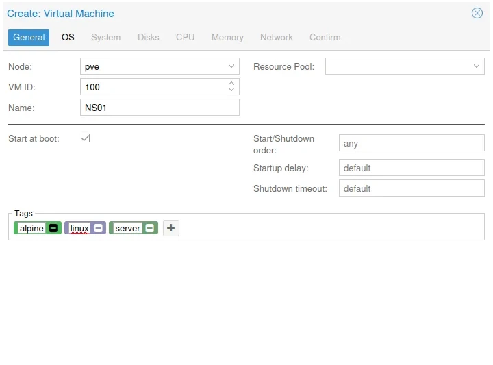
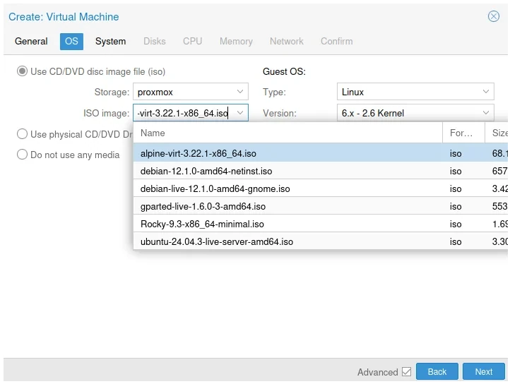
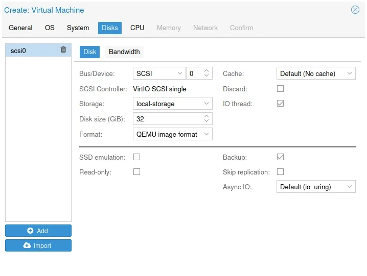
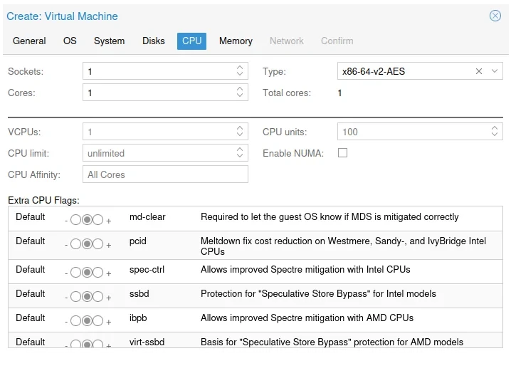
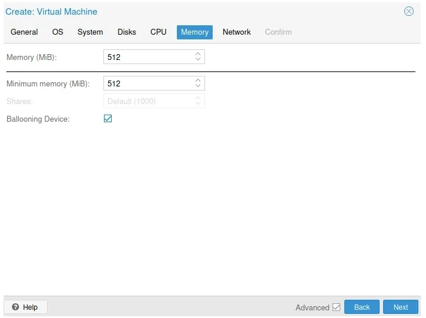
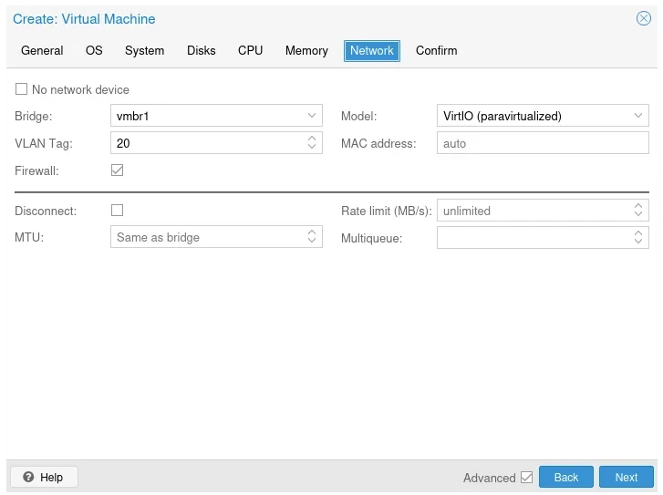
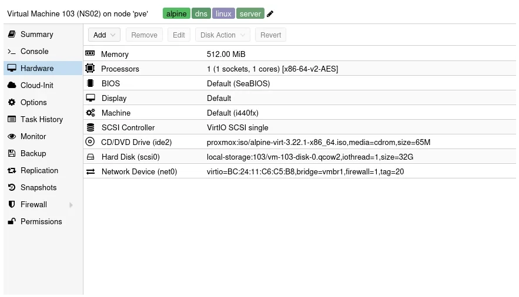

Having recently installed CoreDNS in a [docker container](https://thebloody.cloud/posts/Docker-CoreDNS/), I though that I would also try to install it on [Alpine Linux](https://www.alpinelinux.org/) in a Proxmox Virtual Machine, I might move it to proper hardware at some point, we will see. Saying that, it's working incredibly well with a really small footprint.

Below are the setting's I'm using for my container, do feel free to use them as a template. I'm using the **Virtual X86_64** version downloadable from [this page](https://alpinelinux.org/downloads/)

## Proxmox Settings

### General Settings

_General Settings_

### OS Settings

_OS Settings_

### Disk

_Disk_

### CPU

_CPU_

### Memory

_Memory_

### Network

This will probably be different for you, this docker container is resident on VLAN 20 on my network class C network 192.168.20.0/24

_Network_

### Hardware

A screenshot of my hardware, your hardware will be quite similar, but no doubt you'll change it to suite your own circumstances.

_Hardware_

## Initial Setup

Start the container and Login as root with no password then follow the following instuctions to install.

1. Type: setup-alpine
2. Select Keyboard layout: [none] gb
3. Select variant (or `abort`): gb
4. Enter System hostname (fully qualified form, e.g. `foo.example.org`) [localhost] ns1.local.lan
5. Available interfaces are: eth0
   Enter '?' for help on bridges, bonding and vlans.
6. Which on do you want to initialize? (or '?' or 'done') [eth0]
7. Ip address for eth0? (or 'dhcp', 'none' '?') [dhcp]
8. Do you want to do any manual network configuration? (y/n) (n)
9. Root password
10. Timezone GB
11. Which timezone are you in? (or '?' or 'none') [UTC] GB
12. Proxy none
13. PK Mirror
    Enter mirror number of URL: [1]
14. Setup a user? (enter a lower-case loginname, or 'no') billy
15. Full Name for user billy (billy) Billy Dickson
16. New Password
17. Retype Password
18. Enter ssh key or URL for billy (or `'none') [none]
19. Which ssh server? 'openssh', 'dropbear' or 'none') [openssh]
20. Which disk(s) would you like to use (or ? for help or none) [none] sda
21. How would you like to use it? ('sys', 'data', 'crypt', 'lvm' or '?' for help) sys
22. Warning: Erase the above disk(s) and continue (y/n) [n] y

## Configuring Alpine

### Update Alpine

Login as root, update the disto

```bash
apk update && apk upgrade
```

### Installing nano

```bash
apk add nano
```

### Adding an admin user

```bash
adduser <username> wheel
```

### Installing doas

**doas** is a simplified and lightweight utility that provides a way to execute commands as another user.

```bash
apk add doas
```

Configuration in the default config file /etc/doas.conf may be overridden by /etc/doas.d/*.conf if files exist.

To allow the members of the wheel group to use root privileges with doas command, a config file /etc/doas.d/20-wheel.conf can be created as follows:

```bash
nano /etc/doas.d/20-wheel.conf
```

```bash
permit persist  :wheel
```

### Installing the QEMU tools

Installing the QEMU tools to manage the Alpine Guest OS, if you're running it on a [Proxmox](https://www.proxmox.com) hypervisor.

Edit the repositories and enable community

```bash
doas nano /etc/apk/repositories
```

Install the qemu guest agen

```bash
doas apk add qemu-guest-agent
```

Make it presistant, enable it on reboot

```bash
doas rc-update add qemu-guest-agent
```

### Installing CoreDNS

Why bother? In the UK we have what's know affectionately as the [snoopers charter](https://www.libertyhumanrights.org.uk/fundamental/mass-surveillance-snoopers-charter/)

DNS queries are sent in plaintext, which means anyone can read them. DNS over HTTPS and DNS over TLS encrypt DNS queries and responses to keep user browsing secure and private. However, both approaches have their pros and cons.

```bash
doas apk add coredns
```

Always good to have the DNS tools installed as well, for testing.

```bash
doas apk add bind-tools
```

Create a CoreDNS config

```bash
doas nano /etc/coredns/Corefile
```

This is my Corefile below, I'm forwarding my internal requests (forward and reverse) to my home router to resolve.  

My CoreDNS install only handles external queries, forwarding them to Quad 9 and Cloudflare using [DOT (DNS over TLS)](https://www.cloudflare.com/en-gb/learning/dns/dns-over-tls/).

```yaml
# Authoritative zone for linuxhome.co.uk
# https://www.ibm.com/think/topics/dns-records

# define a snippet
(snip) {
    whoami
    log
    errors
    }

linuxhome.co.uk:53 {
    forward . 192.168.20.1
    import snip
    }

# Reverse zone for linuxhome.co.uk
20.168.192.in-addr.arpa:53 {
    forward . 192.168.20.1
    import snip
    }

# Reverse zone for linuxhome.co.uk
69.16.172.in-addr.arpa:53 {
    forward . 192.168.20.1
    import snip
    }

# https://coredns.io/plugins/forward/
.:53 {
    forward . 127.0.0.1:5301 127.0.0.1:5302
    import snip
    }

# Quad 9 DOT 
.:5301 {
    bind lo
    forward . tls://9.9.9.9 tls://149.112.112.112 {
    tls_servername dns.quad9.net }
    import snip
    }

# Cloudflare DOT
.:5302 {
    bind lo
    forward . tls://1.1.1.1 tls://1.0.0.1 {
    tls_servername cloudflare-dns.com }
    import snip
    }

    policy sequential
    cache 3600
    health localhost:8091 {
        lameduck 1s
    }
    dnssec
    reload

#    If your running Promethus to collect stats, do feel free to uncomment
#    the command below.
#    prometheus :9153
```

### Using CoreDNS on the system

Now that we have our DNS server, let's use it on our server!

If you use DHCP to get the ip address of your server, the DNS will always be used from the DHCP.

```bash
doas nano /etc/udhcpc/udhcpc.conf
```

Uncomment RESOLV_CONF="no"

```bash
# Do not overwrite /etc/resolv.conf
RESOLV_CONF="no"

# Use alternative path for resolv.conf
#RESOLV_CONF="/tmp/resolv.conf"

# Prevent overwriting of resolv.conf on a per-interface basis
#NO_DNS="eth1 wlan1"

# List of interfaces where DHCP routes are ignored
#NO_GATEWAY="eth1 wlan1"
```

Then edit resolv.conf

```bash
doas nano /etc/resolv.conf
```

You might find that nameserver is already populated with your router assigned DNS server, change it to the following.

```bash
nameserver 127.0.0.1
```

### Startup Script

Add at startup.

CoreDNS already has a service!

```bash
doas rc-update add coredns
```

Show services at startup

```bash
doas rc-status
```

For Info (remove service at startup)

```bash
doas rc-update del coredns
```

Start the service

```bash
doas rc-service coredns start
```

## References

- How to install [Alpine Linux on Proxmox](https://wiki.alpinelinux.org/wiki/Installing_Alpine_in_a_virtual_machine)
- How to prepare [Alpine Linux with Cloud init for Proxmox](https://5wire.co.uk/how-to-prepare-alpine-linux-image-with-cloud-init-ready-for-proxmox/)
- Self Hosting [CoreDNS on Alpine Linux](https://www.ipv6.rs/tutorial/Alpine_Linux_Latest/CoreDNS/)
- Installing [QEMU guest in Alpine](https://wiki.alpinelinux.org/wiki/Install_Alpine_in_QEMU#Create_the_Virtual_Machine)
- Krython.com - [Setting up Alpine Linux DNS Configuration](https://krython.com/post/setting-up-alpine-linux-dns-configuration)
- Krypton.com - [Installing and configuring an NTP server](https://krython.com/post/configuring-ntp-server)
- Techmint.com - [Installing and configuring an NTP server](https://www.tecmint.com/Install-chrony-in-centos-ubuntu-linux/)
- Setup CoreDNS on Alpine Linux - [philippeloncaux.com](https://philippeloctaux.com/blog/coredns-alpine/)
- Install and configure CoreDNS - [de-marco.net](https://di-marco.net/blog/it/2024-05-09-Intall_and_configure_coredns/)
- Blog.bythewood.me - [minimal automated update for alpine](https://blog.bythewood.me/posts/minimal-automated-updates-for-alpine-linux/)
- Just Serendipity - [apk autoupdate on Alpine](https://perrotta.dev/2024/08/apk-autoupdate-on-alpine-linux/)
- Philip Peloctaux - [Coredns-Alpine](https://philippeloctaux.com/blog/coredns-alpine/)
