Met [Danny Gig Antics](https://www.gig-antics.live/) at [Ryries Bar](https://www.ryries.bar/) about 12:30 for a few beers and a catch up, before heading to the Venue, I do quite like Ryries as a pitstop as it's pretty easy to get to the Corn Exchange from there (the Number 44 bus if you're asking).

Info about the gig and who was playing below.

## The Gig and Venue

Scotland Calling 2026 is a major punk rock festival taking place on Saturday, April 25, 2026, at the Edinburgh Corn Exchange (O2 Academy Edinburgh). The all-day event features a packed lineup including The Exploited, The Rezillos, UK Subs, and Anti-Nowhere League across two stages.

Headliners: The Exploited, The Rezillos

Confirmed Acts:

    UK Subs
    Anti-Nowhere League
    Ferocious Dog
    Subhumans
    The Meffs
    Gimp Fist
    Crashed Out
    Knock Off
    Split Dogs
    Voodoo Radio
    Fire Exit
    The Cundeez
    The Guillotines
    Bar Stool Preachers
    Dirt Box Disco

### 1 - Voodoo Radio

Loved their songs (quite short and poppy) as well as their tongue and cheek banter throughout the set, you can check out their [website](https://www.voodooradio.co.uk/) and below and other social links.

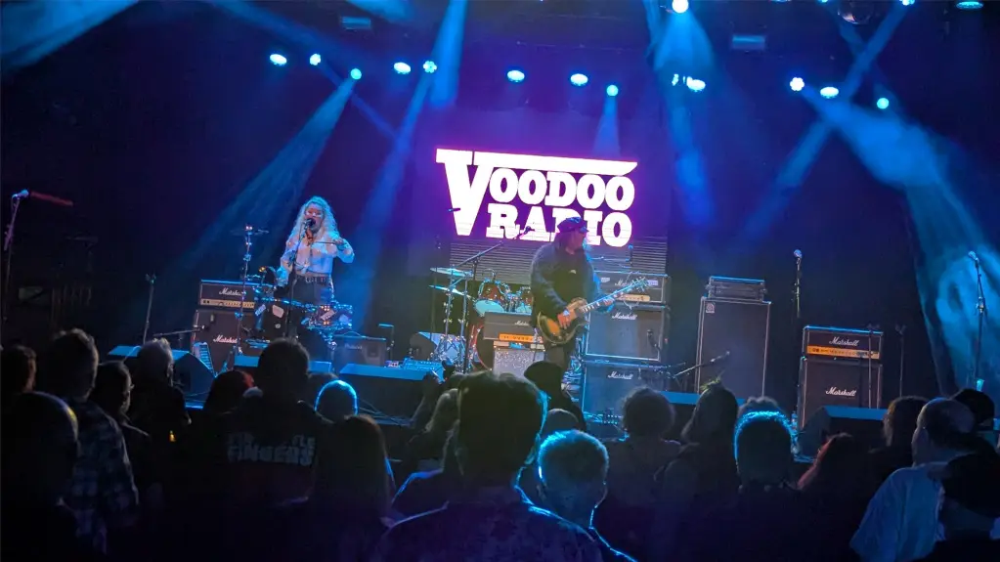_Voodoo Radio_
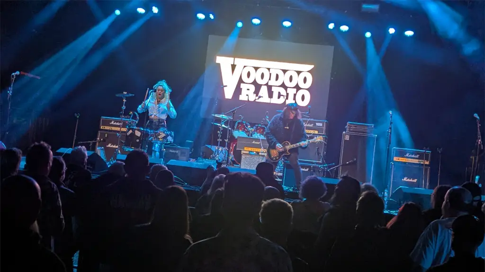_Voodoo Radio_
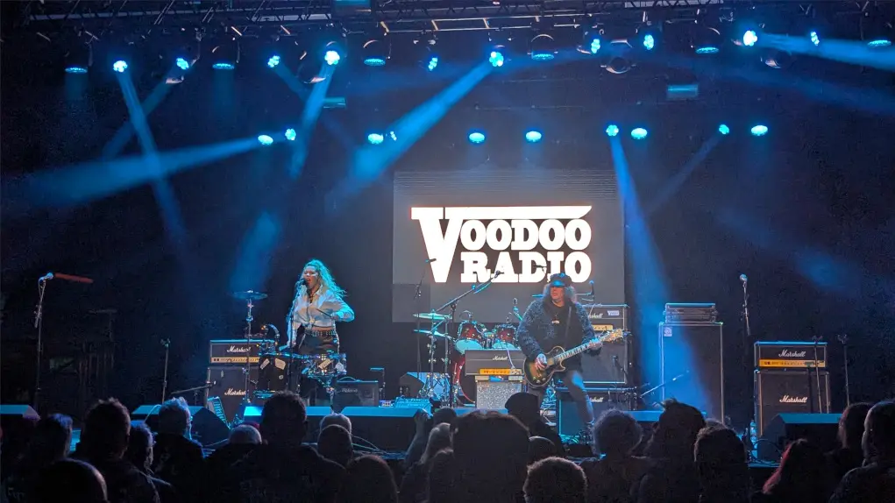_Voodoo Radio_
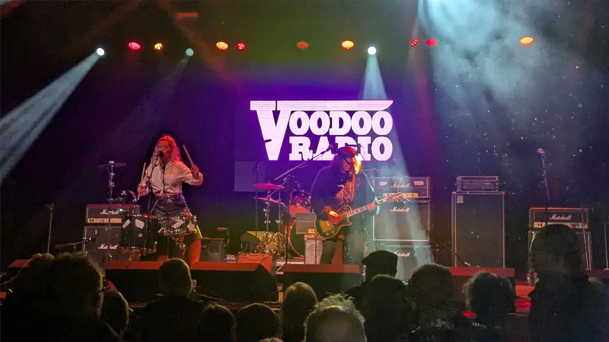_Voodoo Radio_

- [Voodoo Radio - Youtube](https://www.youtube.com/@voodooradio1339)
- [Voodoo Radio - Spotify](https://open.spotify.com/artist/4tQFnqCtv74rbUmeqx8g3a)
- [Voodoo Radio - instagram](https://www.instagram.com/voodooradioband/)
- [Voodoo Radio - Soundcloud](https://soundcloud.com/voodooradio)

### 2 - Split Dogs

I really enjoyed their vibe and music, I'll definitely go and see them again if they happen to be playing near.

What Wikipedia says

> Split Dogs are a Bristol-based, four-piece punk'n'roll band known for high-voltage live shows and a "raw," DIY sound. Formed in 2020 by Harry Atkins (vocals) and Mil Martinez (guitar), the lineup also includes bassist Suez Boyle and drummer Chris Hugall. They released their second album, Here To Destroy, in early 2025 via Venn Records.

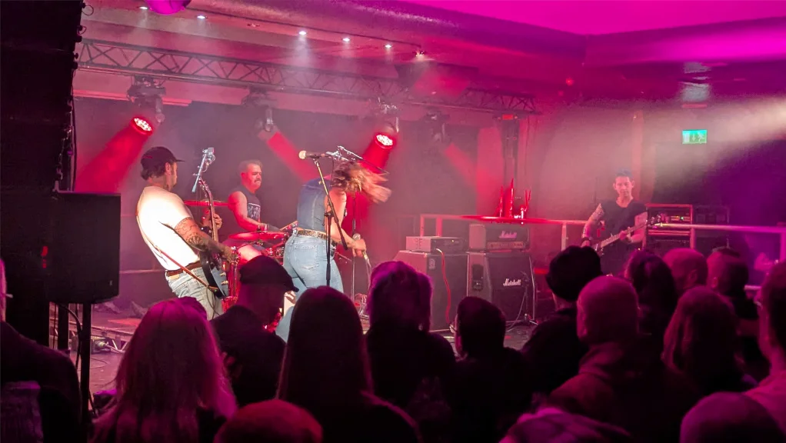_Split Dogs_
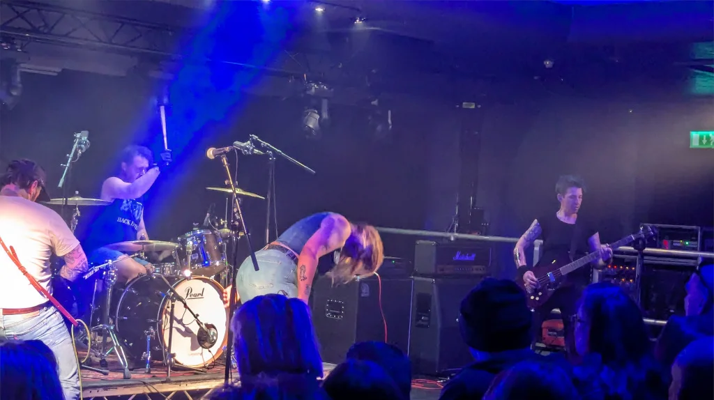_Split Dogs_

- [Split Dogs - Website](https://www.splitdogs.co.uk/)
- [Split Dogs - Spotify](https://www.splitdogs.co.uk/)
- [Split Dogs - Yourtube](https://www.youtube.com/@splitdogsuk)
- [Split Dogs - Instagram](https://www.instagram.com/splitdogs)

### 3 - The Meffs

What [Distorted Sounds Mag](https://distortedsoundmag.com/introducing-the-meffs/) said about the Meffs, its a great read if you have the time. Personally, I thought they were great, topical lyrics carried by brilliant tunes, what's not to like.

> Over the last few years, we have seen the rise of Colchester-based punk duo, THE MEFFS. Made up of Lily Hopkins [guitars/vocals] and Lewis Copsey [Drums/vocals], the pair have taken the punk world by storm, picking up support from punk icons such as Fat Mike (NOFX) and FRANK TURNER along the way. 2024 has been the biggest year of their careers so far, seeing the pair go from strength to strength as they release their excellent debut album, What A Life. We were honoured to be able to sit down with Lily for a chat about all things THE MEFFS.

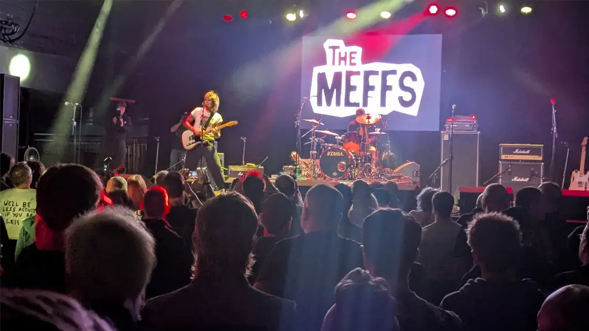_The Meffs_
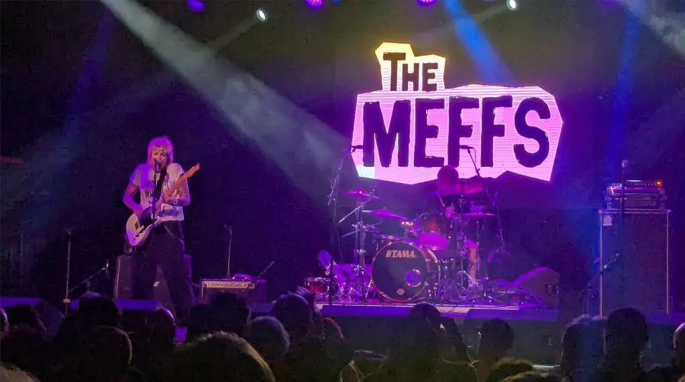_The Meffs_
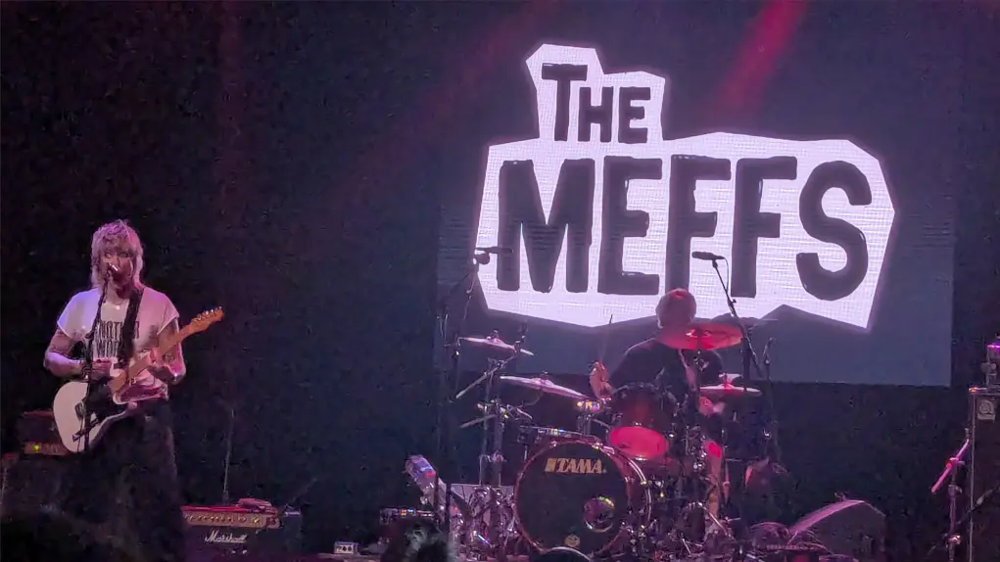_The Meffs_

- [The Meffs - Website](https://www.themeffs.com/)
- [The Meffs - Spotify](https://open.spotify.com/artist/0PY1X64i2EWLucPpunaJRy)
- [The Meffs - Facebook](https://www.facebook.com/Themeffsuk/)
- [The Meffs - Instagram](https://www.instagram.com/themeffsuk/)
- [The Meffs - BandCamp](https://themeffs.bandcamp.com/music)

### 4 - Bar Stool Preachers

The review below is probably as close to how I would describe them live, even if it's AI generated, on a personal note, loved the vibe the tunes and the energy of the band, definitely a band I would see again, given the chance.

> The Bar Stool Preachers are a Brighton-based punk band recognized for blending punk rock, ska, and folk into an anthemic, high-energy sound often described as "music for the soul". Their 2023 album Above The Static shows a progression toward a more polished, power-pop sound while retaining their signature working-class, politically conscious lyrical themes.

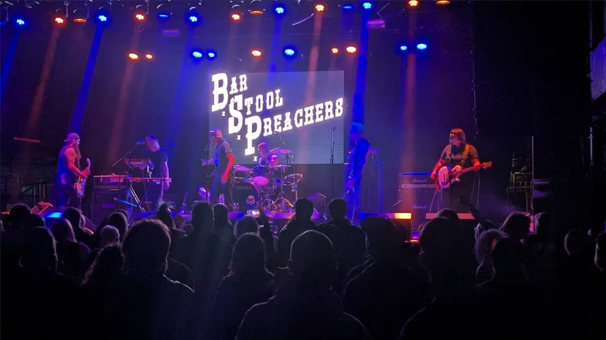_The Bar Stool Preachers_
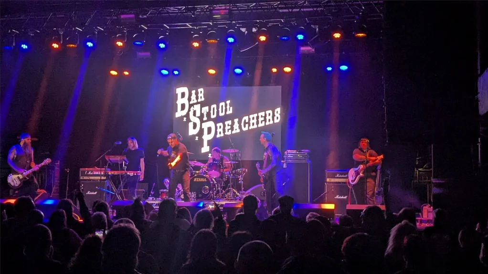_The Bar Stool Preacher_
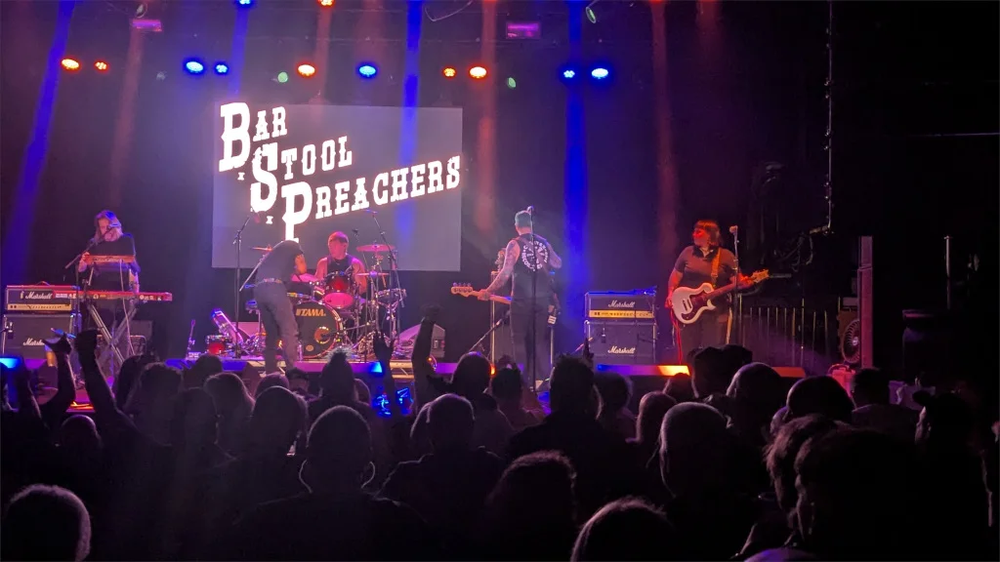_The Bar Stool Preacher_
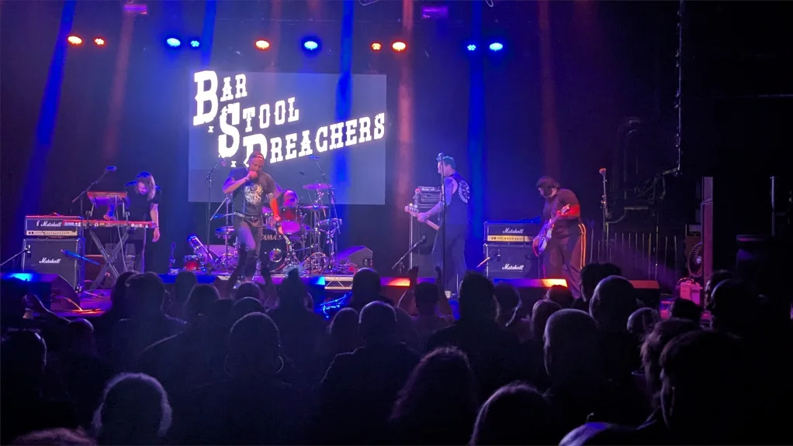_The Bar Stool Preacher_

- [The Bar Stool Preachers - Website](https://thebarstoolpreachers.com/)
- [The Bar Stool Preachers - Instagram](https://www.instagram.com/thebarstoolpreachers)
- [The Bar Stool Preachers - Facebook](https://www.facebook.com/thebarstoolpreachers/)
- [The Bar Stool Preachers - Spotify](http://open.spotify.com/user/The%20Bar%20Stool%20Preachers)

### 5 - Dirt Box Disco

Below is a snippet of a brilliant review by Echo's and Dust that really does describe the [band](https://echoesanddust.com/2013/04/dirt-box-disco-peoplemadeofpaper/), not everyone cup of tea, but I did enjoy the electric atmosphere and the vibe of the audience, who have obviously seen them before (they were singing the lyrics). Next time I see them, I might go in a bit better prepared and listen to more of their songs.

> I just wanna start the review by say in a big thank you to Dirt Box Disco for bringing back some real proper punk.  I don't mean the radio friendly mess the likes of Green Day, Blink 182 or Fallout Boy et al, you know the stuff that you can hear grannies, granda's, mum's and dad's singin' along to on the radio after a brainwashing 300 rotation per week onslaught!!  Punk was/is about rebellion against whatever, all with attitude.  Not about earning millions, overproducing music or rehab.

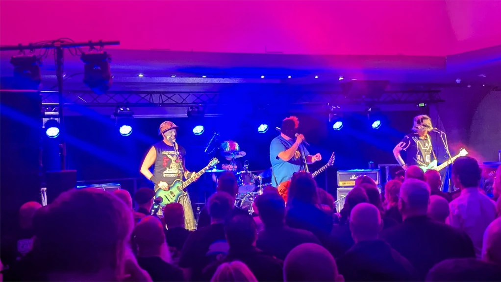_Dirtbox Disco_
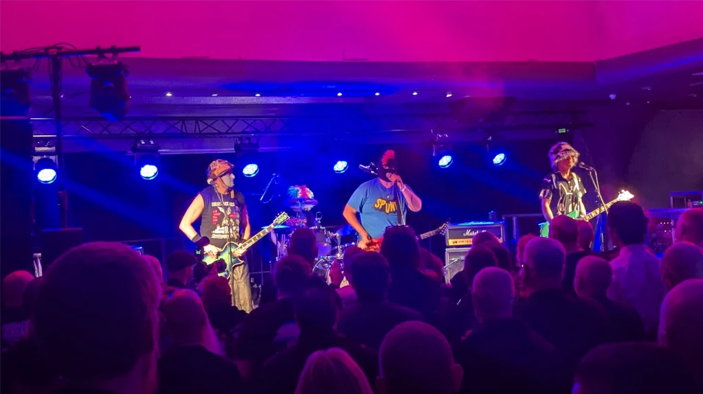_Dirtbox Disco_
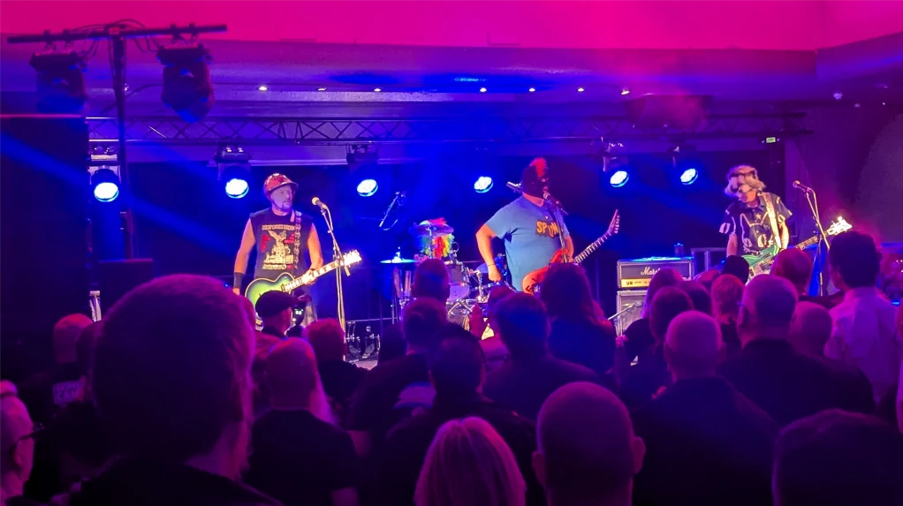_Dirtbox Disco_

- [Dirtbox Disco - Website](http://www.dirtboxdisco.com/)
- [Dirtbox Disco - Facebook](https://www.facebook.com/dirtboxdisco/)
- [Dirtbox Disco - Instagram](https://www.instagram.com/dirt.box.disco/)
- [Dirtbox Disco - Twitter](https://x.com/dirtboxdisco)

### 6 - Anti-Nowhere League

For me, that was the first time I've seen the Anti-Nowhere league, surprisingly, or maybe not if you know me, I do happen to know more songs by them than I was expecting.

Fun fact, back in the day, in my early teens (a very long time ago indeed), some of my mates used to play a cover version of "Woman", good times. 😉

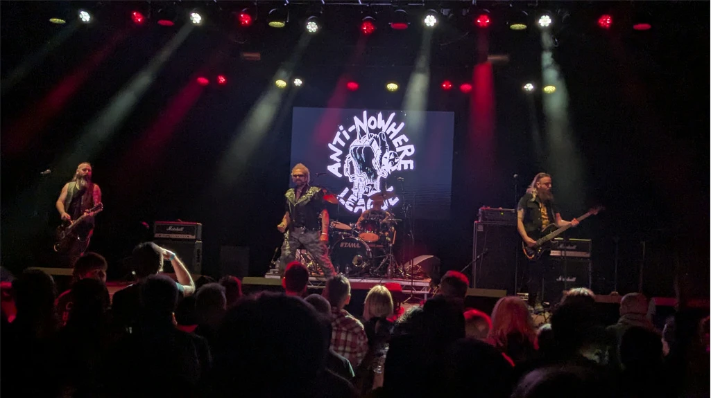_Anti-Nowhere League_
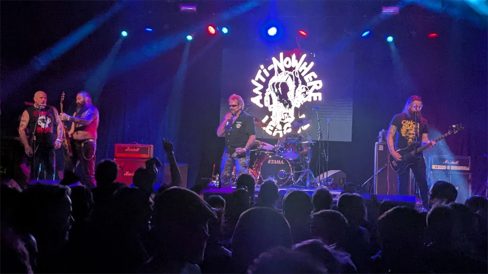_Anti-Nowhere League_
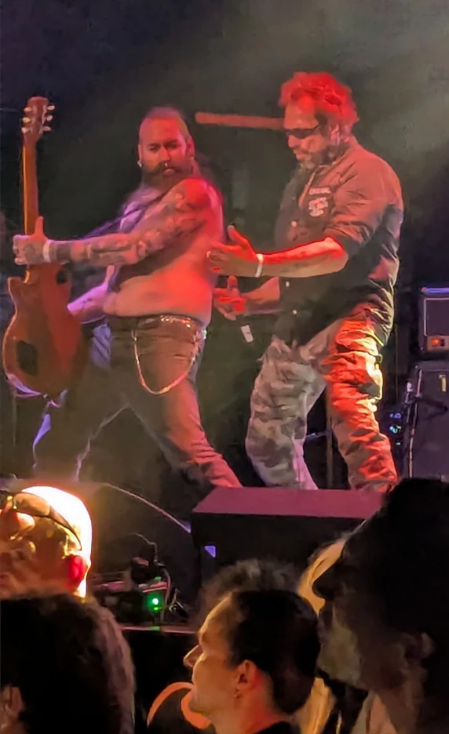_Anti-Nowhere League_
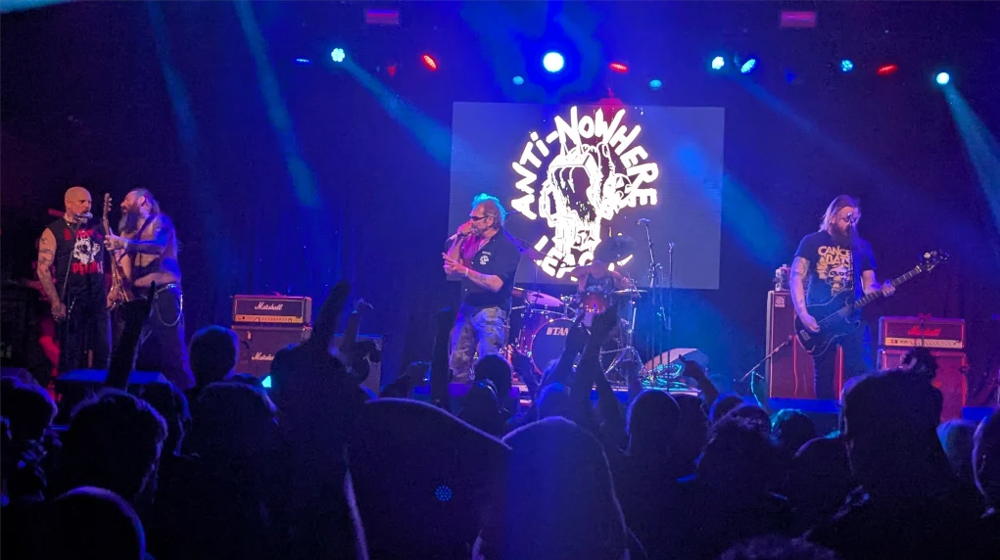_Anti-Nowhere League_

- [Anti-Nowhere League - Website](https://antinowhereleague.com)
- [Anti-Nowhere League - Facebook](https://www.facebook.com/antinowhereleague/)
- [Anti-Nowhere League - Instagram](https://www.instagram.com/anti_nowhere_league/)
- [Anti-Nowhere League - Fansite](https://barrysta9.wixsite.com/anti-nowhereleague)

### 7 - U.K. Subs

I've not seen the UK Subs play before and I was suitably impressed, brilliant band and Charlie is an absolute treasure!

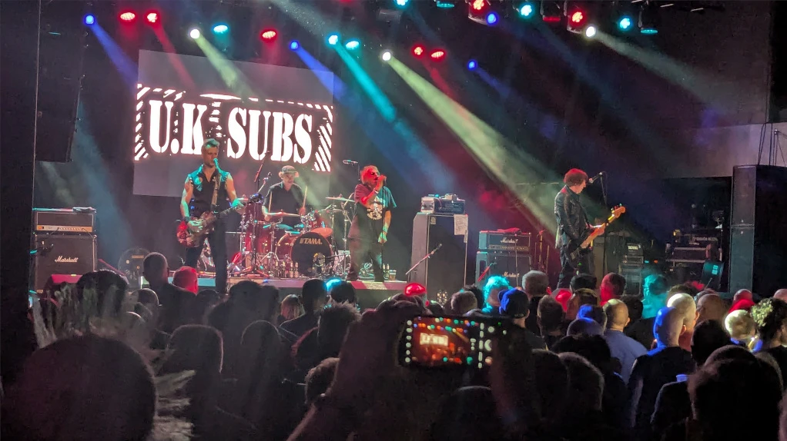_UK Subs_
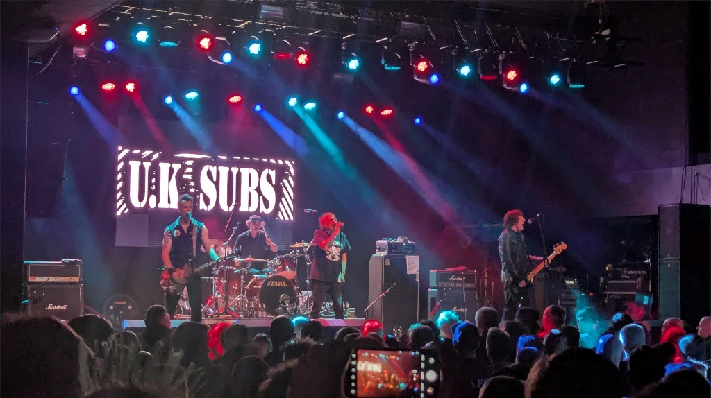_UK Subs_
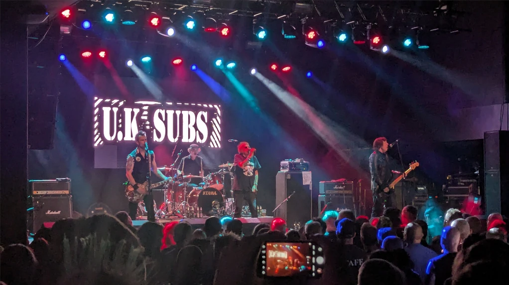_UK Subs_

- [UK Subs - Official Website and Archive](https://www.uksubstimeandmatter.net/)
- [UK Subs - Facebook](https://www.facebook.com/UKSubs/)
- [UK Subs - Instagram](https://www.instagram.com/uksubsofficial/)
- [Charlie Harper - Instagram](https://www.instagram.com/charlieharpersubs/)

### 8 - The Rezillos

Love The Rezillos and they were smoking hot tonight, on point and even I had a wee sing (I do happen to know a few of their back catalogue), just as well everyone else was singing, no one want to hear me sing. 🤣

Great review on the [Punk 77 website](https://punk77.co.uk/band/the-rezillos/) snippet below.

> In nineteen months The Rezillos went from being local heroes to having a top 20 hit, major tours and a major label and then promptly split up. Were they a punk band? power pop? a joke band? or a beat group? … who cares… The Rezillos were f***ing brilliant both live and on record.

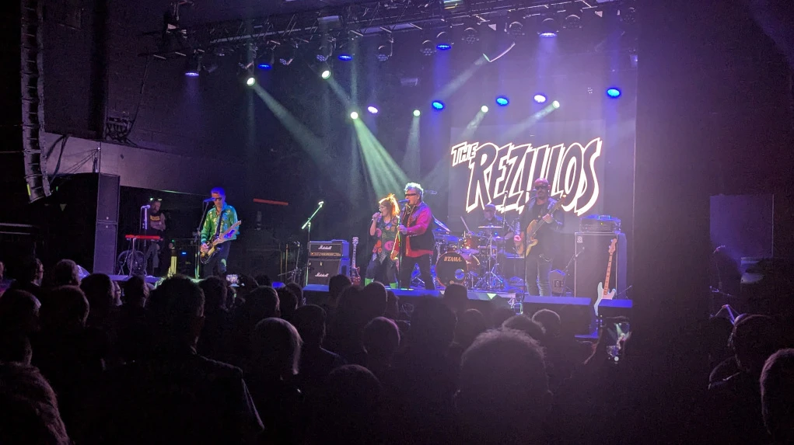_The Rezillos_
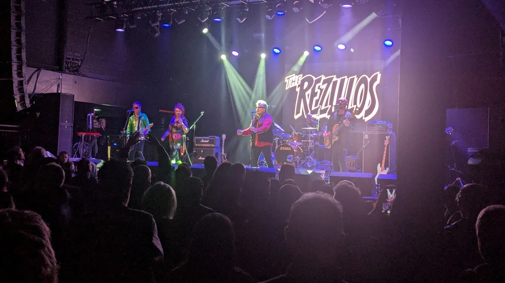_The Rezillos_
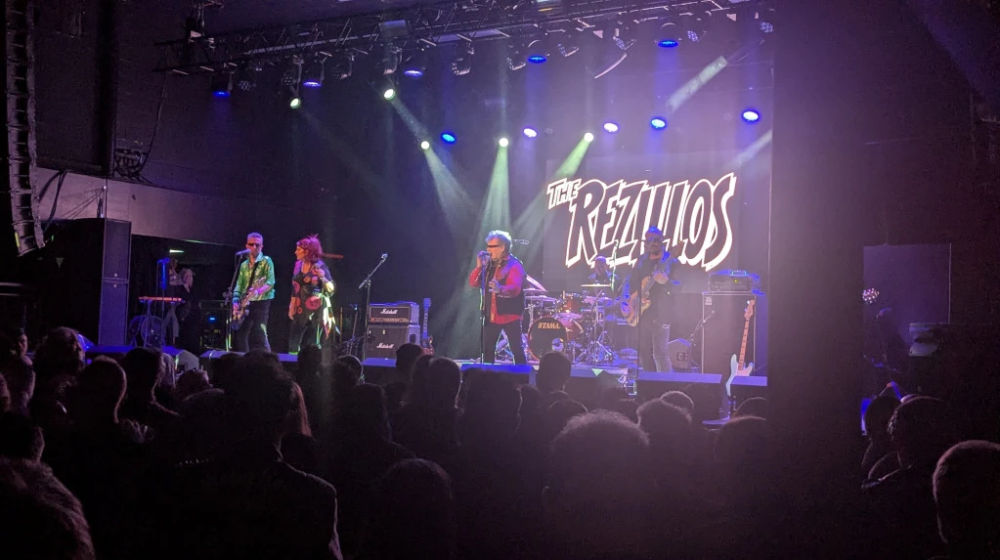_The Rezillos_

- [The Rezillos - Website](https://www.rezillos.rocks/)
- [The Rezillos - Facebook](https://www.facebook.com/TheRezillos/)
- [The Rezillos - Instagram](https://www.instagram.com/therezillosofficial/)

## References

- [Ticket Scotland](https://tickets-scotland.com/sc050)
