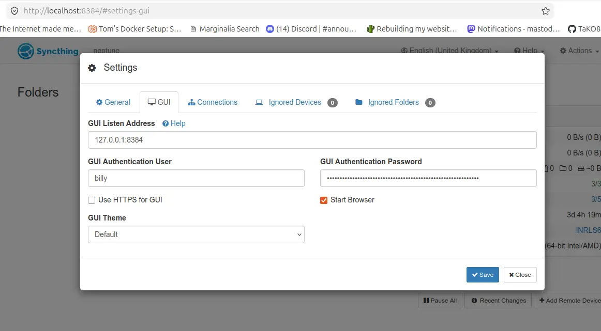
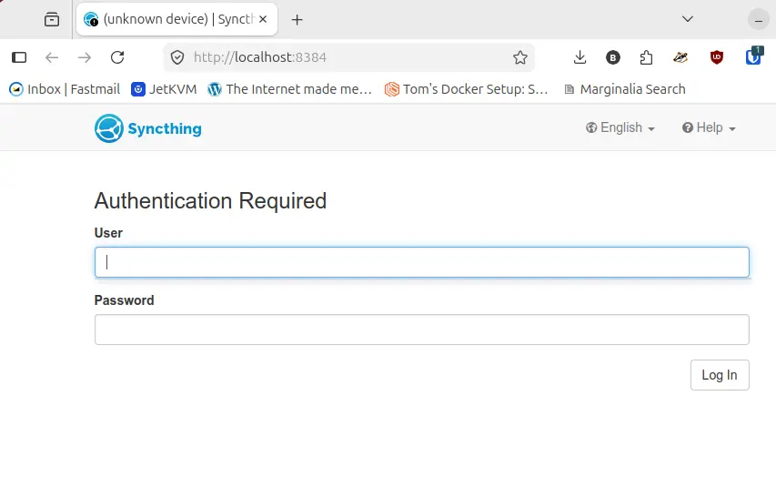

As I do most of my web devlopment on my Linux machine at home, I thought it prudent to install Syncthing on that machine to backup up my work to my home TrueNAS server. I'm currently running Ubuntu 24.04.4 LTS, but no doubt these instructions will work on newer Ubuntu distributions going forward.

Running and Managing SyncthingSyncthing runs per user rather than as a system-wide service. To start it automatically on boot for your user account.

## Install Syncthing

```bash
sudo apt install syncthing
```

### Enable startup after reboot and start the service

```bash
# Enable the service for your specific username
systemctl --user enable syncthing.service
systemctl --user start syncthing.service
```

1. Fire up a web browser on the workstation with syncthing installed
2. Bare in mind the address below is localhost.
3. [Local workstation URL](http://localhost:8384)
4. Go to Action -> Settings and add a GUI Authentication User and password

All going well and assuming you filled in the Username an Password (you may have to clear the cookies for that URL first), you'll be presented with a login box.





References

- Syncthing's great [documention pages](https://docs.syncthing.net/index.html)
- Syncthing [Firewall Settings](https://docs.syncthing.net/users/firewall.html)
- Lawrence Systems great [Syncthing Video](https://www.youtube.com/watch?v=se4V-CgO7ZM&vl=en)
