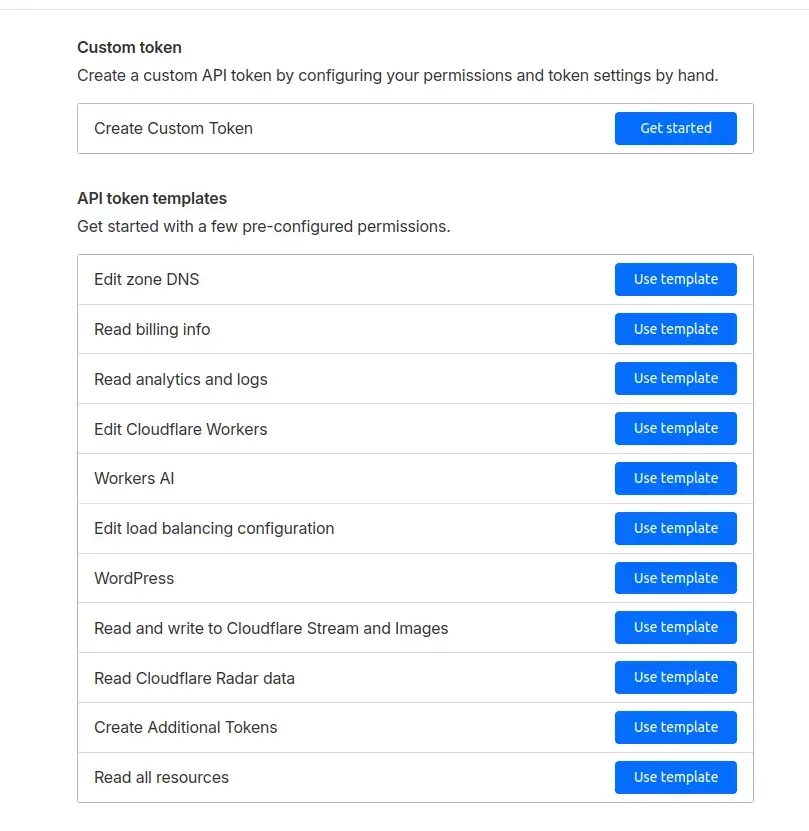
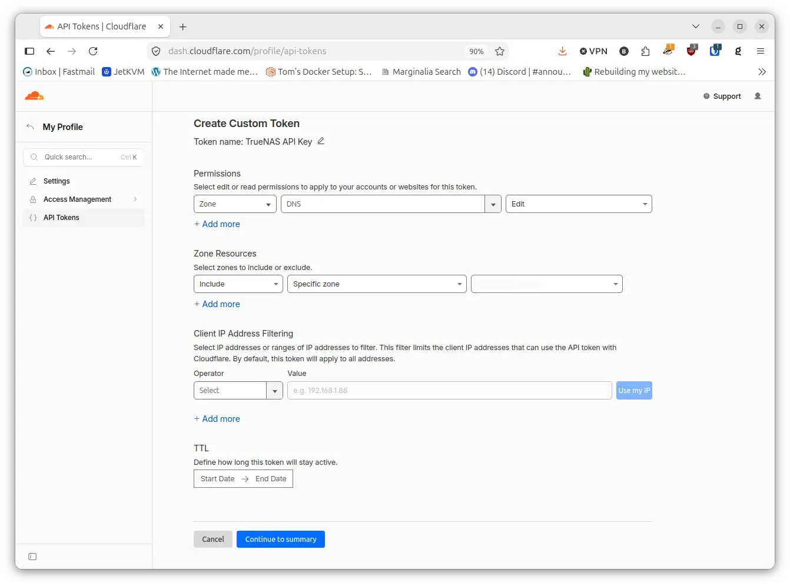
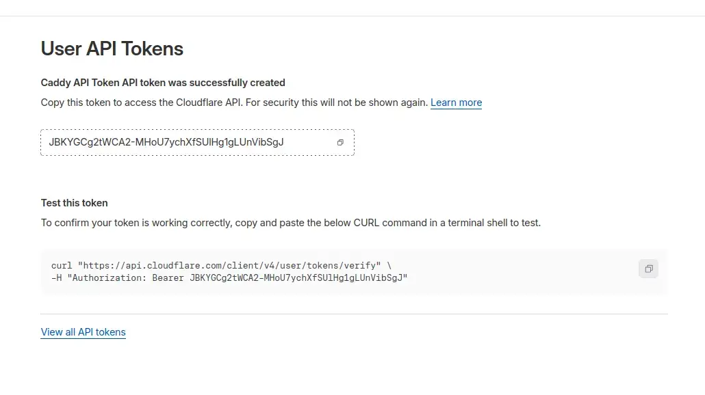
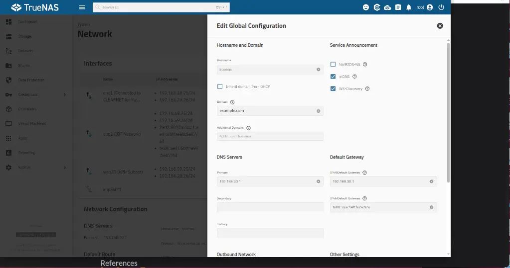

## Introduction

TrueNAS SCALE/Community Edition include the ability obtain a trusted TLS certificate from Let's Encrypt and keep it up to date automatically. If you meet the requirements below, this is probably the easiest way to keep an up-to-date, trusted certificate for your NAS.

## Prerequisites

1. You must own or control an actual publicly registered domain. That domain doesn't need to be accessible from the public Internet, but it must have public-facing DNS records. This guide will use example.com as a placeholder for your domain.
2. The ability to add internal DNS records for your registered domain via your router, or your internal DNS setup. e.g _truenas.example.com_
3. You must host your domain's DNS at Cloudflare. Cloudflare provides free DNS hosting, among many other services (not all of which are free).
4. Your DNS provider matters because we're going to be obtaining certificates from Let's Encrypt, and that requires they validate your control over your domain.
5. TrueNAS Scale needs to be on a fairly recent version such as 25.10.7 - Goldeye, you may find that it work fine on older version, as I've not tested that, so your milage may vary.

## Instructions

### Generating a Cloudflare API Token

1. Go to [https://dash.cloudflare.com/profile/api-tokens](https://dash.cloudflare.com/profile/api-tokens)
2. Click on your domain (if you have more than one)
3. Click "Get API Token"
4. Click on "Create Custom Token"

5. Set permissions

    Zone:DNS:Edit

Take a note of the _Cloudflare API Token_ as you will need it later when setting up TrueNAS.

### Setting up TrueNAS

1. Create an internal domain name on your router with an associated IP address and reserve it in your DHCP settings, something like truenas.example.com. With example.com, being your your own domain that's been registered with [Cloudflare](https://www.cloudflare.com/domains/).

2. Change the general network settings (System -> Network -> Network Configuration -> Settings) on TrueNAS to reflect the setps above.

3. Go to Credentials > Certificates and click ADD in the ACME DNS-Authenticators widget
Enter the required fields depending on your provider, then click Save.

4. For Cloudflare, enter either your Cloudflare Email and API Key, or enter an API Token. If you create an API Token, make sure to give the token the permission Zone.DNS:Edit, as it’s required by [certbot](https://certbot-dns-cloudflare.readthedocs.io/en/stable/).

## References

* Dan's Wiki - [Let's Encrype Certificate for TrueNAS](https://wiki.familybrown.org/fester/maintain-truenas/letsencrypt-scale)
* TrueNAS Website - [Instructions](https://www.truenas.com/docs/scale/credentials/certificates/settingupletsencryptcertificates/)
* Lets Encrypt - [Website](https://letsencrypt.org/)
* A review of [TrueNAS 25.10 Golden Eye](https://linuxiac.com/truenas-25-10-open-source-nas-released-with-nvme-of-zfs-enhancements/)
