After Hogmanay, the Beltane festival is arguably the biggest party in Edinburgh's calendar. It began life in the mid 1980s as a re-enactment of an ancient fire festival on the top of Calton Hill in the heart of Edinburgh. Now thousands indulge, on the last April night of each year, in this Bacchanalian festival of fire, pagan ceremony and hypnotic music. But is there more to Beltane than getting off your head and ravishing each other? The name of the fertility festival of Beltane means "good fire", and bonfires were once used to mark the symbolic return of the Summer sun and renewed life. The Celts have a God named Bel or Beli, meaning "Lord", who is known as "The Bright One" - a God of light and fire. In Germany the festival is known as Walpurgis Night, and this name is also sometimes used elsewhere.

Anyway, here are some photos of the night.

## Photos

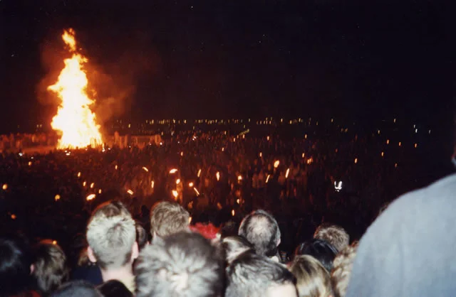_Bonfire_

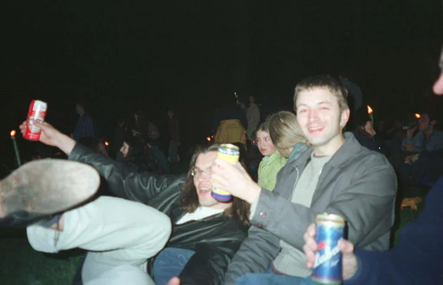_Mark and Paul_

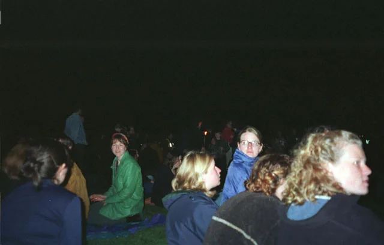_Gathering for the start_

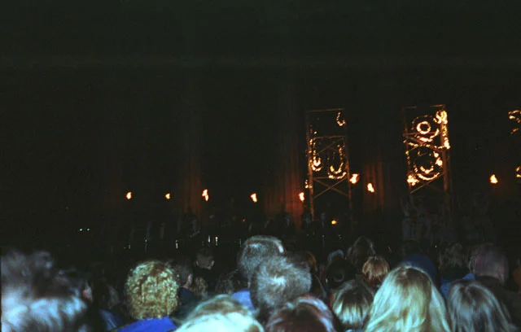

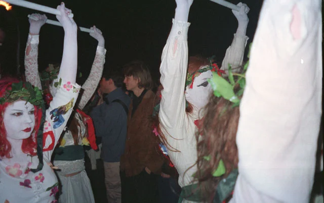

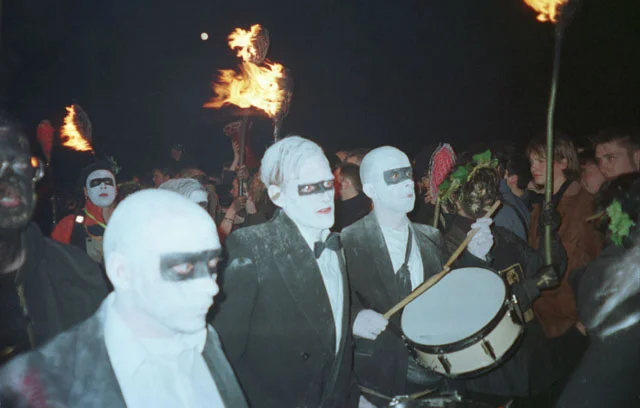

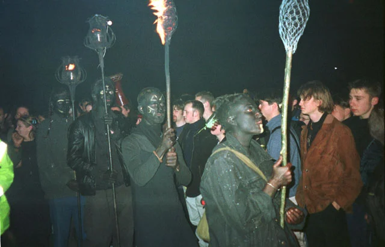

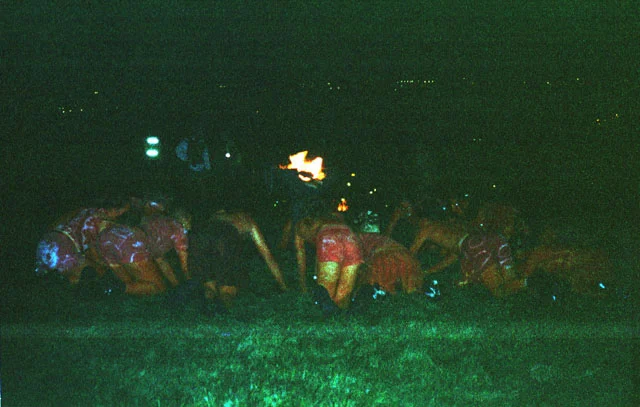

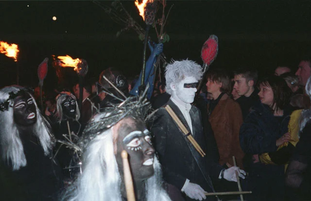

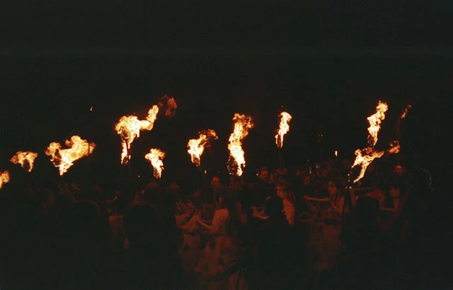

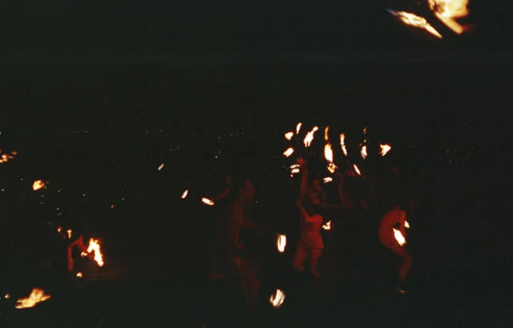

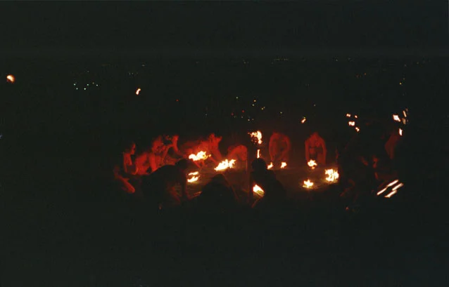

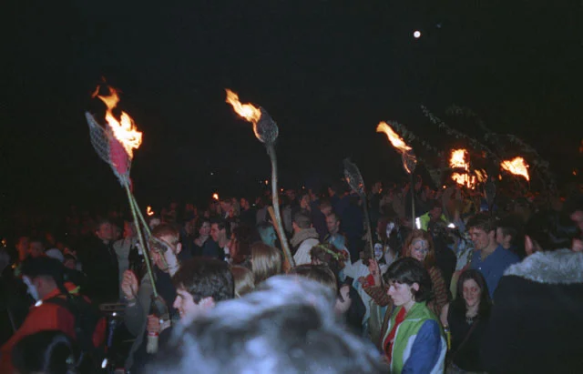

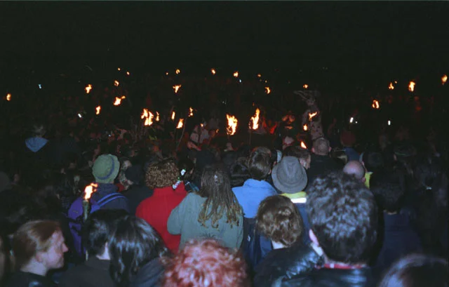

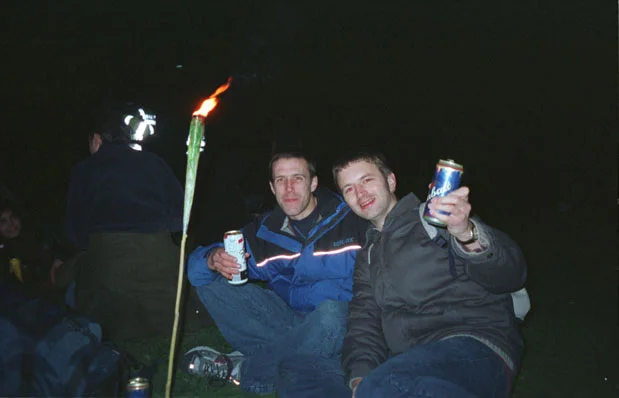_Chris and Mark, hale to the ale_

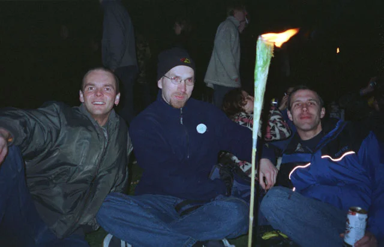_The 3 Amigos after a few beers_

## References

- The Beltane Festival [Website](https://beltane.org/about-beltane/)
