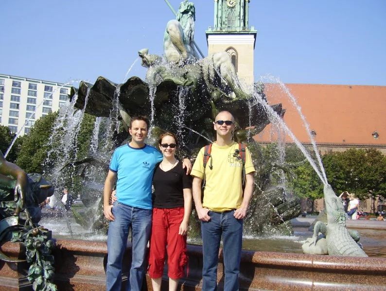
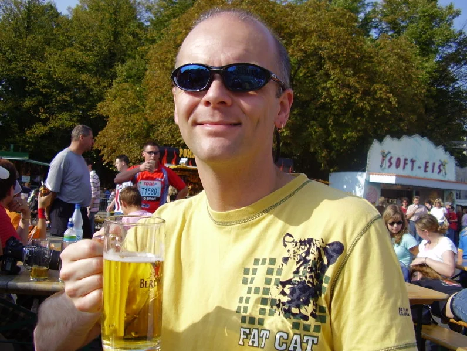
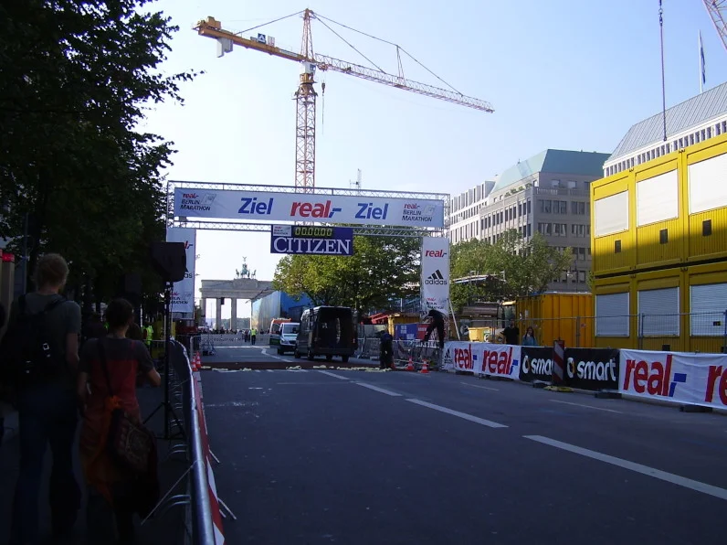
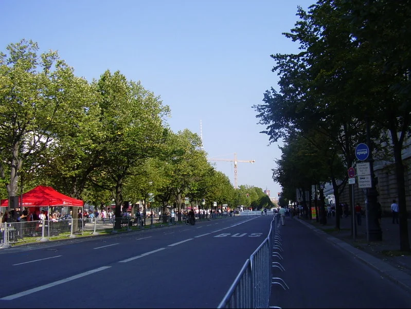
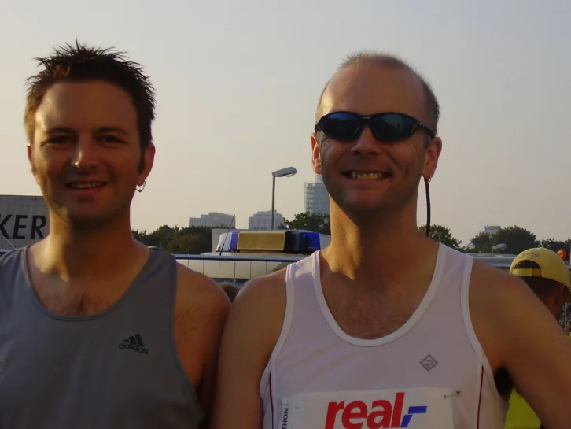
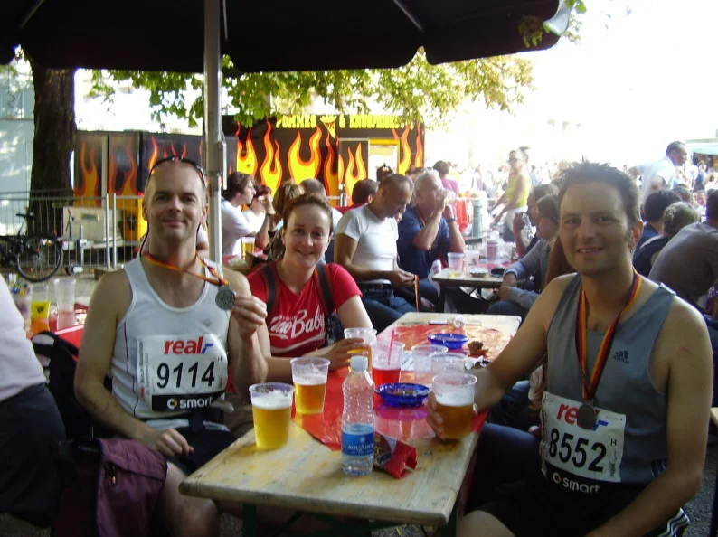
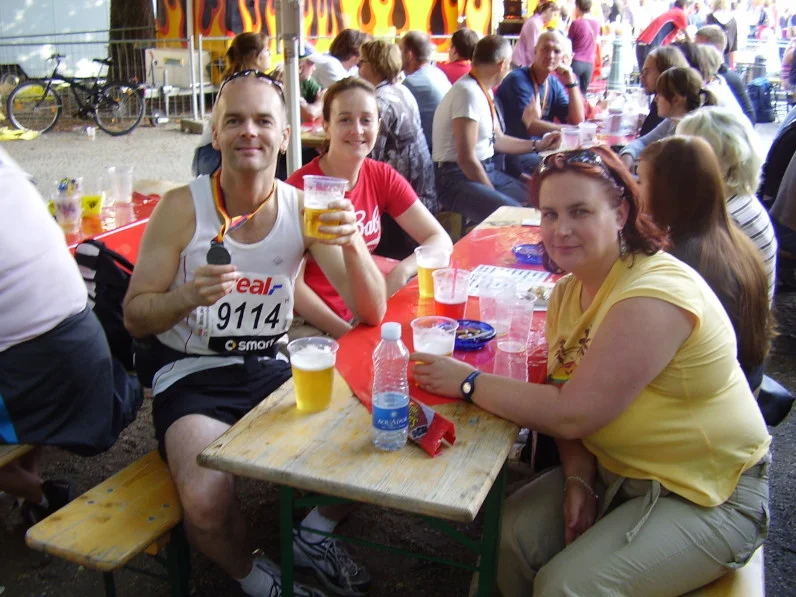

## Preamble

During the summer months of 2004, while we were having a few beers at [The Pond](https://www.edinburghlive.co.uk/best-in-edinburgh/restaurants-bars/iconic-neighbourhood-edinburgh-pub-reopens-21079002) in Edinburgh. Myself and some of my mates decided it would be a grand idea for us all to run a marathon together (great idea ehh?), back in those days we were all a bit unfit, and maybe liked having a few too many beers.

As with all great ideas conceived in pubs, when the cold light of day hit, almost everyone dropped out, so when we had a wee chat about it the next time we were out, there was only 2 still standing, [Mark](https://www.dawsoncreative.co.uk/) and myself.

At that point, we were both committed, so we both went online, entered the marathon and started looked into booking accommodation for ourselves and out significant others. This was my fist jaunt at the marathon distance at an official recognised marathon. Things were definitely starting to get real, we agreed that our only priority was to finish, we weren’t fussy about the time, and we were going to treat the whole trip as a holiday (with some running in between). The training went well, the only downside being I had to cut down on the beer at the weekend, near the end of the training I even started to look fit and healthy (always a good thing).

## Memoral Moments

1. Being passed by a man in an [Obelix](https://en.wikipedia.org/wiki/Obelix) fat suit twice, while Mark was using the toilet.
2. Having to walk down steps backwards on the second day because of the [DOMS](https://en.wikipedia.org/wiki/Delayed_onset_muscle_soreness).
3. The beer at the end, best wheat beer I've ever tasted, [Erdinger](https://int.erdinger.de/) sponsored the Marathon that year
4. The Bratwurst at the [end](https://www.mashed.com/1097412/15-types-of-german-sausages-and-how-they-are-made/), it was amazing!

## Finishing Times

| Place | Bib  | Lastname | First Name | Nation | AC  | AC Place | Net      | Finish   |
| :---- | :--- | :--------| :--------- | :----- | :-- | :------- | :------- | :------- |
| 23120 | 9114 | Dickson  | William    | GBR    | M35 | 3831     | 04:39:12 | 04:42:20 |
| 23122 | 8552 | Dawson   | Mark       | GBR    | M35 | 3832     | 04:39:12 | 04:42:21 |

## Event Photos

### Tourists

{: .light .w-75 .shadow .rounded-10 w='1212' h='668' .normal }
{: .dark .w-75 .shadow .rounded-10 w='1212' h='668' .normal }

### Beer in the sun

{: .light .w-75 .shadow .rounded-10 w='1212' h='668' .normal }
{: .dark .w-75 .shadow .rounded-10 w='1212' h='668' .normal }

### The Day Before

{: .light .w-75 .shadow .rounded-10 w='1212' h='668' .normal }
{: .dark .w-75 .shadow .rounded-10 w='1212' h='668' .normal }

### Der Linden Strasse

{: .light .w-75 .shadow .rounded-10 w='1212' h='668' .normal }
{: .dark .w-75 .shadow .rounded-10 w='1212' h='668' .normal }

### On the Day

{: .light .w-75 .shadow .rounded-10 w='1212' h='668' .normal }
{: .dark .w-75 .shadow .rounded-10 w='1212' h='668' .normal }

### At the Finish

#### Prost

{: .light .w-75 .shadow .rounded-10 w='1212' h='668' .normal }
{: .dark .w-75 .shadow .rounded-10 w='1212' h='668' .normal }

#### Cheers

{: .light .w-75 .shadow .rounded-10 w='1212' h='668' .normal }
{: .dark .w-75 .shadow .rounded-10 w='1212' h='668' .normal }

## References

* Wikipedia - [Berlin Marathon 2005](https://en.wikipedia.org/wiki/2005_Berlin_Marathon)
* BMW Berlin Marathon - [Historic Results](https://www.bmw-berlin-marathon.com/en/impressions/statistics-and-history/results-archive/)
