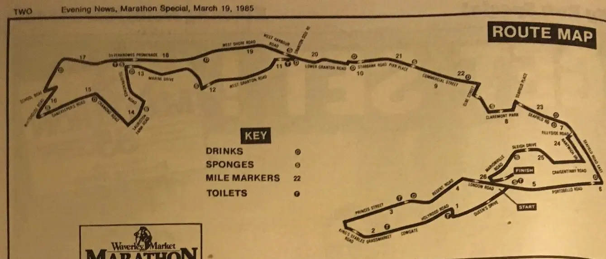

This Edinburgh Marathon started at Princes Street and finished in Holyrood Park, definitely one of my favourite routes  as it took in some of the best of Edinburgh and finished in Edinburgh, rather than Musselburgh where it finishes these days. I think they should really just call it the Edinburgh to Musselburgh Marathon and be done with it. I do understand that I costs more money to close roads off in Edinburgh, but at the end of the day, it's not all about the money.

Saying that, I’m thankful that I got to run that route and I did really enjoy it.

## Photographs

### The Start

### Me Running

### Chris Running

### Me and Mum

### Chris looking nonchalant

## Reference

* Marathon View [Statistics](https://marathonview.net/race/98397)
