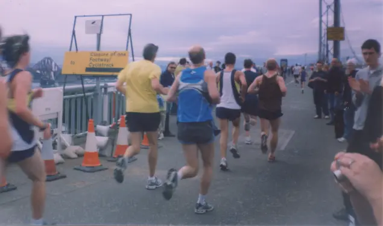
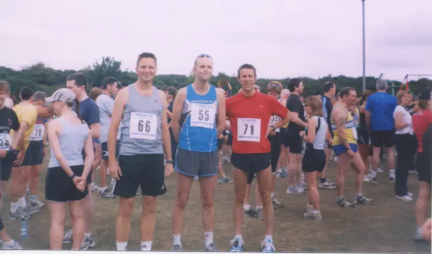
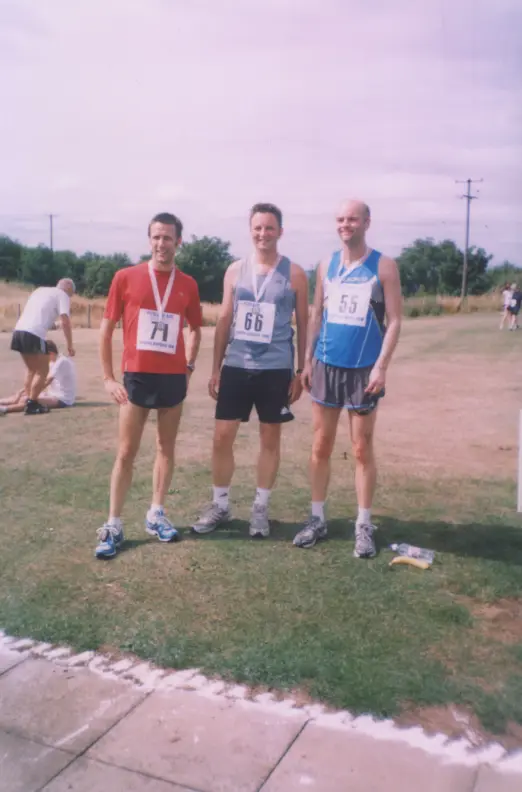

This was my first time running this race, with Mark and Chris, and is soon became a firm favorite with for us all for a while.

It's an out and back course over the Forth Road Bridge, the spread (food and drink) provided at the end is brilliant! One of the runs that I run with my sister, or failing that, some of my JogScotland runner.

## Event Photos

As this run is pre Garmin Gonnect and Strava, I've no stats to show, instead I've posted some photos. If I happen to come across some stats, I'll be sure to post them.

## Reference

Pitreavie [AAC Website](https://pitreavie-aac.co.uk/)
