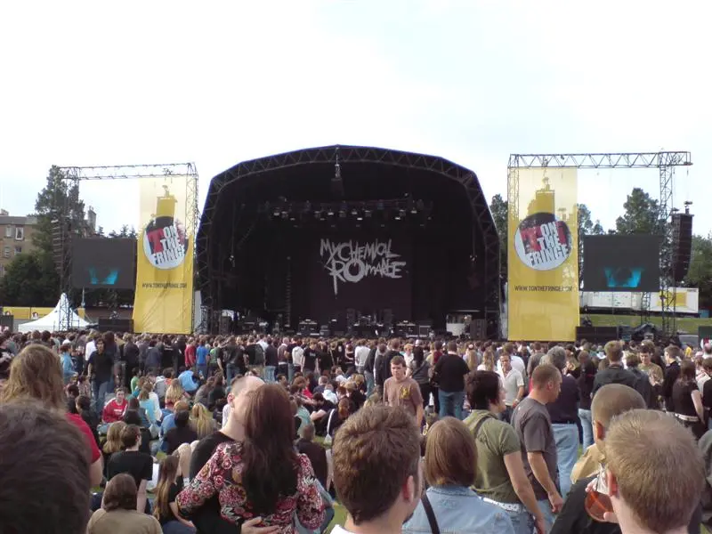
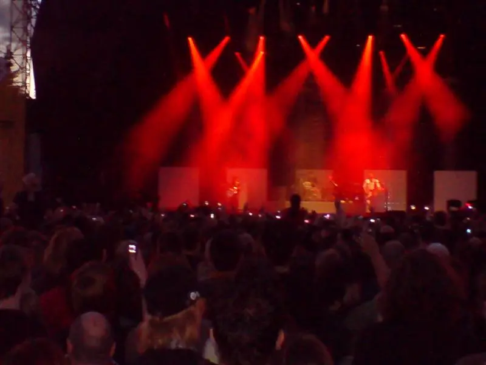
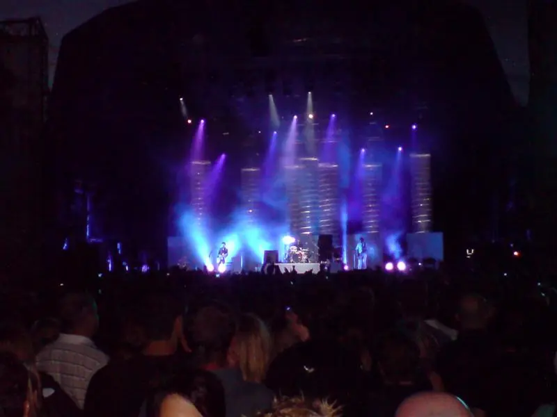

Myself and a few mates went to see [My Chemical Romance](https://www.mychemicalromance.com/) and [Muse](https://www.muse.mu/) play T on the Fringe yesterday, got to say they were excellent and I really enjoyed it. Got a new toy yesterday (The new [Sony Ericsson K800i](https://en.wikipedia.org/wiki/Sony_Ericsson_K800i)) so I took some photo’s of Muse and My Chemical Romance on my phone. Pretty good quality considering its a phone and not a camera.



I’m really going to have to spend more time going to see bands, that must be the first one I’ve seen this year. Note to self “Must try harder!” 😉

## Gig Photos

_Outsite the venue_

_My Chemical Romance 1_

_My Chemical Romance 2_

_My Chemical Romance 3_

_My Chemical Romance 4_

_Muse 1_

_Muse 2_

_Muse 3_

_Muse 4_

_Muse 5_

_Must 6_

_Muse 7_

_Muse 8_

_Muse 9_

_Muse 10_

_Muse 11_

_Muse 12_

_Muse 13_

_Muse 14_

_Muse 15_

_Muse 16_

## References

* [The Edge Festival](https://en.wikipedia.org/wiki/The_Edge_Festival) - formally known as T on the Fringe
* My Chemical Romance - [Wikipedia Page](https://en.wikipedia.org/wiki/My_Chemical_Romance)
* Muse - [Wikipedia Page](https://en.wikipedia.org/wiki/Sony_Ericsson_K800i)
