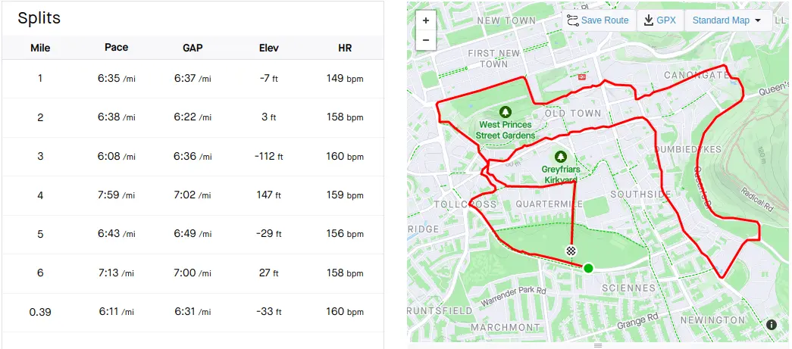

I remember running this one in 2007, it was one of the best 10K runs in Edinburgh, as the route went through all of the scenic parts. It also finished in the Meadows, which was a lovely place to finish.

Strava [Stats](https://www.strava.com/activities/321111505/overview)

## Event Photos

## Route and Stats

