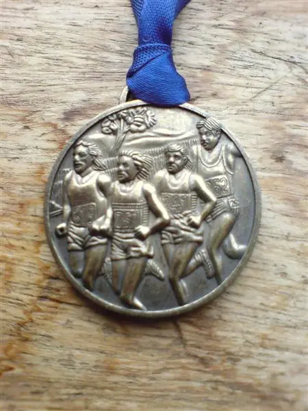

Just finished "The Pitreavie AAC Forth Bridge 10K", this is the second time I've competed in this race, it was hard work but well worth the effort. Going by my running watch I did it in approximately 42 minute, I'll know more when the results come out this week.

## Event Photos

_The three amigos, ready for the off_

_Me in the distance_

_Mark running over the bridge_

_Finishers Medal_

There was a postal strike at the time, so everyone got a home made number.

_Race Number_

## Finishing Times

| Positions | Name and (Number) | Time  |
| :-------- | :---------------- | :---- |
| 45        | Chris Dawson      | 41:16 |
| 48        | Billy Dickson     | 41:54 |
| 207       | Mark Dawson       | 53:50 |

We did quite well considering there were 307 runners on the day, quite a few of them in clubs (apart from us unattached fellows)

## References

* RunABC [Website](https://runabc.co.uk/forth-bridge-10k-august)
* Pitreavie AAC [Website](https://www.pitreavie-aac.co.uk/)
* Pitreavie AAC [Facebook](https://www.facebook.com/pitreavieaac/) page