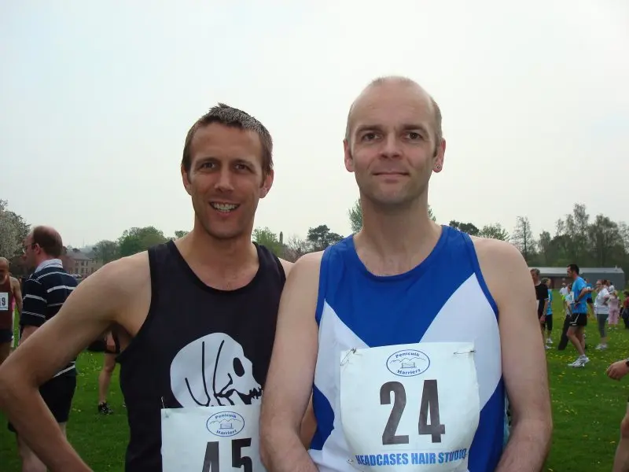
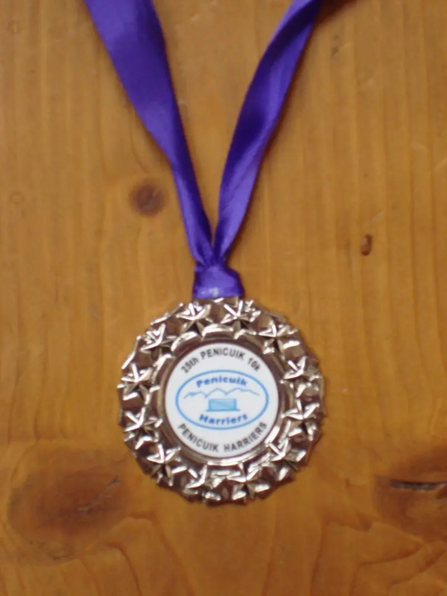

Myself and Chris ran the [Penicuik Harriers 10K road race](https://penicuikharriers.org.uk/10k-road-race/) today, got to say I really enjoyed it, although the start was a tad tough (Uphill for a while) so I was blowing big time for the first 4K or so.

What I found quite surreal, was that having lived in Penicuik. During my formative years I went to Penicuik High School, I found it really quite strange having to walk the hallowed halls of the “Big School” after so many years. That and using the same changing rooms that we used between the ages of 12-16.

The finish was eventful for me because I sprinted the last 100m to avoid getting passed by someone, I love doing that but one of these days, someone will sprint faster and I’ll be passed, it’s not happened yet but it will.

About 10 minutes after we finished the heavens opened and everyone got soaked to the skin, even heard a bit of thunder in the background.
Below are the finishing times and photos of myself and Chris at the start.

## Finishing Times

| Positions | Name                 | Time  |
| :-------- | :------------------- | :---- |
| 30/185    | Chris Dawson         | 41.42 |
| 37/185    | William Dickson (Me) | 42.21 |

## Photos

Penicuik Harriers 10K Road Race.

_Chris and Me_

_Medal Time!_

## Route Map

Below is a google map of the route provided, both provided by Penicuik Harriers.

<iframe src="https://www.google.com/maps/d/embed?mid=1OFamEzCynrZMmd9cVe5XemWfMq4&hl=en&ehbc=2E312F" width="420" height="440"></iframe>
