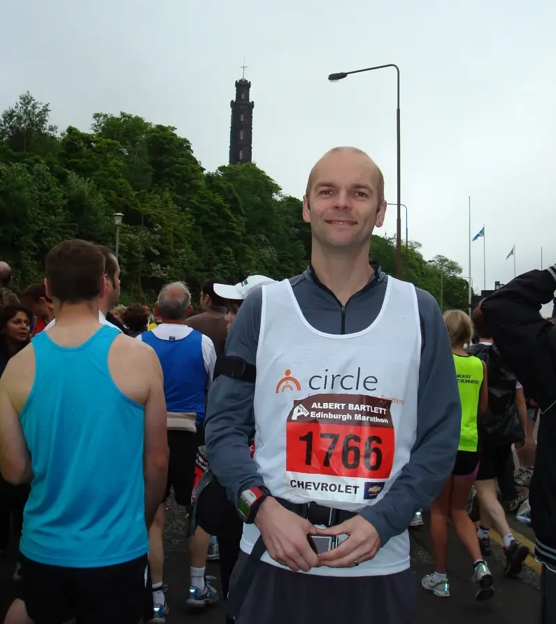
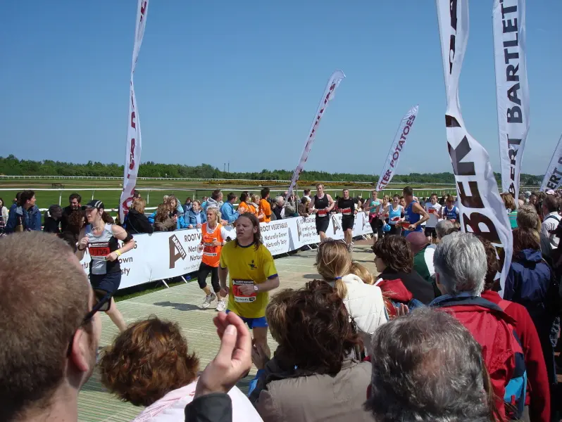
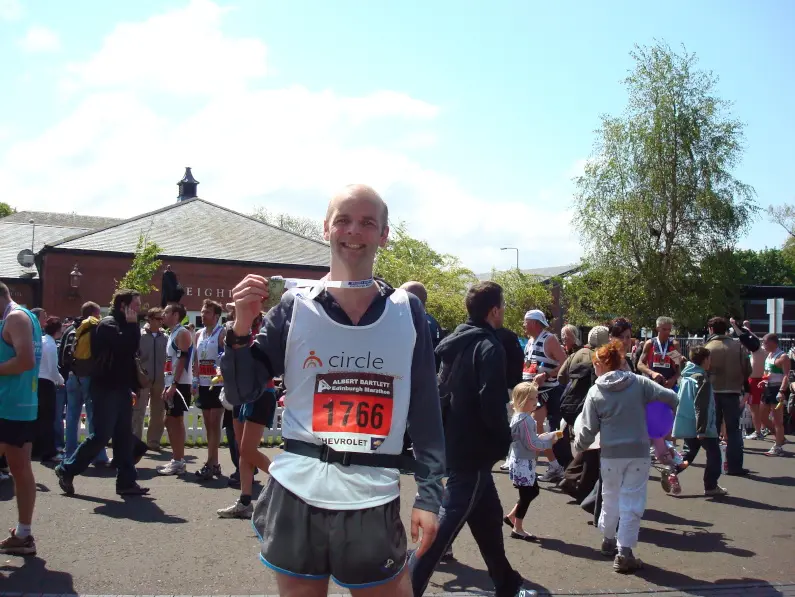
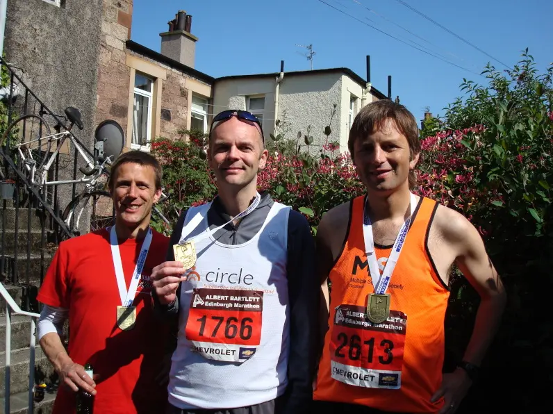

## Preamble

If I remember correctly, it was a cracking day weather wise and not too hot. The main sponsor of the Marathon that year and for many more years was [Albert Bartlett](https://www.albertbartlett.co.uk/), a large UK and Scottish potato supplier.

That year I ran to raised money for the Scottish charity [Circle Scotland](https://circle.scot/), a great charity that help families in and around Scotland.

> Circle is a registered charity working at the heart of communities across central Scotland.   We work with families facing multiple disadvantages because of structural inequality, poverty, drug and alcohol use, imprisonment, physical or mental health, trauma, abuse, and loss.
>
> We believe that every child, no matter their background or circumstances should have the support they need to live a happy and healthy life.

## Event Photos

### The Start

Check out my chunky garmin [Forerunner 305](https://www.youtube.com/watch?v=9DauylbD8ws) great watch back in the day. I loved that watch, although not a much as I love my current watch, which is a fenix 6 Pro.

{: .light .w-75 .shadow .rounded-10 w='1212' h='668' .normal }
{: .dark .w-75 .shadow .rounded-10 w='1212' h='668' .normal }

### At the finishing line

{: .light .w-75 .shadow .rounded-10 w='1212' h='668' .normal }
{: .dark .w-75 .shadow .rounded-10 w='1212' h='668' .normal }

### Finishing photo at Musselburgh

{: .light .w-75 .shadow .rounded-10 w='1212' h='668' .normal }
{: .dark .w-75 .shadow .rounded-10 w='1212' h='668' .normal }

### Chris me and Mark with Medals

{: .light .w-75 .shadow .rounded-10 w='1212' h='668' .normal }
{: .dark .w-75 .shadow .rounded-10 w='1212' h='668' .normal }

## References

* Marathon View [Statistics](https://marathonview.net/race/98395)
* Runners Mentor [Edinburgh Marathon 2019 Review](https://www.runnersmentor.com/post/race-review-edinburgh-marathon-in-the-eye-of-the-tiger)
