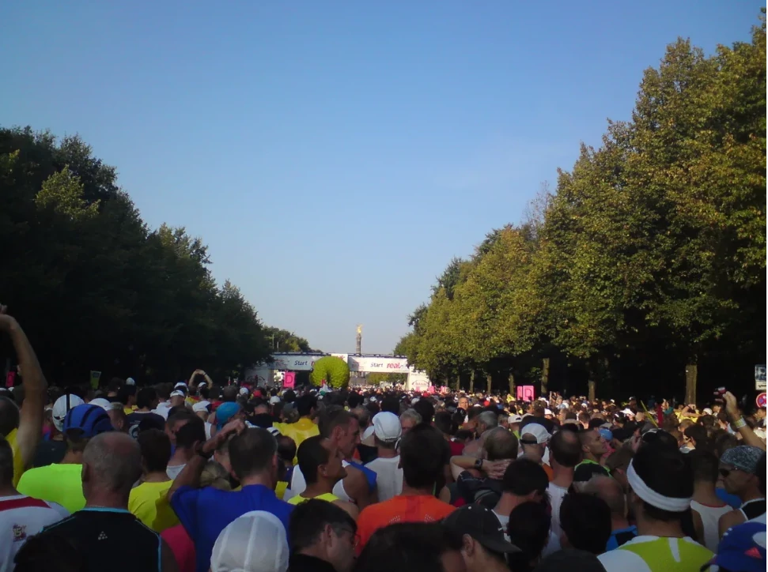
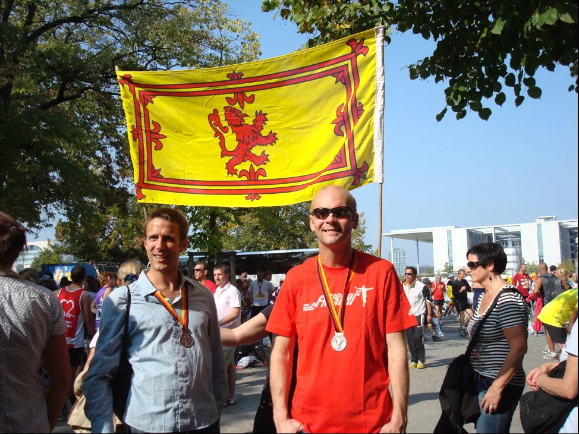
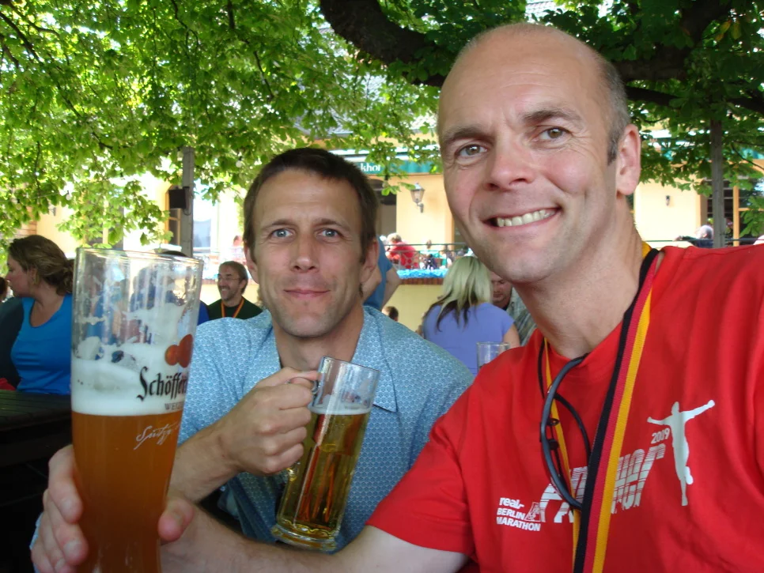
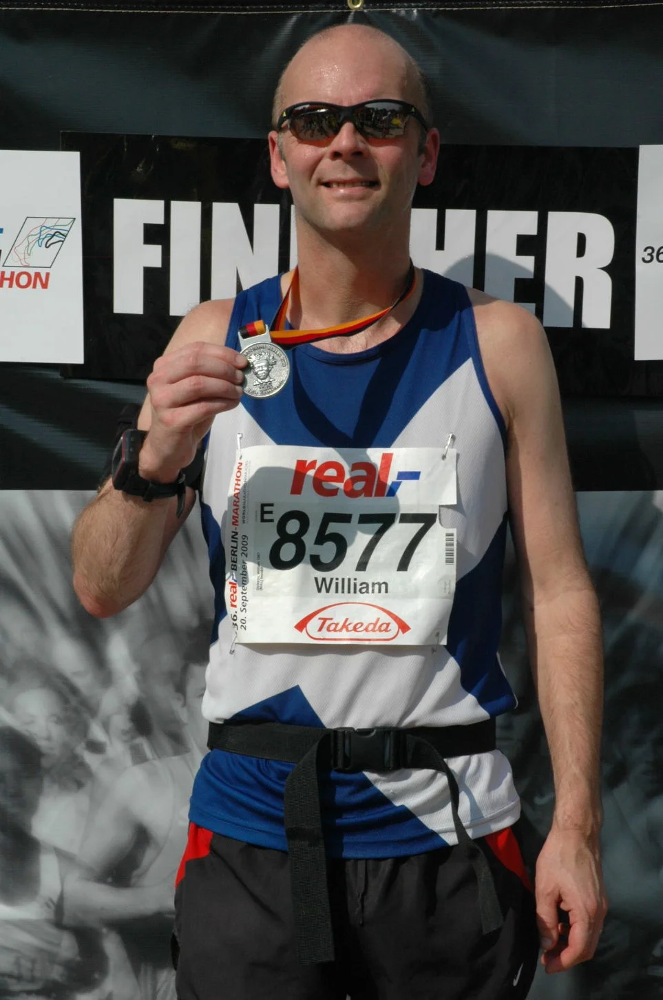
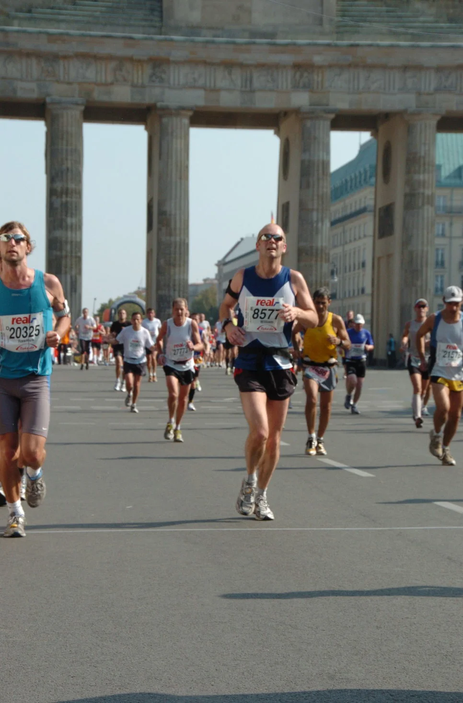
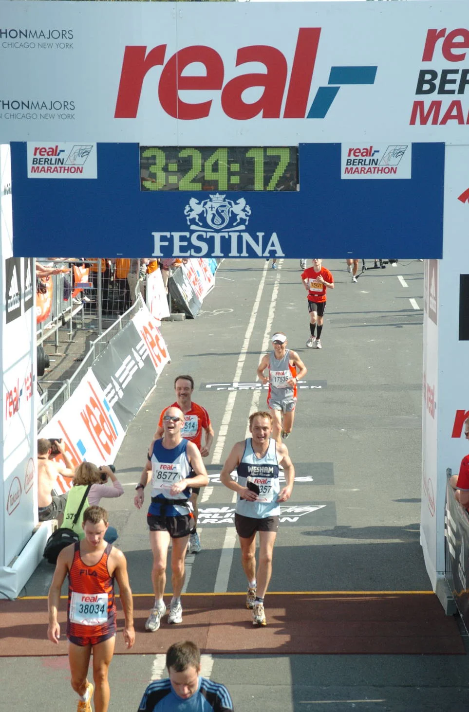
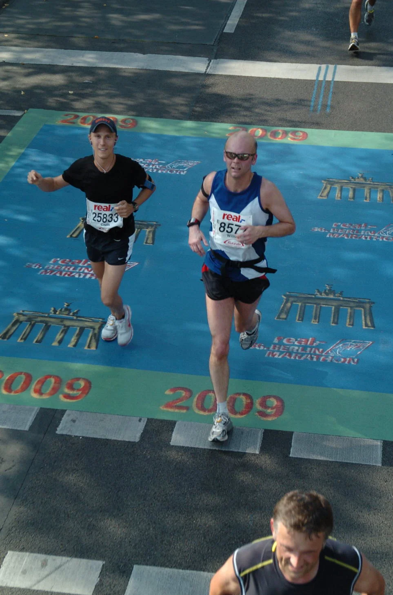

## Preamble

Two weeks ago I ran the Berlin Marathon and I’ve got to say, it’s still one of my favourites. I just seems to be so well organised, a total no brainer to be honest. Well, apart from me getting us lost on the way to the marathon expo on Friday all went really well. I’m thinking it’s just as well to get the “getting lost” thing over and done with on the first day there.

I actually managed a personal best so I’m well chuffed, my good friend Chris managed to pick up an injury at around the 5 mile mark which seriously affected his time (he’s usually faster than me). I will of course not slag him off about wearing a new pair of trainers (only 2 weeks old and still not worn in) for a marathon. Still, we live and learn!

## Memoral Moments

1. The weather was stunning
2. Great company, good food and beer
3. The whole atmosphere on the day, it was really well organised.

## Finishing Times

| Position   | Name            | Time     |
| :--------- | :-------------- | :------- |
| 3440/47000 | William Dickson | 03:20:12 |
| 4853/47000 | Chris Dawson    | 03:27:32 |

## Event Photos



