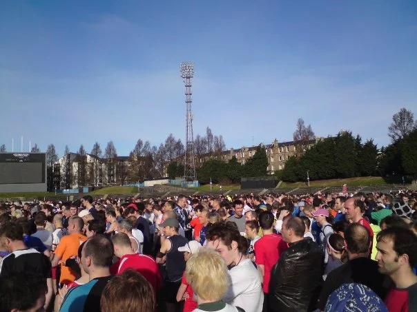
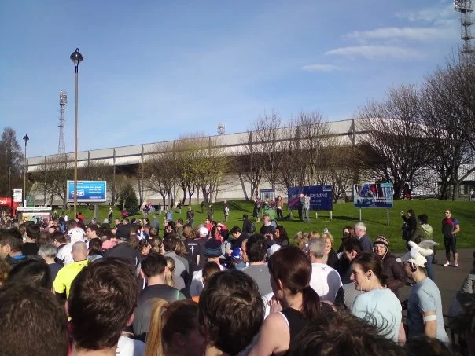
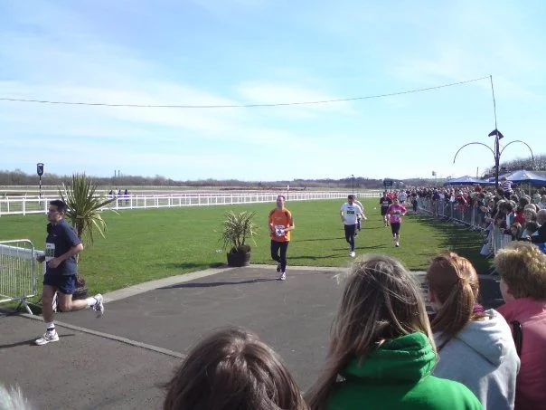
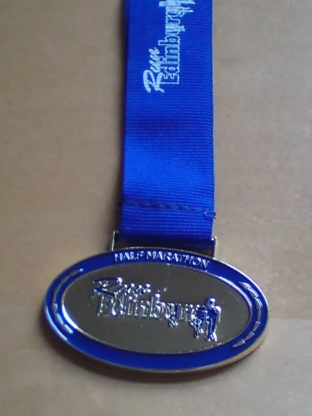

## Preamble

Today myself and my mate [Mark](https://www.dawsoncreative.co.uk/) ran the Chris Hoy Edinburgh Half Marathon, the run started at the Meadowbank Stadium, it wound its way out of the city to the Firth of Forth coast at Portobello, and then headed southwards along the coastline to a grandstand finish at Musselburgh Racecourse.

The weather was surprisingly good, sunny with a little breeze. I actually managed to get a personal best. So I was well chuffed, looks like things are looking good for the Albert Bartlett Edinburgh Marathon this year. The only bad thing is that I think I'm coming down with a cold (felt a bit snotty this morning), so tonight I'm going to dose myself with Vitamin C and have an early night, fingers crossed.

## Results

| Position   | Name             | Time     |
| :--------- | :--------------- | :------- |
| 192/2470   | William Dickson  | 01:31:45 |
| 1602/2470  | Mark Dawson      | 02:01:30 |

## Event Photos

_Before the start_

_Outside Meadowbank Stadium_

_Mark at the Finish_

_The Finishers Medal_

A nice sunny Sunday run 🙂
