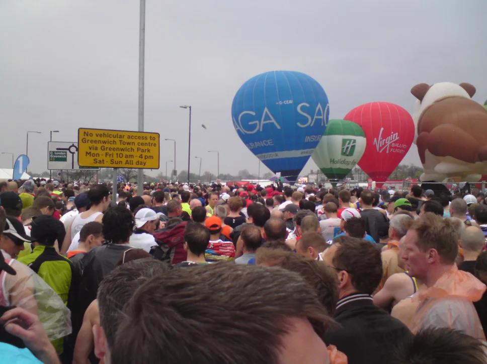
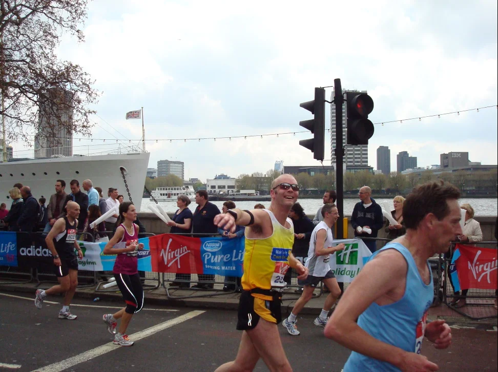
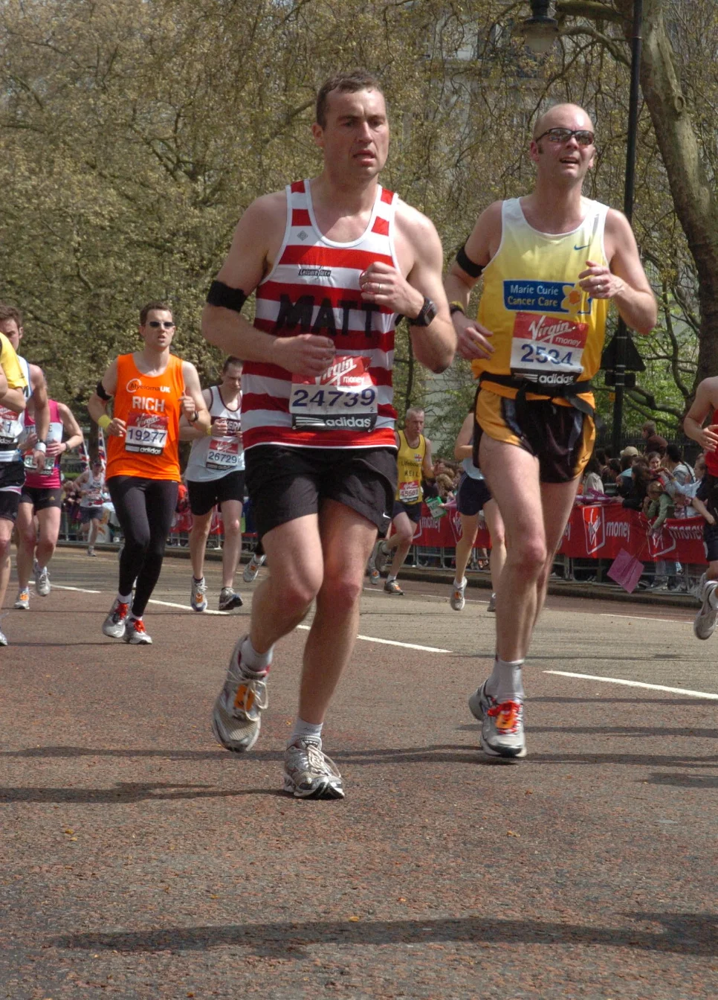
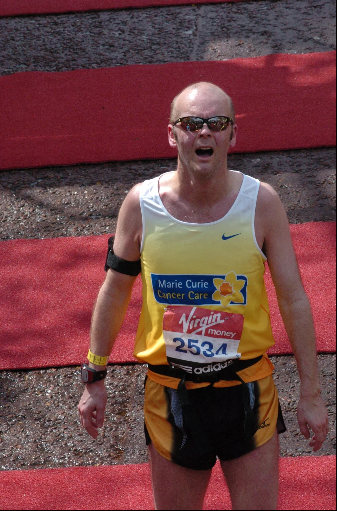
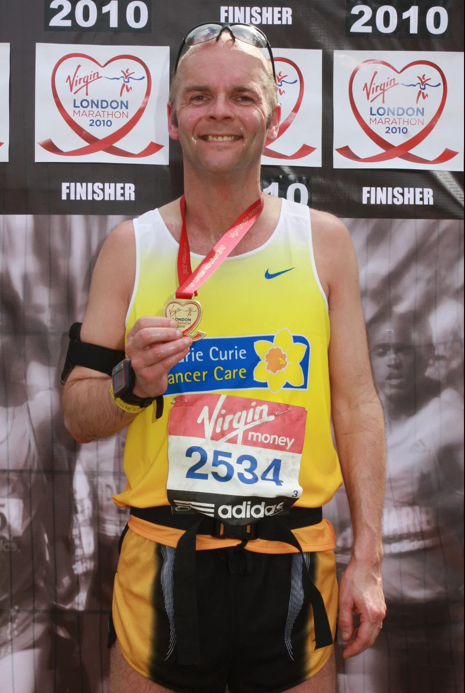

It was a fabulous opportunity to be able to run the Virgin London Marathon, times below. I’m going to take a week off and just relax, maybe next week I’ll do a little work at the gym (probably cardiovascular), I think I’ll give my legs a rest for the full 2 weeks before starting to run again.
I more please with raising money for [Marie Curie Cancer Care](https://www.mariecurie.org.uk/) who are a fabulous bunch of guys, I would certainly run for them again given the chance.

## Memorable Moments

1. Running over Tower bridge
2. The whole atmosphere, which was just magical
3. Spending time with my Uncle Michael and Auntie Anna who I don't see often.
4. Spending time with my my very pregnant wife who did brilliantly getting around

## Finishing Time

| Person     |                         |
| :--------- | :---------------------- |
| Name       | Dickson, William (GBR)  |
| runner no. | 2534                    |
| cat        | 40-44                   |

| Total          |          |
| :------------- | :------- |
| place (total)  | 3552     |
| place (gender) | 3185     |
| place (cat)    | 702      |
| finish time    | 03:24:59 |

## Event Photos

_London Marathon - The Start_

_During the Run - Photo 1_

_During the Run - Photo 2_

_Finish Line - Smiling on the inside Honest!_

_Finish Line with Medal_
