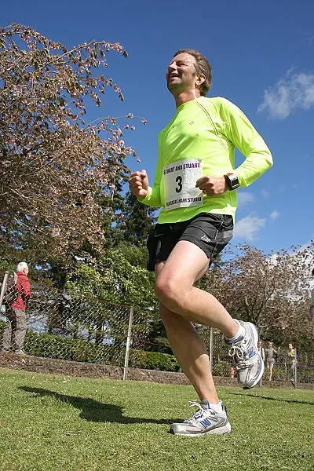
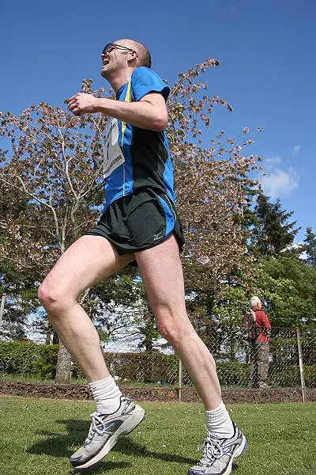
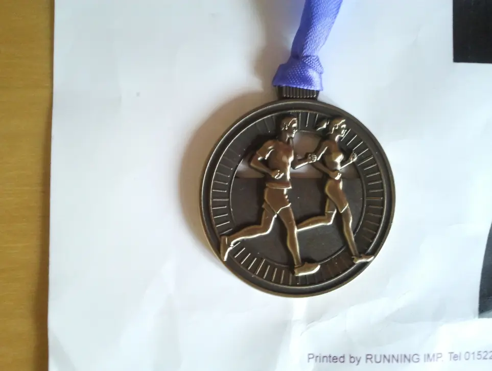

This is my local [running clubs](https://penicuikharriers.org.uk/) [10k road race](https://penicuikharriers.org.uk/10k-road-race/) and I really love running it, the years I'm not running it, I'm helping the club marshal it. The course is described as _undulation_, but those in the know would describe it as uphill at the start, especially Pomathorn Road.

However you want to describe it, I always enjoy it and it's a fabulously organised 10k road race.

## Results

| Number | Position | Name            | Club | Time    | Catagory |
| :----- | :------: | :-------------- | :--- | :------ | :------- |
| 3      | 113      | Mark Dawson     |  UA  | 0:52:38 | M40      |
| 7      |  44      | William Dickson |  UA  | 0:44:00 | M40      |

## Event Photos

_Mark Dawson_

_Me almost at the Finish_

_Finishing Medal_

## Route Map

<iframe src="https://www.google.com/maps/d/embed?mid=1OFamEzCynrZMmd9cVe5XemWfMq4&hl=en&ehbc=2E312F" width="420" height="440"></iframe>
