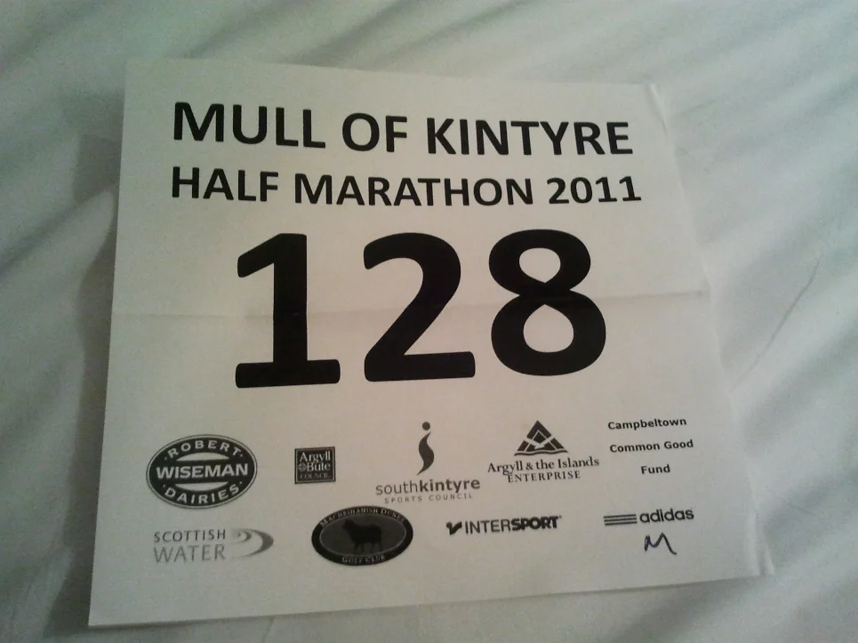
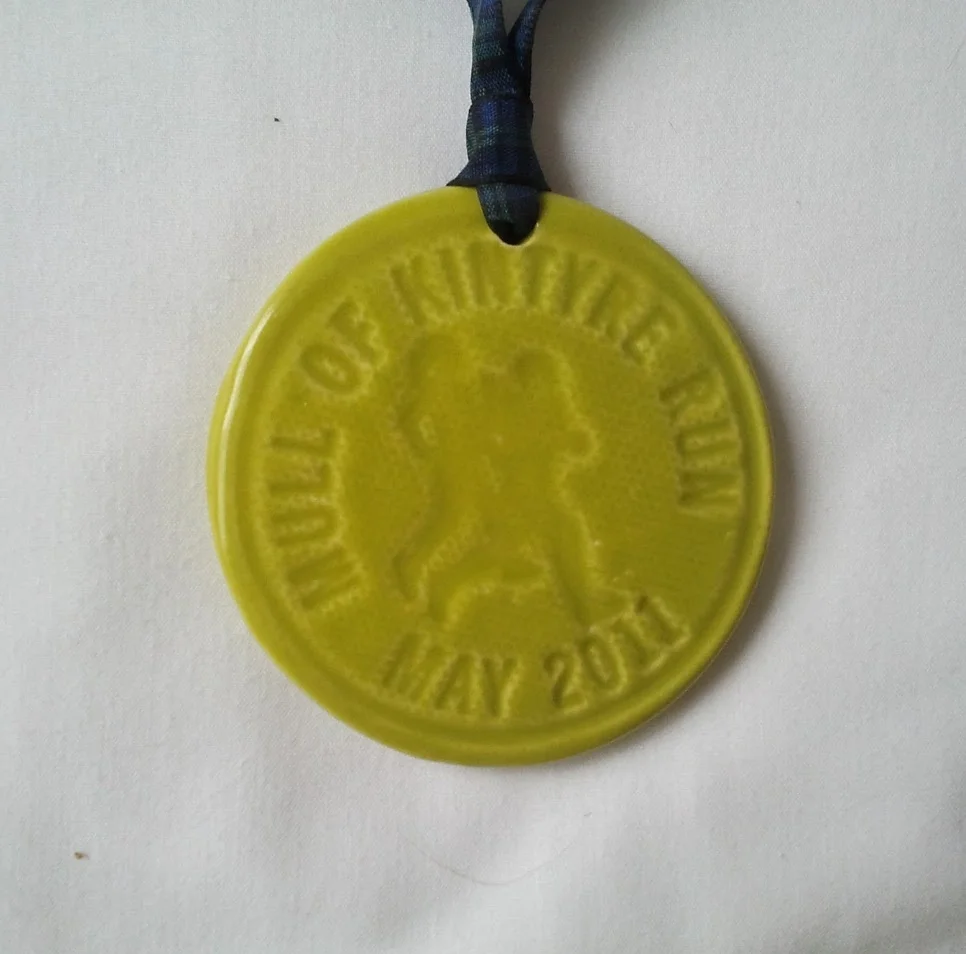

Not a lot of photos of this one, as we just drove up the day before and stayed the night. Still, I do remember it being fun and the running on sand bit being challenging. I do remember the medal being ceramic, which is fairly unusual and the only ceramic medal that I have in my collection, at least it won’t rust like some of the other I own.

## Route

See the route description from their website, link in references.

> The Half-Marathon route is mostly flat with a slow incline as the race leaves town in miles 2 and 3.  The A83 from  Campbeltown to the Craigs’ Farm is a busy road but will be well marshalled.  Please follow instructions and cross  as directed.
>
> The section from beyond Clochkeil Farm to the beach (approx 1,000m) crosses the Machrihanish Dunes golf course. Marshals and signs will highlight the route but extra care should be taken here.  This section is run in reverse coming off the beach.  Beach conditions can vary.  Marshals & Coastguard 4x4 vehicle will be present  and will mark out the best route. The section on the beach is approximately 1 mile.

## Finishing Times

| Postition | Name    | Surname | Finishing Time |
| :-------- | :------ | :------ | :------------- |
| 44        | Chris   | Dawson  | 01:42:22       |
| 62        | William | Dickson | 01:46:14       |
| 137       | Mark    | Dawson  | 01:57:25       |

## Photos

_Running Number_

_Ceramic Medal_

## References

MOKRUN Website - www.mokrun.com
