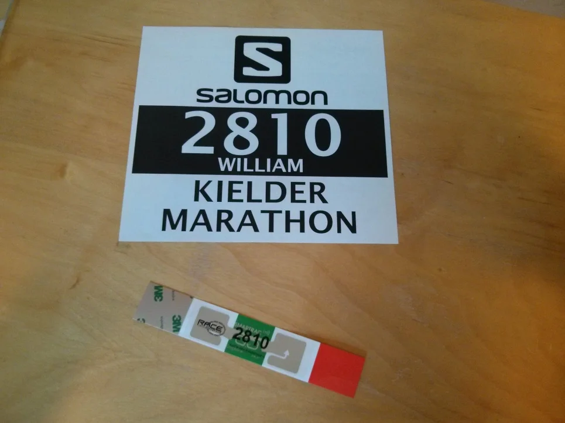
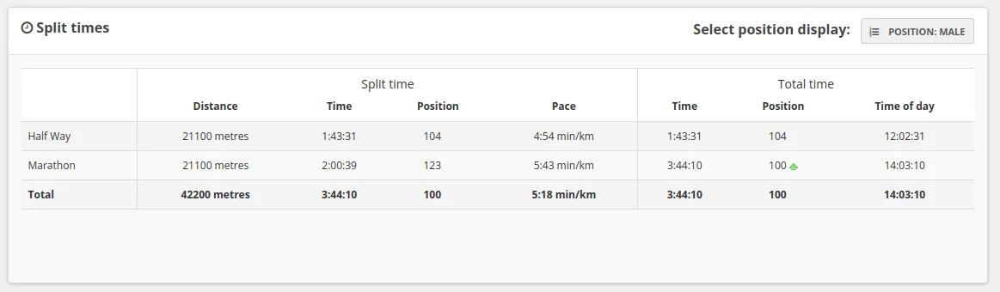
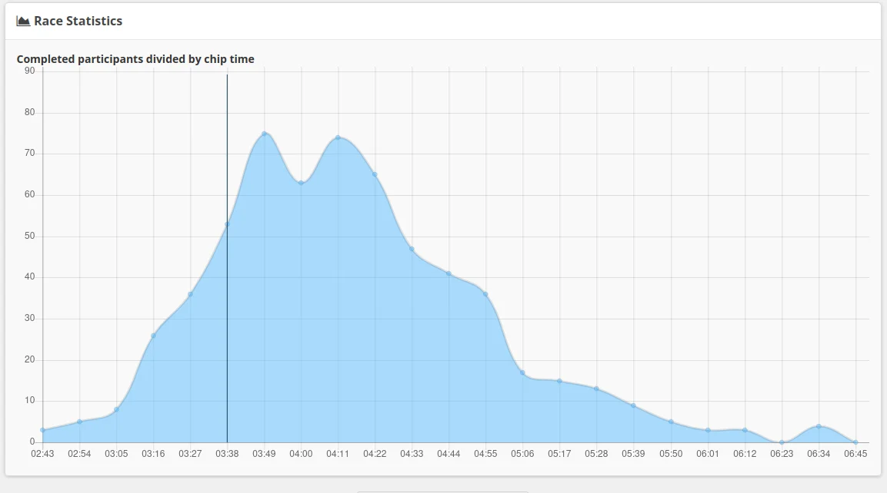

After our usual discussion about the run in the pub one night, myself and Chris decided to run it together. But as it happened, Chris was a bit injured and didn’t manage to get enough training done, and being the sensible lad that he is, he decided not to run. Being a good mate, he did however run me down in his car, as we had already arranged digs down there. He also cheered me off at the start and cheered when I crossed the finish line.

Although, I've only got a few photos of this one, it's one that I really did enjoy. It's advertised as Britain's most beautiful marathon, and the scenery really is stunning. It’s also fairly hardcore and I’m glad that I did the right amount of training, which included hills, otherwise I would have really  struggled. I  had a chat with someone at the start line (another runner) who assured us, that if we added an hour to our PB (Personal Best), I would be doing well, as it happens, my finishing time was only about 30 minutes outside my PB, so I was fairly happy with that.

At the finish line, my calves were in tatters, I managed to stretch a bit standing up, I then sat down in the hope of stretch my legs some more. Unfortunately, at that point my calves started to spasm and I had to lie down until that stopped. Thankfully, a lovely lady came over to ask if I needed help, I would imaging she noticed my predicament and being the good Samaritan that she was, offered to help me stand (yep that happened). 😀

## Race Number

## Finishing Stats

| Position        |             |
| :-------------- | :---------- |
| Overall         | 118 of 826  |
| Male            | 100 of 601  |
| Veteran 40 male | 39 of 233   |

| Details         |                  |
| :-------------- | :--------------- |
| Distance        | 42200 meters     |
| Chip Time       | 3:44:10          |
| Finish Time     | 3:45:11          |
| Start Time      | 10:19:00         |
| End Time        | 14:03:10         |
| Date            | 05 October 2013  |

_Split Times_

_Race Stats_

## References

* Kileder Marathon [website](https://kieldermarathon.com/)
* My result was posted [here](https://resultsbase.net/event/1443/results/747676)
* The Chronicle Live [photos](https://www.chroniclelive.co.uk/news/north-east-news/gallery/kielder-marathon-2021-photos-northumberland-21749539) of the Kielder Marathon 2021
