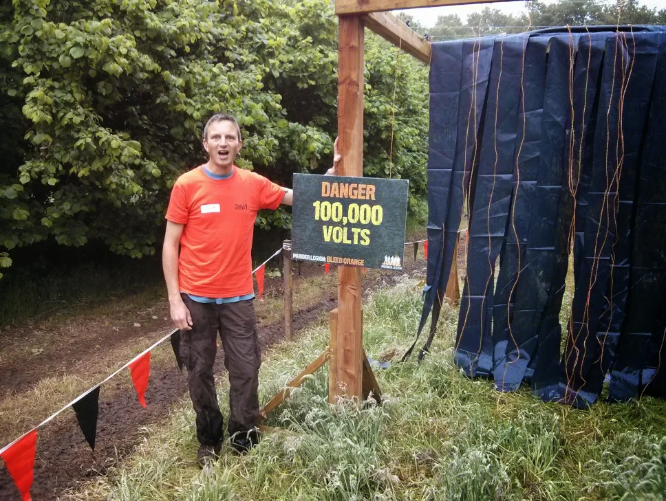
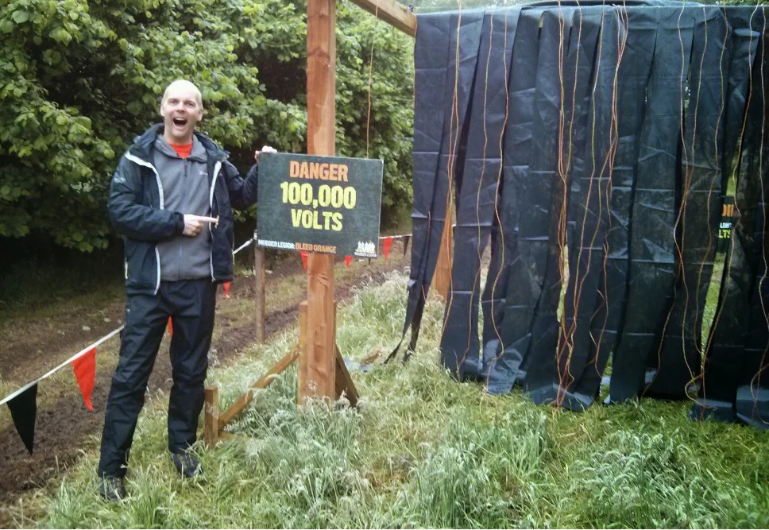
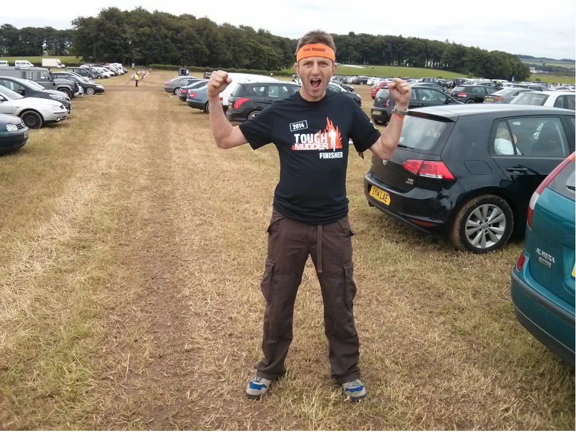
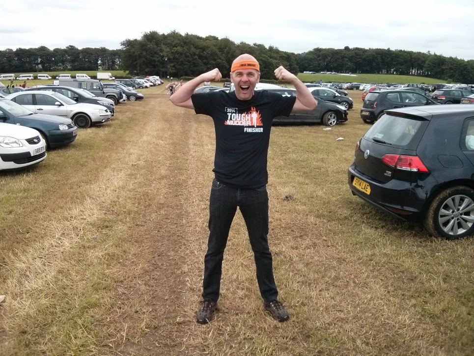

Mark and myself volunteered to help out the day before our event, our obstacles was the 100,000 volt shocker, bet that would sting!! Well, we had to convince everyone that it would, me and Mark had a ball of a day with that one. 😉

There was of course a money off voucher at the end off  the day, which was nice.

Venue:
Dalkeith Country Estate
Edinburgh, United Kingdom - [View Map](https://maps.app.goo.gl/PMxbQ6LeJ1va18aR7)

## Before the event

_Volunteer Mark_

_Volunteer Billy_

## Official Video



## After the event

This was the first time that Mark and I completed the Tough Mudder, spot the orange headbands of the newbies! It ended up being a great day that we both enjoyed, the only fly in the ointment being Mark cracking a rib on one of the obstacles and I had to phone his missus (the lovely Jan) to explain what had happened.

_Marcus_

_Me myself and I_

## Course Description

### Arctic Enema

This obstacle is all about mental grit. Many athletes use ice baths for recovery, but you’ll have a difficult time relaxing your muscles in this frigid dumpster. First you must bravely jump into Big Mudder’s floating iceberg abyss. Once submerged, find the mental and physical strength to swim through the ice, under a wooden plank and pull yourself out on the other end before you become hypothermic.

### Bale Bonds

Hurl yourself over (or through) a stack of hay bales – and watch out for the pitchfork inside! You’ll need a strong core to get over this mountain and help your teammates complete this obstacle. The hay bales present a unique challenge with an uneven surface and loose hay making it difficult for Mudders to get a good grip while climbing. Once you get to the top, help Mudders behind you by giving them a hand! You can train for Bale Bonds by strengthening your core with planks, side planks and dips.

### Ball Shrinker

This obstacle earned its name because it’s almost impossible to conquer without getting at least half submerged into an icy pool of water. Mudders must cross a body of water with just one rope overhead to hold, and another below to walk on. The rope is slippery, and tends to get water-logged causing it to sag deeper and deeper into the water as the day goes on. This obstacle requires mental grit and persistence to successfully complete. Forget about trying to keep your jewels warm, just suck it up and Mudder on.

### Berlin Walls

This obstacle relies on teamwork. Scale three 12′ wooden walls with the help of your teammates, strategically placed for when you are at your weakest during the event. While some Mudders have worked up the strength to ascend the walls alone, most need a boost from a fellow Mudder — they got your back, literally.

### Boa Constrictor

If you don’t like small spaces, this obstacle will be a challenge for you. Crawl through a series of pipes that force you on a downhill into some freezing mud, then a slippery uphill to the other side. Your legs will be useless in the narrow confines of the Boa, so use your arms to pull yourself through this obstacle. There really is light at the end of the tunnel.

### Braveheart Charge

Charge onto the Tough Mudder course with a start wave full of pumped-up Mudders. Battle cries are essential! The Braveheart Charge marks the beginning of every Tough Mudder obstacle course. Some courses navigate straight up a hill or mountain as soon as Mudders exit the start area. It’s up to you to decide whether you want to charge full-steam ahead or use the slow & steady approach. The Mudders go marching one by one, ooh rah.

### Cliffhanger

Cliff Hanger is an obstacle all about teamwork and camaraderie: a 40+ foot cliff of slippery mud angled at 45-degrees. The Cliff always begins with good intenions: a muddy sprint up onto the slope and transitions into a crawl with handholds and footholds in short supply. Beware if you attempt this obstacle alone, your futile verticle scramble will likely turn into an uncontrolled slide back down into the mudpit below. Successful Mudders will form a chain link of fellow participants slowly inching up the slope. If you want to train for Cliff Hanger you should find the biggest hill near your house, measure it, then drive until you get to a hill twice as steep.

### Devil’s Beard

A cargo net fastened to the ground that Mudders must pass underneath. Try as you might, you will get caught up in this annoyingly low cargo net. Teamwork is essential to get through this obstacle, otherwise you’ll be forced down to the ground by the weight of the cargo net. On some courses, Devil’s Beard is placed on an uphill, adding gravity to the already strong forces pushing you downward.

### Dirty Ballerina

Leap with the grace of a black swan muddily over our 4-foot-wide mud pits. 4 feet may not sound challenging at first, but the tracks of leaping Mudders will erode the mud pits into wide, jagged-edged muddy gaps. Should your inner ballerina stumble, as she often can, you’ll find yourself submerged in a mud pit and calling your teammates for an assist.

### Electric Eel

Mudders frequently forget about this obstacle since they’re so focused on Electroshock Therapy – but they shouldn’t. Slide on your belly through frigid water or, even worse, a layer of ice and beware of the shocks overhead. Should you try to crawl on your knees, you’ll be smacked with live wires and your body will compulsively contort. Be sure to protect your head, otherwise you might experience what Big Mudder calls a brain reboot.

### Electroshock Therapy

Sprint through a field of live wires — some carrying as much as 10,000 volts of electric shock. Watch out for hay bales and deep mud, or you will face-plant into some electrifying mud. Some Mudders try to stealthily wind their way through the wires without getting shocked, while others barrel forward to get through as quickly as possible. Either way, you are guaranteed to get zapped with as much as 10,000 volts of electricity and it does NOT tickle. This is typically the last obstacle Mudders must overcome before they cross the finish line.

### Everest

Snowboarders and skate boarders have the half-pipe. Mudders have a real obstacle: Everest. A quarter-pipe that you’ll have to sprint up and enlist the help of other Mudders to hurl you over this beastly summit. Everest is coated in mud and grease, a combination which will likely send you right back from where you came. Call upon other Mudders to catch you as you run up the quarter-pipe or work together to form a human chain so that you can scale someone’s shoulders to finally summit Everest.

### Fire Walker

As the name of the obstacle implies, you’ll be running through a trench of blazing, kerosene-soaked straw. You can expect flames at least 4 feet tall. While the flames might seem like the most intimidating aspect of this obstacle, Mudders often forget that with fire comes smoke. Take a deep breath before you enter this obstacle because believe us, you don’t want your lungs full of this thick smoke. Build up your lung capacity while training for Tough Mudder or you’ll be forced to inhale some nasty carcinogens.

### Funky Monkey

Sure monkey bars were easy when you were 5 years old, but you’ll need to hold on extra tight to these. Some have been greased with our finest mixture of mud and butter and if you slip you’ll fall into an icy pond below. Bars are spaced 1.5 feet apart and you will be on an incline upward for the first half of the Monkey and then descending downward for the second portion. Seasoned Mudders keep their arms bent at a 90-degree angle and bicycle-kick their legs to gain momentum.

### Gauntlet

Prepare to feel like you’re at a South American political demonstration as you get high-pressure hosed from both sides while climbing a steep, muddy incline. Usually, Mudders are already soaked to the bone and quite cold when entering the Gauntlet. This obstacle is as mentally challenging as it is physically, and definitely contributes to the “Tough” in Tough Mudder.

### Glacier

The concept is simple: summit a frigid glacier. Your hands and feet will freeze while you try climb this big-ass pile of snow and ice. The longer you take, the colder you’ll get. Try to move quickly to preserve warmth and mobility in your extremities!

### Greased Lightning

Have some fun sliding down this massive slippery slope into a frigid, muddy pool of water at the bottom. On some courses, Greased Lightning is built on a snowy hill making for some literally cold-ass Mudders. Inflatable inner-tubes and pool toys are welcome! Real Mudders go head first.

### Hangin’ Tough

Swing Tarzan-style across a series of hanging rings suspended over a pool of ice-cold water. Rings are placed 4 to 6 feet apart. It is important to maintain momentum and coordination while swinging across this series of rings. A strong grip and precise coordination are required to complete this obstacle successfully.

### Hold Your Wood

Make like a lumberjack and carry a heavy log through a section of the Tough Mudder course. If the course is flat, expect to be lugging your log for at least 1/2 mile. If the area is hilly or mountainous, get friendly with your wood because you’ll be hauling it up a steep and challenging ascent.

### Kiss of Mud

Eat dirt as you crawl commando-style under barbed wire set 8 inches from the ground. This obstacle is true to it’s name – Mudders must belly-crawl through mud in order to avoid getting snagged by the barbed wire above. On some courses, the Kiss of Mud is set on an uphill, increasing the level of difficulty. To prepare for this obstacle, start crawling in any mud you come across, or, do our Tough plank series (alternating low & high planks – fast!).

### Log Bog Jog

Jump over and crawl under large logs strewn across the course. This may not sound very difficult, but with fatigued muscles and logs placed at varying heights, the Log Bog Jog has proven to be a challenge for Mudders. To prepare for this obstacle, find a bunch of fallen trees to scale & crawl underneath. If you don’t have an abundance of fallen trees nearby to train with, belly-bombers (also known as burpees) will suffice.

### Mud Mile

Slosh through up to a mile of waist-deep sludge as you try not to lose your shoes in the mud. Balance and coordination are required if you want to make it through this obstacle without face-planting… but what’s the fun in that? Real Mudders eat mud for breakfast. On some courses, Mudders will encounter obstructions throughout Mud Mile that require them to fully submerge in the mud to slosh onward.

### Spiders Web

Crawl like a spider up and over a cargo net suspended between two trees – keep a good grip or you will fall into a tangled web (er, cargo net) below! The net is fastened with tension at the top only, leaving the bottom of the net loose and unsteady. Teamwork has proven to be very helpful for successfully completing this obstacle. Mudders will pull the bottom of the net towards the ground to create tension so their teammates can climb with balance and control.

### Trench Warfare

This military-style obstacle requires Mudders to crawl through narrow, dark, muddy trenches. Watch out for rocks, obstructions, and the occasional splash of muddy water from the Mudder crawling ahead. We advise all Mudders to move quickly through this obstacle to reduce the risk of contracting gangrene or trench foot. These trenches will test the stamina and mental grit of all Mudders, especially those who fear dark, confined spaces.

### Turd’s Nest

Crawl over this suspended cargo net – make sure you don’t fall! Watch out for raging rivers, barbed wire or Mudders running below. The cargo net can feel unsteady and Mudders risk getting limbs tangled in the ropes if they fall through the gaps. Balance and coordination are required to successfully complete this obstacle.

### Twinkle Toes

This obstacle’s not as easy as it sounds. Call upon your inner chi to maintain balance and carefully traverse a narrow wooden beam or risk falling in yet another ice-laden pond. Mudders are known not only for their strength and stamina, but also for their balance and agility. Just remember to breathe.
Underwater Tunnels:Bob underneath rows of floating barrels as you battle the frigid water temperatures. This obstacle requires mental grit, as extreme cold can be as challenging mentally as it is physically. Focus on breathing, and move quickly through the water to complete the Underwater Tunnels and warm up once you are ashore. You can prepare for this obstacle by swimming in ice-cold bodies of water, or taking cold showers. Try to regulate your breathing and control your heart rate in order to acclimate your body to cold water conditions.
Walk The Plank: Test your fear of heights and cold all in one with our 15+ feet high jump into freezing water. Mudders like to display their fancy diving skills (or belly-flops) at this obstacle. Don’t spend too much time pondering your leap – Marines at the top of the platform will chew you out, or worse, push you into the freezing depths below.

## References

* Tough Mudder [Website](https://toughmudder.com/)
* Mud [Running Guide](https://www.mudrunguide.com/event/saturday-scotland-tough-mudder-2014/) Website
* Tough Mudder [Facebook](https://www.facebook.com/toughmudder) Page
