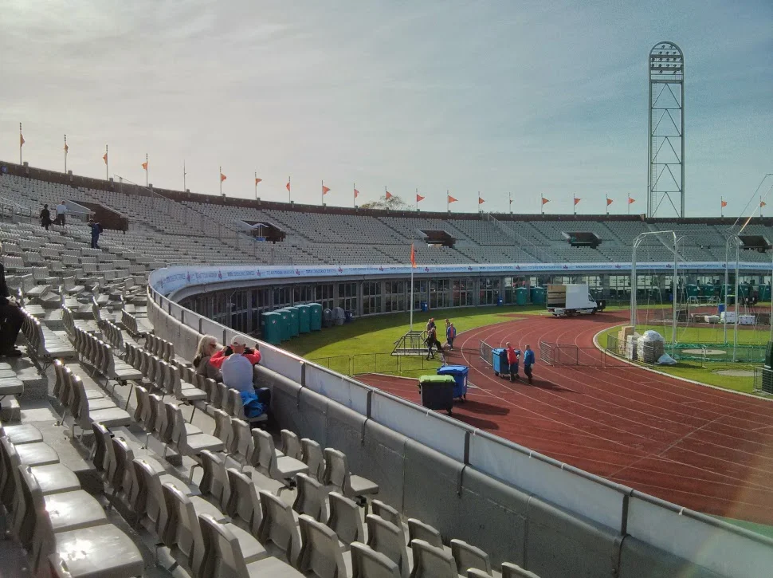

## Preamble

I loved visiting Amsterdam, the place is just a great place to visit, being from Scotland and a fairly hilly part of Scotland at that, I found the Marathon more difficult that I was expecting. I suspect it was my choice of routes and not running enough flat long routes that contributed to my discomfort, that and the onset of a cold.

I would still recommend it to anyone considering it as a marathon to run and/or a holiday destination, lovely place!

## Photographs

_Picking up my number from the Stadium_

_The Stadium the day before the Marathon_

_Sunny day at the Stadium_

_Working on the Finishing Line_

## Marathon Stats and Certificate

_Finishing Stats_

_Finishing Certificate_

## Reference

Amsterdam Marathon [Results](https://evenementen.uitslagen.nl/2014/amsterdammarathon/) Page
