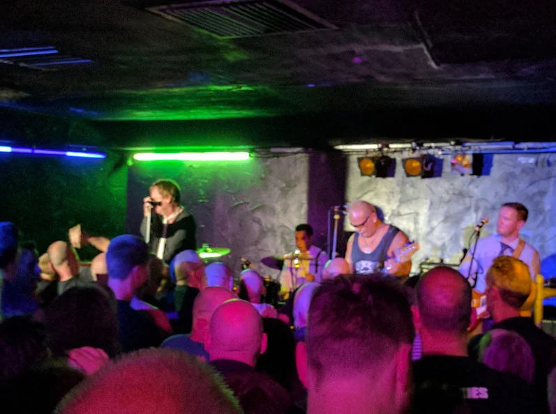
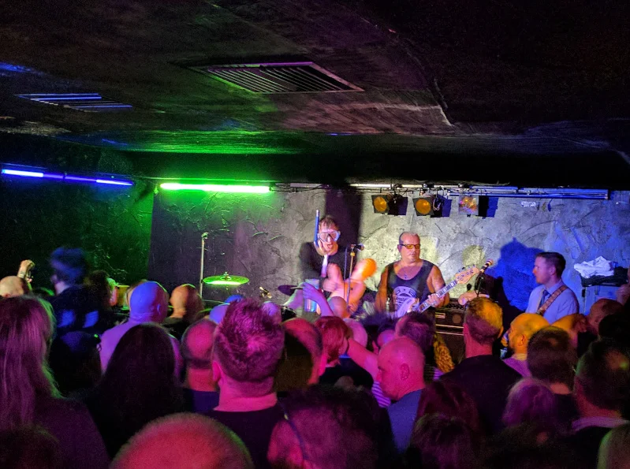
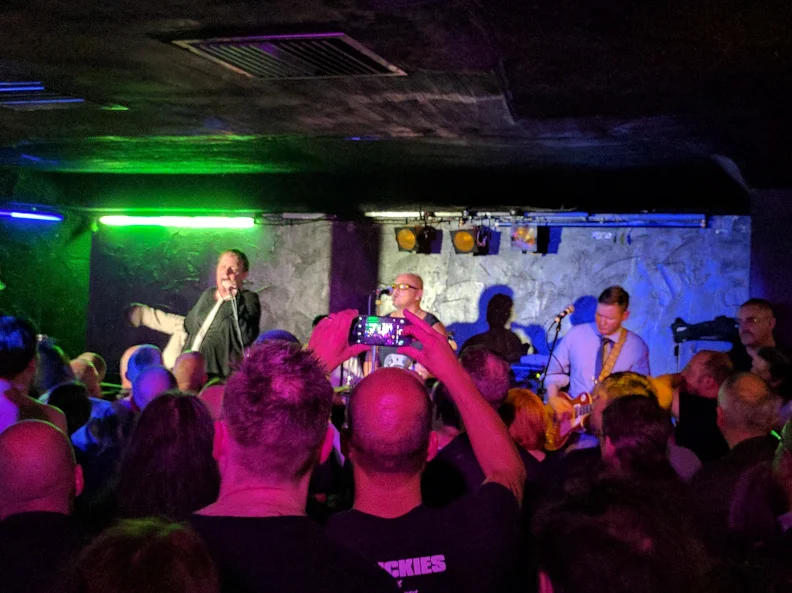
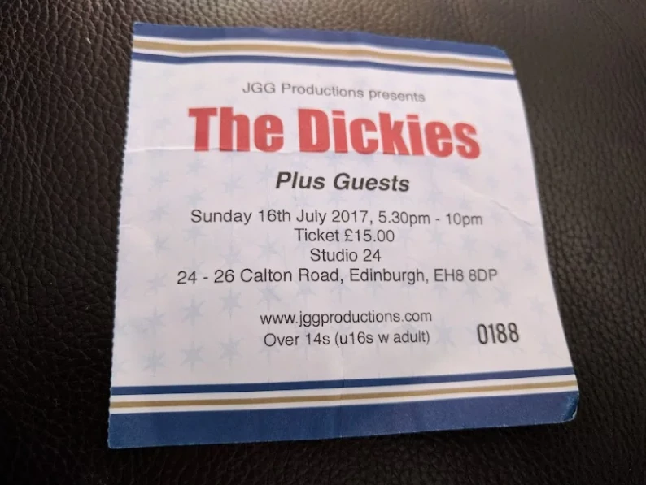

## My Thoughts

Having been lucky enough to be introduced to the Dickies in my youth at a mates house (Billy H and Rus). I was lucky enough to get to see them when they were touring Scotland. The venue Studio 24 is no longer with us [closed](https://www.theskinny.co.uk/music/news/edinburgh-studio-24-to-close) but I do have fond  memories of bopping around to familiar and well loved tunes from [The Dawn of the Dickies](https://en.wikipedia.org/wiki/Dawn_of_the_Dickies) and [The Incredible Shrinking Dickies](https://en.wikipedia.org/wiki/The_Incredible_Shrinking_Dickies).

## About the Band

The Dickies are an American punk rock band formed in the San Fernando Valley, Los Angeles, in 1977. One of the longest tenured punk rock bands, they have been in continuous existence for over 40 years. They have consistently balanced catchy melodies, harmony vocals, and pop song structures, with a speedy punk guitar attack. This musical approach is paired with a humorous style and has been labelled "pop-punk" or "bubble-gum punk". The band have sometimes been referred to as "the clown princes of punk".

* The Dickies [Wikipedia Page](https://en.wikipedia.org/wiki/The_Dickies)

## Photos of the night

