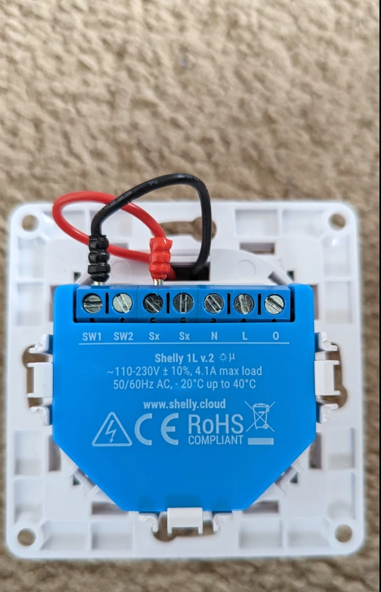
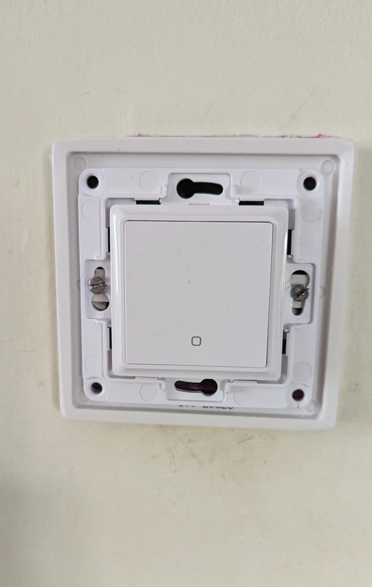
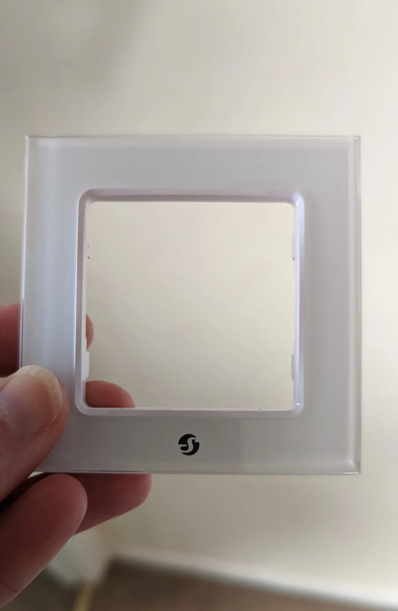
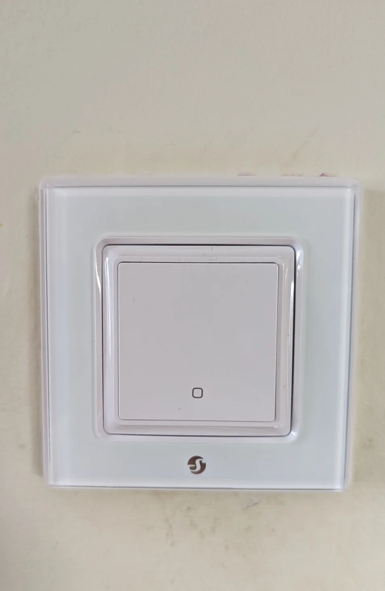
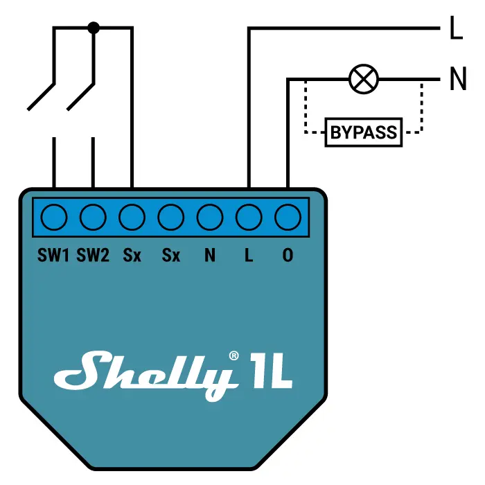
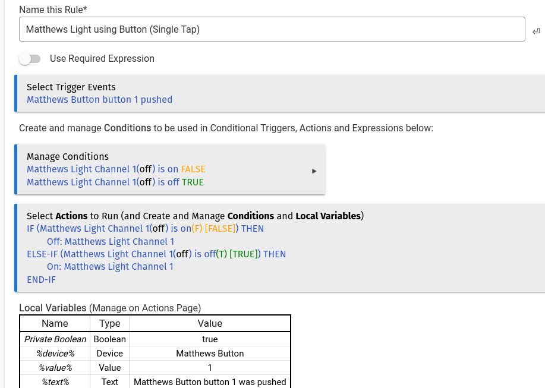

I've just spent a productive afternoon adding my son's main light to my [Hubitat Hub](https://hubitat.com/).

I now have the ability to contol his main light by voice using my [Google Nest Mini](https://store.google.com/gb/config/google_nest_mini?hl=en-GB), or by using the [Google Home app](https://apps.apple.com/us/app/google-home/id680819774) on my phone when I'm out and about. I live in an older house so my light circuit doesn't have a neutral, for this reason I'm using the [Shelly 1L](https://shellystore.co.uk/product/Shelly-1L/).

 > Remember to switch off the circuit at the fuse box (consumer unit) and check with a meter or an electrical testing pen that the circuit is off before working on it, mains electricity can kill. If you don’t know what you're doing and/or, are not comfortable working with  mains electricity, then pay an electrician to do the work.
 {: .prompt-danger }

### Parts List

| Part | Price |
|-|-:|
|[Shelly 1L](https://shellystore.co.uk/product/shelly-1l/) | £17:00 |
|Shelly [Wall Switch](https://shop.shelly.cloud/shelly-wall-switch-1-white-wifi-smart-home-automation?search=switch#565) White| £9:00 |
|Frame [for Shelly Wall Switch](https://shop.shelly.cloud/shelly-wall-frame-1-black-wifi-smart-home-automation#559)| £4:00  |
|[Shelly Bypass](https://smarthomeshopuk.com/products/shelly-bypass) | £4:00 |
|**Total Price** |**£34:00**|

### Installation Photos

_Switch and Light_

_Switch Partial Install_

_Light Frame_

_Switch Installed_

### Wiring Diagram (No Neutral)

The Shelly Bypass resides in the ceiling rose of the light fitting. I usually manage to get my Shelly 1L installed in the pattress box with no issues, see the video below for wiring instructions and tips. In some cases I've had to buy a new ceiling rose as the original ones in my house are pretty small, with little space to install the Shelly Bypass, the one that I usually buy to solve this problem, can be bought from Screwfix, [here](https://www.screwfix.com/p/crabtree-capital-6-pendant-set-bc-white/65501) is a link to the ones that I use.  

I went for [Dimmable LED Lightbulbs](https://www.amazon.co.uk/EDISHINE-Dimmable-Bayonet-Incandescent-Equivalent/dp/B08P2HFW22/ref=sr_1_5?keywords=bayonet+led+dimmable+light+bulb&qid=1663519577&sprefix=baynet+led+dimma%2Caps%2C88&sr=8-5) from Amazon, as they're reasonably priced and seem to be ok. They work well and they don't flicker like some of the bulbs I've tried. It also gives me the opportunity of changing from an on/of switch, to a dimmer switch at a later date, see [Shelly Dimmer2](https://smarthomeshopuk.com/products/shelly-dimmer-2).

### Installation Video

A very helpful installation video by Homesite, a UK based tech channel, feel free to subscribe and like.



Here's are some instructions from Shelly, that will help you connect your new Shelly 1L to your home network. You can skip to 7 minutes 20 seconds where it shows you how to connect, I don't use cloud control, I use local control via Hubitat. But feel free to use Shelly Cloud control if it's the way your planning to control your Shelly switch(s).



I've also found that if your using cheaper LED bulbs that flicker, if you switch off **Eco Mode** on the Shelly 1L it helps reduce and/or stop the flickering.

I already have a Hubitat Hub, and have had it for number of year. But for reference, the hub as of today, costs £135 via [Vesternet](https://www.vesternet.com/products/hubitat-elevation-hub-uk?currency=GBP&variant=31600222273651&utm_medium=cpc&utm_source=google&utm_campaign=Google%20Shopping&utm_campaign=17611366711&utm_source=x&utm_medium=cpc&utm_content=&utm_term=&ad_id=&gclid=CjwKCAjw4JWZBhApEiwAtJUN0Blc53XY_VBTqGDuYui_uCyLEjYaSmtQvOFo-mGPgEgLx80gNukpzxoCnUwQAvD_BwE).  

### Hubitat Specific (Add Shelly Device)

Open up your Hubitat Hub in a browser of you choice.

Select Devices

1. Click on **Add Device**
2. Click on **Brand**
3. Type **Shelly**
4. Click on **Shelly**
5. Click on **Switch**
6. Select Add **Shelly 1**
7. Select **Install Device**
8. Give your new Switch a name
9. **Select a room for your new Switch:**
10. Click on **View device details**
11. Add the **IP address** of your device to **Shelly IP address**
12. Click on **Save Preferences**
13. Scoll down to **Device Information**
14. If needed, amend or change the **Device Name**
15. If needed, amend or change the **Device Label**
16. If needed, assign it to a room.
17. Click on **Save Device**
18. Scroll down to Component Devices and click on the newly created link to the right.
19. If you've completed the steps above correctly, you should be able to click on the On and Off buttons and the your light(s) should switch on and off.

Here's the programming for the my son's button on his bedside table, it's fairly basic as it's only switching on and off.

## References

* [Smart Home Shop UK](https://smarthomeshopuk.com/)  
* UK based Youtube channel for IOT [Home Sight Tech](https://www.youtube.com/c/HomeSight/featured)  
* Home Sight Tech [Webpage](http://homesight.tech/).  
* Brian from Automate Your Home [Home Automations 101 - The Ultimate Guide to Build Better Automations](https://www.youtube.com/watch?v=c5MF3MnMmJw)
