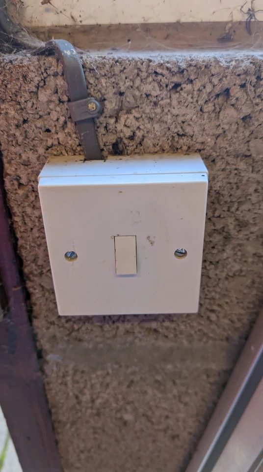
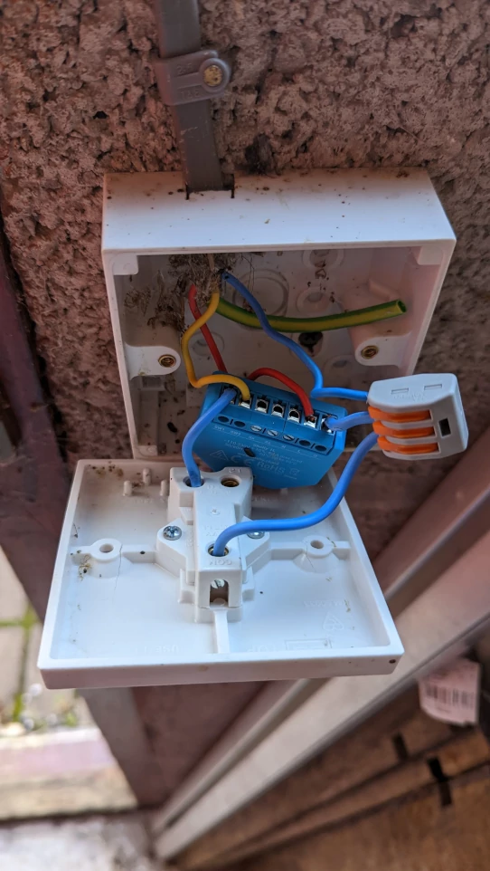
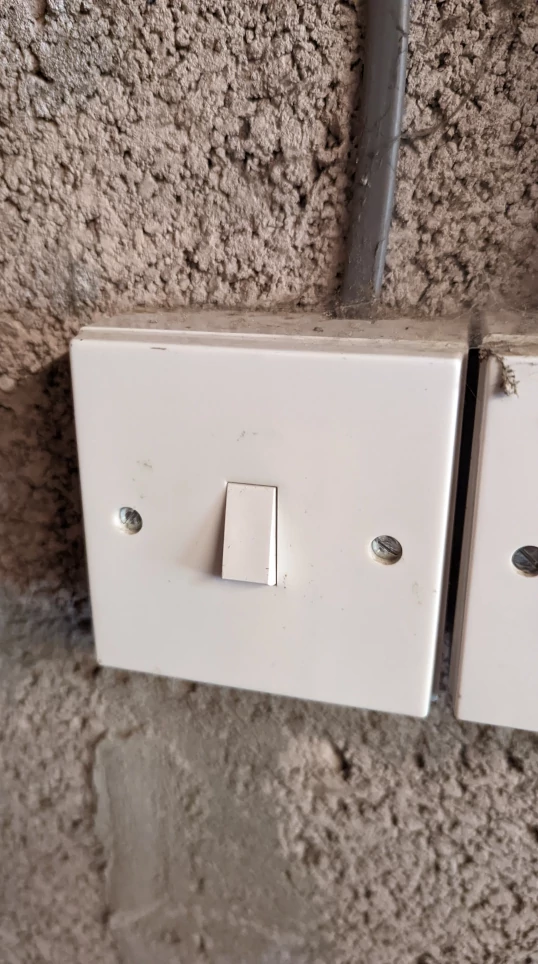
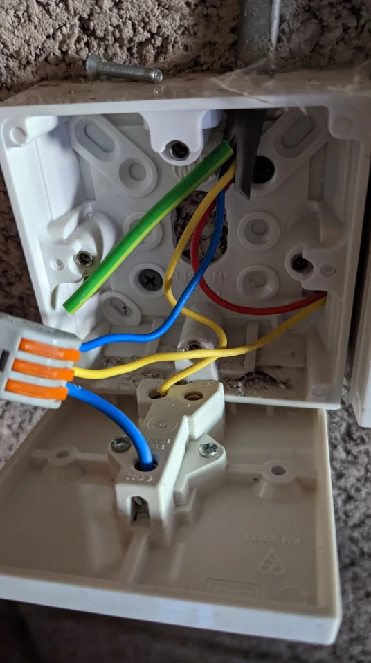
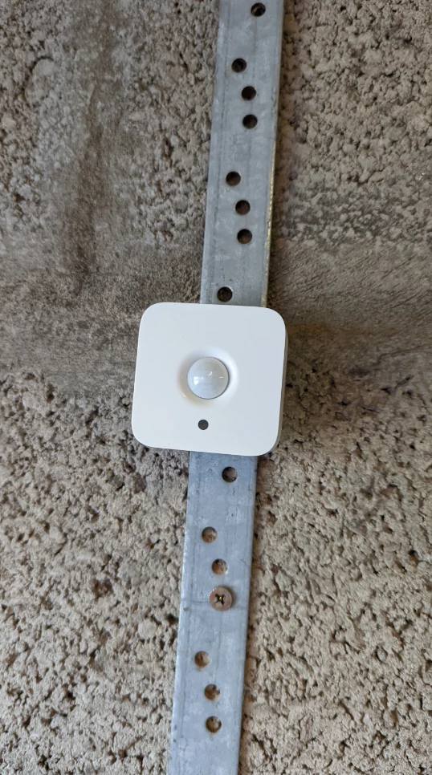
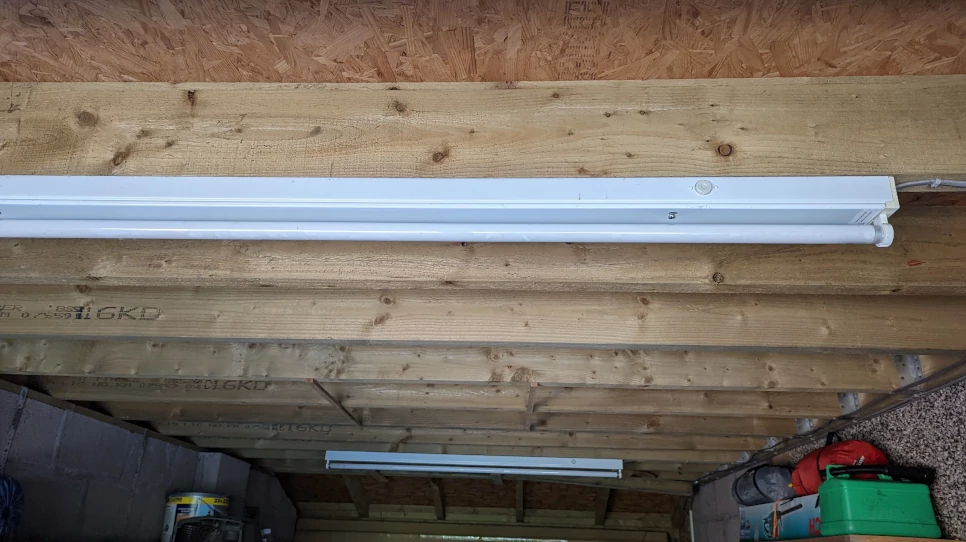
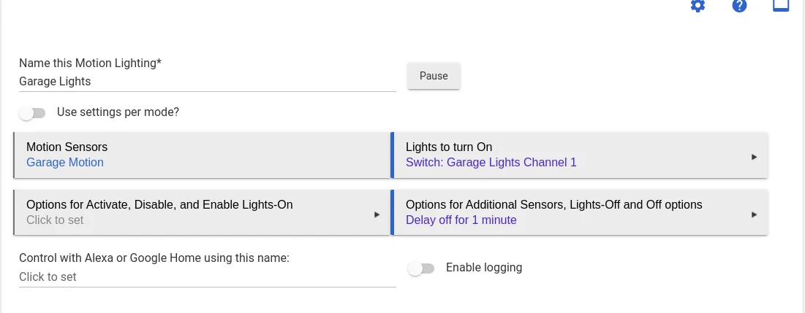

I now have the ability to contol my garage florescent light strips by voice using my [Google Nest Mini](https://store.google.com/gb/config/google_nest_mini?hl=en-GB), or by using the [Google Home app](https://apps.apple.com/us/app/google-home/id680819774) on my phone when I'm out and about. I live in an older house so my light circuit doesn't have a neutral, for this reason I'm using the [Shelly 1L](https://shellystore.co.uk/product/Shelly-1L/). Thankfully, these Florescent lights draw 20W each, so there isn't a need for a [Shelly Bypass](https://smarthomeshopuk.com/products/shelly-bypass).

 > Remember to switch off the circuit at the fuse box (consumer unit) and check with a meter or an electrical testing pen that the circuit is off before working on it, mains electricity can kill. If you don’t know what you're doing and/or, are not comfortable working with  mains electricity, then pay an electrician to do the work.
 {: .prompt-danger }

### Parts List

|**Part**|**Price** |
|-|-|
|Shelly [1L](https://shellystore.co.uk/product/shelly-1l/) | £17:00 |
|Philips Hue [Motion Sensor](https://amzn.eu/d/9HBs1sy)| £39:99 |
|**Total Price** | **£56:99** |

### Installation Photos

_Back Door Switch_

_Back Door Switch Wiring_

_Front Door Switch_

_Garage Door Switch Lighting_

_Philips Hue Motion Sensor_

_Florescent Lights_

### Wiring Diagram (No Neutral)

Thankfully, as I'm  using florescent lights, the current draw is more than 20W, so I don't have to use a [Shelly Bypass](https://smarthomeshopuk.com/products/shelly-bypass) to power the Shelly 1L. I'm using 2 switches to turn the lights on and off, so the wiring diagram is slightly different from what you would normally see.

_Wiring Diagram_

### Installation Video

Here's are some instructions from Shelly, that may help you connect your new Shelly 1L to your home network. You can skip to 7 minutes 20 seconds where it shows you how to connect, I don't use cloud control, I use local control via Hubitat. But feel free to use Shelly Cloud control if it's the way your planning to control your Shelly switch(s).



### Hubitat Specific (Add Shelly Device)

Open up your Hubitat Hub in a browser of you choice.

Select Devices

1. Click on **Add Device**
2. Click on **Brand**
3. Type **Shelly**
4. Click on **Shelly**
5. Click on **Switch**
6. Select Add **Shelly 1**
7. Select **Install Device**
8. Give your new Switch a name
9. **Select a room for your new Switch:**
10. Click on **View device details**
11. Add the **IP address** of your device to **Shelly IP address**
12. Click on **Save Preferences**
13. Scoll down to **Device Information**
14. If needed, amend or change the **Device Name**
15. If needed, amend or change the **Device Label**
16. If needed, assign it to a room.
17. Click on **Save Device**
18. Scroll down to Component Devices and click on the newly created link to the right.
19. If you've completed the steps above correctly, you should be able to click on the On and Off buttons and the your light(s) should switch on and off.

I already have a Hubitat Hub, and have had it for number of year. But for reference, the hub as of today, costs £135 via [Vesternet](https://www.vesternet.com/products/hubitat-elevation-hub-uk?currency=GBP&variant=31600222273651&utm_medium=cpc&utm_source=google&utm_campaign=Google%20Shopping&utm_campaign=17611366711&utm_source=x&utm_medium=cpc&utm_content=&utm_term=&ad_id=&gclid=CjwKCAjw4JWZBhApEiwAtJUN0Blc53XY_VBTqGDuYui_uCyLEjYaSmtQvOFo-mGPgEgLx80gNukpzxoCnUwQAvD_BwE).

Here’s the Hubitat programming for the Garage, it’s fairly basic as it’s only switching on and off when the sensor triggers. For this one, I'm using the **Motion and Mood Lighting** App, at some point, I'm going to convert it to  **Rules Machine**, when I do, I'll update the page.

_Hubitat Programming for Florescent Lights with Motion Sensor_

### Future Plans

At some point, I'll have to replace the the florecent tubes and fittings (probably when they fail), as the regulation surronding them have changed, so I won't be able to purchase them going forward.

[Halogen light bulbs will be banned from September 2021 with fluorescent light bulbs to follow, cutting emissions and saving consumers on their energy bills](https://www.gov.uk/government/news/end-of-halogen-light-bulbs-spells-brighter-and-cleaner-future)

In the future, I'll be programming the Hubitat to use **Rules Machine** instead of **Motion and Mood Lighting**, this will allows me to program TTS (Text To Speech) so we'll know if anyone has opened the garage door, at the Living Rooms Nest Hub will tell us.

## References

* [Smart Home Shop UK](https://smarthomeshopuk.com/)
* Brian from Automate Your Home [Home Automations 101 - The Ultimate Guide to Build Better Automations](https://www.youtube.com/watch?v=c5MF3MnMmJw)
