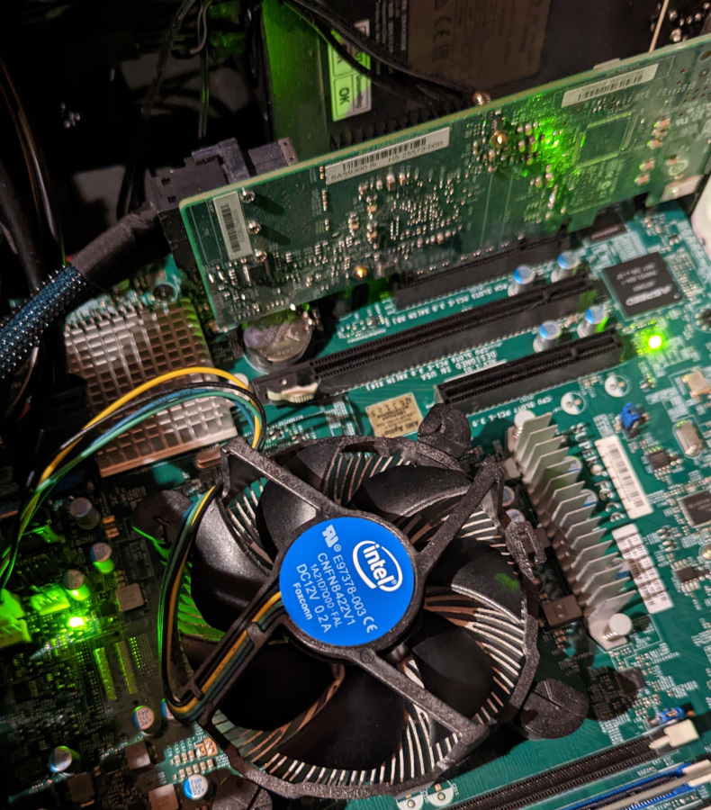
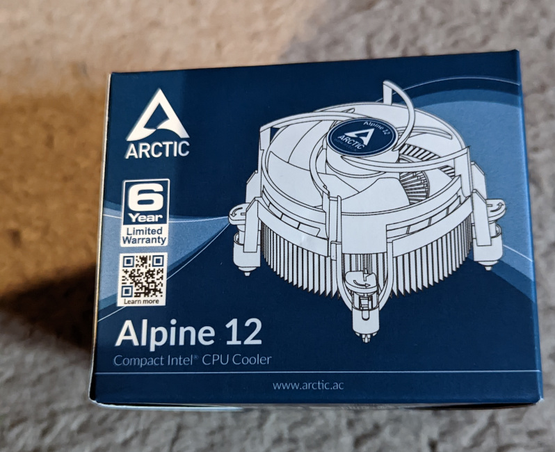

As you can see, the CPU fan is now faulty (knackered), to be honest it's been running non stop for 5 years with no problems, so I'm happy enough to replace it, as with all moving parts, eventually it will break due to wear and tear.

Thankfully, I've setup email notifications for these little eventualities, so I popped onto amazon during the week and purchased a replacement, 30 minutes later and the jobs done. Took me longer to blog  about it than it did to actually do the work.

## Replacement Fan

Amazon link is [here](https://www.amazon.co.uk/gp/product/B07HJ198TB/ref=ppx_yo_dt_b_asin_title_o00_s00?ie=UTF8&psc=1), I'm hoping to have  many more years of service, before I have to think about replacing the server.

## Fitted and Working

Job done, thankfully it wasn't too hard and I had all the tools to hand.
