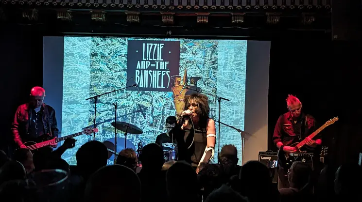
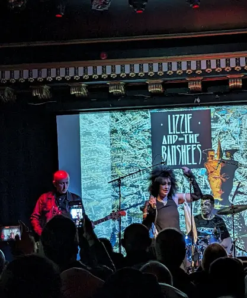

## Thoughts

I remember seeing [Siouxsie and the Banshees](https://linktr.ee/siouxsieandthebanshees) back in my early 20 at the Playhouse  Edinburgh and they were totally awsome! At the time there was no other band that sounded or looked like them, and I  was totally up for it. Years later as my musical taste matured, I was more into Rock, Metal and Thrash, but I always had a soft spot for the darker stuff.

Last year I managed to see the covers band Lizzie and the Banshees with my mates, [Danny](https://www.gig-antics.live/), Ross and Mark and I really enjoyed it. I even managed to remember some of the Lyrics to the original songs, just as well everyone was singing along. It was also fab bumping into some old friends [Marissa Gray (Nee-Quarta)](https://www.facebook.com/marisa.gray.5) and [Alison Thompson](https://www.facebook.com/alison.thomson.313) from our partying days at the nightclub **The Backroom** later re-named to  [**The Mission**](https://www.facebook.com/groups/178065414199) in Edinburgh.

## The Band

Venue - [The Voodoo Rooms](https://www.thevoodoorooms.com/)

Lizzie and the Banshees [facebook](https://www.facebook.com/LizzieAndTheBanshees) page

### What the ticket website said

> Lizzie and the Banshees are the UK's premier tribute to Siouxsie and the Banshees. Since forming in 2012 the band have been touring the country with their hit after hit Siouxsie and the Banshees show, capturing the sound, look and feel of the Banshees. Concentrating on material from the Scream to Tinderbox such as Spellbound, Christine, Dear Prudence, Hong Kong Garden, Happy House, Cities in Dust and many more.

