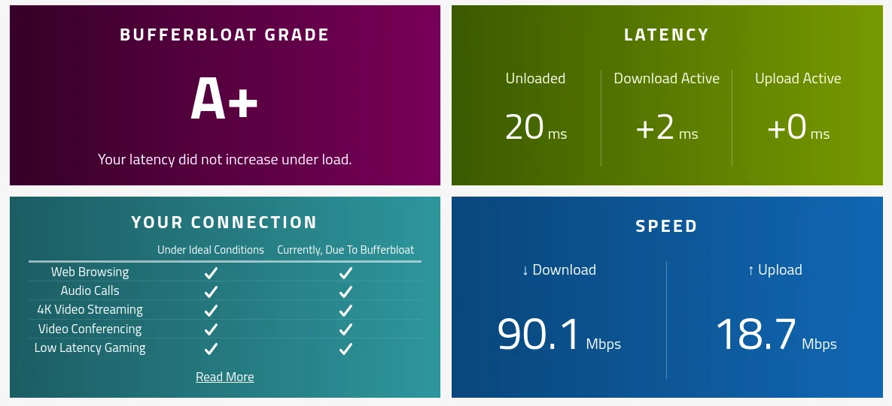

A bit of a work in progress, I'm going to add sites and snippets of instructions as and when I find them.

* [MAC address lookup](https://hwaddress.com/) site, particularly handy if your trawling through dhcp logs.

## Instructions on fixing bufferbloat on pfsense

I've recently had my home internet upgraded to fibre on 2nd May 2024. It didn't go smoothly or well, but that's a different story that I hight blog about, this being depending on how they handle my complaint.

Anyway, below are some intructions on how to set up a codel-limiter to combat buffer bloat, the instructions worked really well and I'm really chuffed with the results.

1. Test your broadband speed with this [site](https://www.speedtest.net/), do make sure that it's quiet on your network (not downloading or watching youtube), take a note of the speed, Its best tested directly via ethernet.
2. Test for bufferbloat [here](https://www.waveform.com/tools/bufferbloat) and take a note of your results.
3. After testing the virgin install, it was showing a B, which was quite resonable.
4. Fix bufferbloat via the instructions on the [pfsense](https://docs.netgate.com/pfsense/en/latest/recipes/codel-limiters.html) website
5. Retest your [network speed](https://www.speedtest.net), you might find its slightly slower, maybe 1% to 2% (but I'm ok with that).
6. Retest your network for [bufferbloat](https://www.waveform.com/tools/bufferbloat) and all being well, you should get a better result, see mine below.

