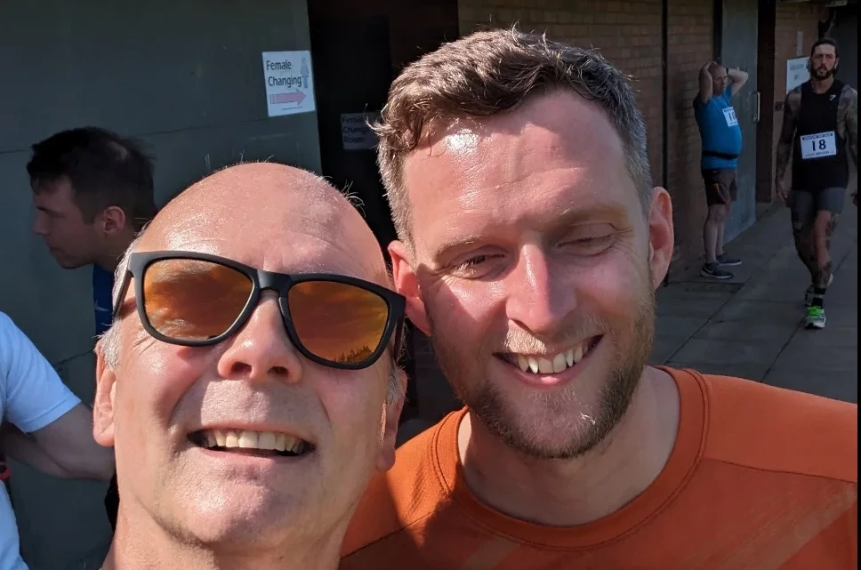
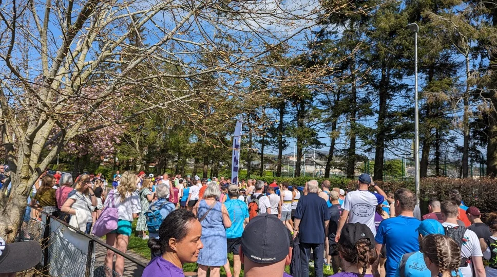
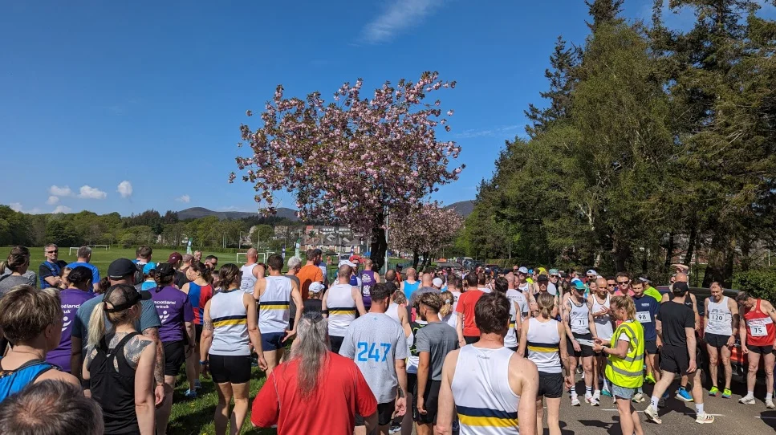
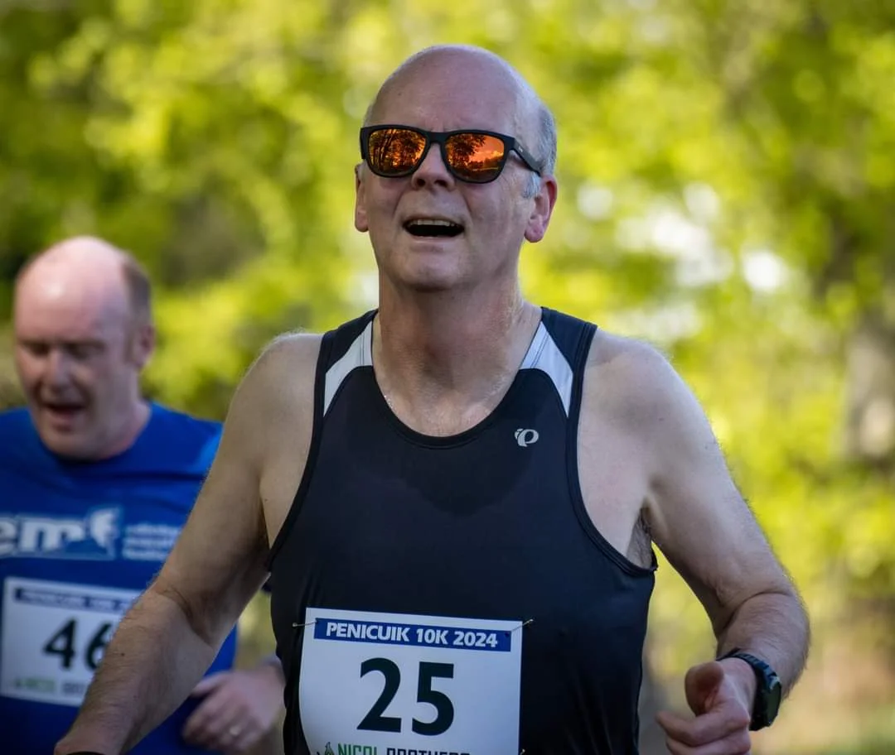
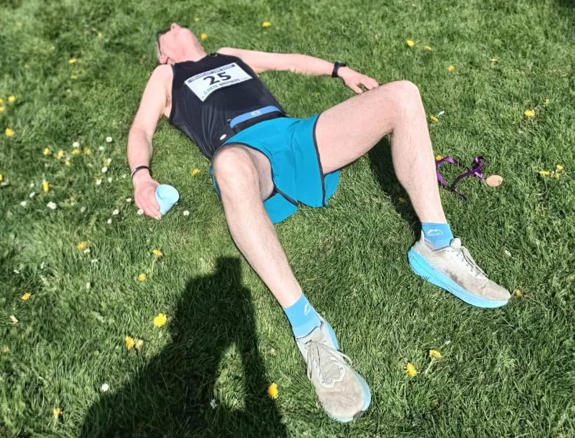

## Preamble

This is my local [running clubs](https://penicuikharriers.org.uk/) [10k road race](https://penicuikharriers.org.uk/10k-road-race/) and I really love running it, the years I'm not running it, I'm helping the club marshal it. The course is described as _undulation_, but those in the know would describe it as uphill at the start, especially Pomathorn Road. This year, I found it quite a tough one as the weather was unseasonally hot, for us Scottish folk, anything over 23C is considered hot. 🤣

However you want to describe it, I always enjoy it and it's a fabulously organised 10k road race.

## Route Map

<iframe src="https://www.google.com/maps/d/embed?mid=1OFamEzCynrZMmd9cVe5XemWfMq4&hl=en&ehbc=2E312F" width="420" height="440"></iframe>

## Event Photos

_Me and my running buddy Gavin_

_Lining up at the start_

_Lining up at the start_

_Me mid Run_

_Tired and sweaty but happy_
