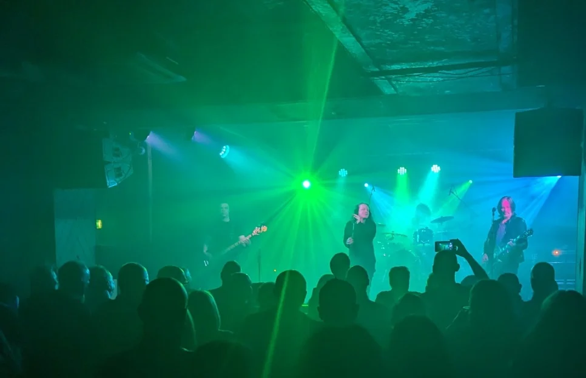
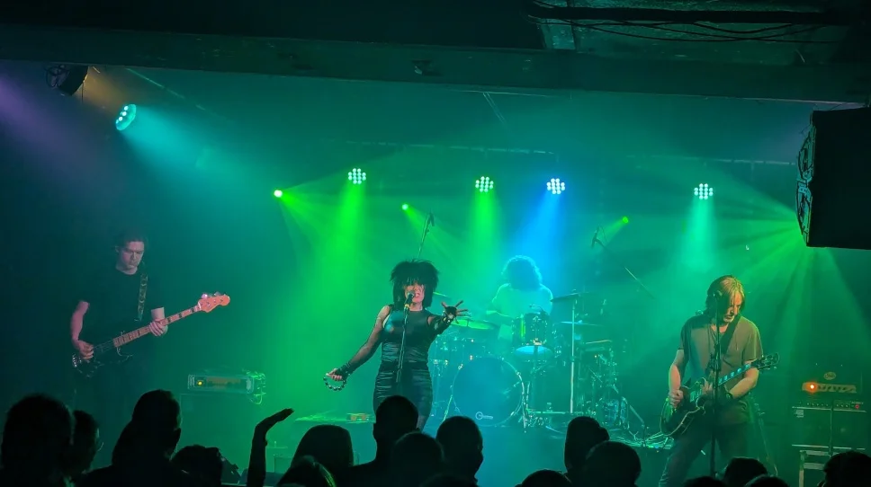

## Thoughts

A great night was had, It was just the three amigos, [Danny](https://www.gig-antics.live/), Mark and myself, the venue wasn't full, but sometimes that fine as it means you don't have to queue to get to the bar. I enjoyed their Cult, Killing Joke and their Siouxsie and the Banshees covers, wasn’t that impressed with the Bauhaus covers, the singer’s voice was good, just not low or deep enough to be Pete Murphy.

Still, overall it was a cracking gig and it’s always nice to catch up with mates.

Venue - [La Belle Angele](https://la-belleangele.com/)

## The Band

The info on their facebook page.

> Formed through a mutual love of 80’s goth and alternative rock music. Sanctum Santorium are a live 6-piece band that faithfully recreate classic hits by artists such as The Cult, Killing Joke, Sisters of Mercy, Siouxsie & The Banshees, The Cure, Bauhaus and more. Smoke machines at the ready with the clothes and the attitude. Visually and musically, they are startlingly accurate. SS deliver a blistering live set from She Sells Sanctuary and Love like Blood through to Bela Lugosi’s Dead & This Corrosion. Dust down your leather jacket and paint your nails and get ready to be transported to The Dark Side of the 80’s



_Killing Joke Cover_

_Siouxsie Cover_

## References

* [Bauhaus](https://en.wikipedia.org/wiki/Bauhaus_(band))
* [The Cult](https://en.wikipedia.org/wiki/The_Cult)
* [Killing Joke](https://en.wikipedia.org/wiki/Killing_Joke)
* [Siouxsie and the Banshees](https://en.wikipedia.org/wiki/Siouxsie_and_the_Banshees)
* The Band [Sanctum Sanctorium](https://www.facebook.com/people/Sanctum-Sanctorium-The-Darkside-of-The-80s/100063463263826/)
