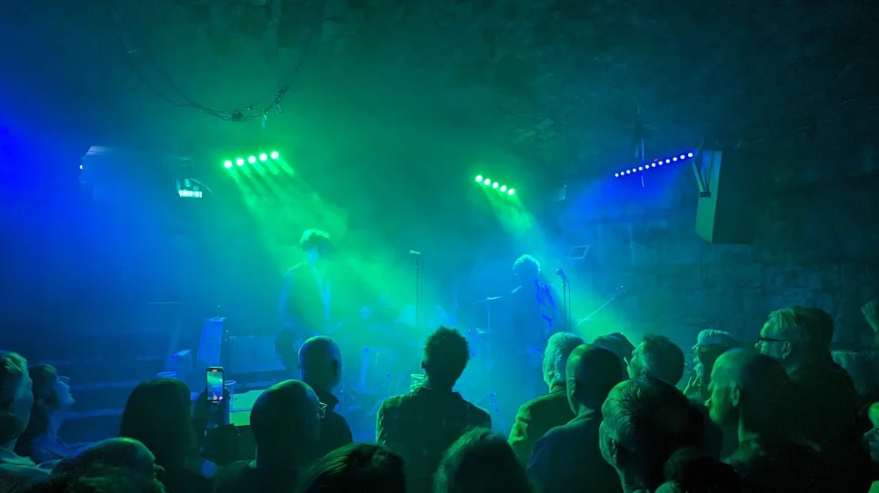
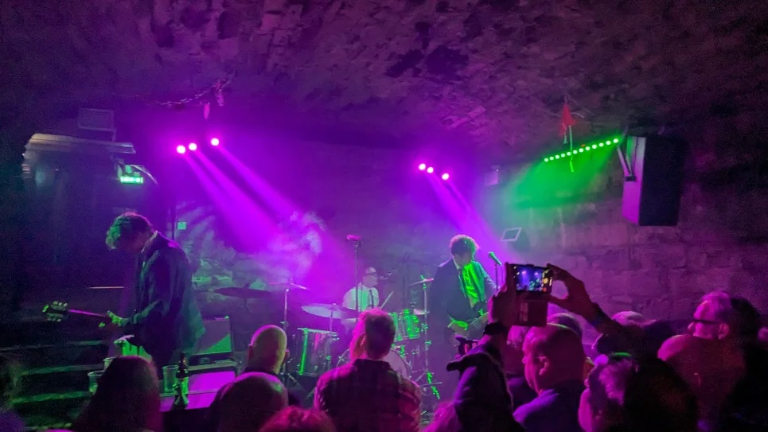
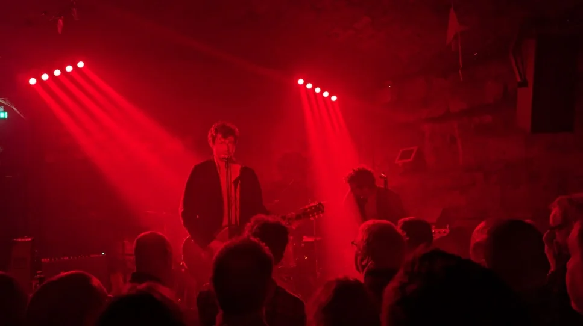
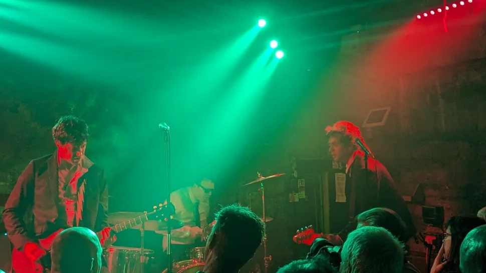
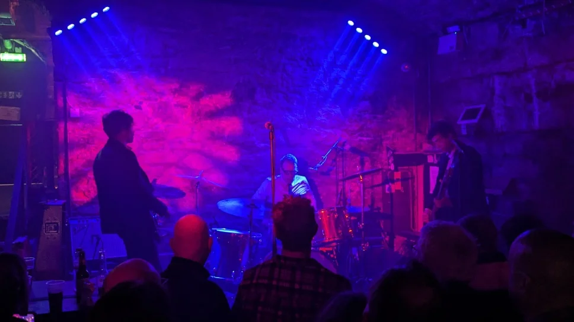

## Thoughts

I met the guys in Bannerman's for a few early gig libation and a wee catchup, I didn't know what to expect at the venue, When I got to the venue, I was surprised to see some of Edinburgh's more mature Rockabilly's from back in the day. At that point I know I was going to be treated to some real rock and roll! I really quite enjoyed this one, See Danny's full review [here](https://www.gig-antics.live/post/his-lordship-cabaret-voltaire-17-05-24).

Venue - [The Cabaret Voltaire](https://www.thecabaretvoltaire.com/)

## The Band

A Couple of reviews from their website, impressive stuff!

> “A dose of helter-skelter outlaw energy from two of the best in the biz” – Clash Magazine
> “A ram-jam barrage of 50s rock ‘n’ roll mania, shot through with punk venom” – Classic Rock
> “A breath of fresh air…reminds me of Motorhead. What the world needs now!” – Chrissie Hynde

## Photos of the night

## References

* Danny's [Gig Antics Website](https://www.gig-antics.live/)
* His Lordship [website](https://hislordship.net/)
