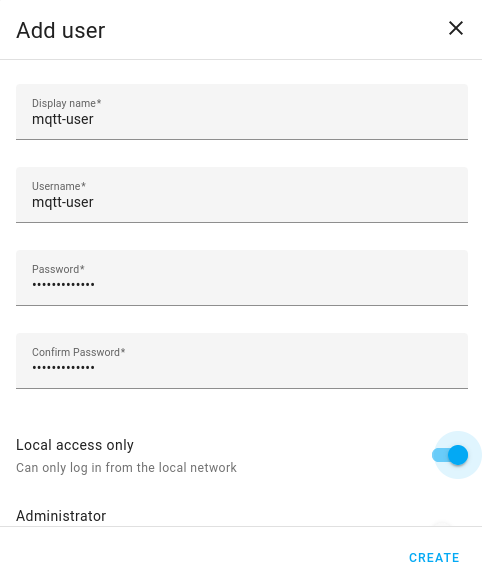
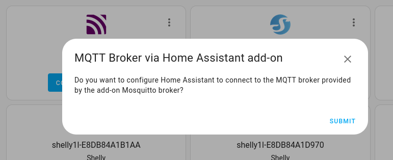
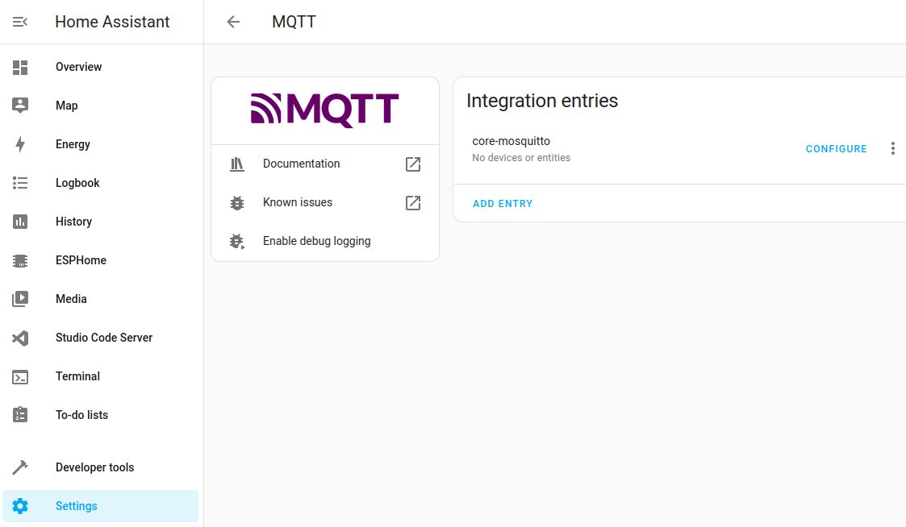

## Create a user for the Mosquitto Broker addon

1. Select __Settings__
2. Select __People__
3. Select __Users__
4. Select __Add User__
5. Create a user called __mqtt-user__
6. Give it a good password, take a note of what is, an example being 44G$2Yto^^$Zs
7. Turn on __Can only log in from local network__

_Add a User_

## Install MQTT addon and setup with user

1. Select __Settings__
2. Select __Addon-ons__
3. Click on __ADD-ON STORE__
4. In the search bar, type __Mosquitto__ and select __Mosquitto Broker__
5. Click on the __INSTALL__ button
6. Turn on __Start on Boot__
7. Turn on __Watchdog__
8. Select __Settings__ then __System__ then __Restart Home Assitant__ then __Advanced Options__ the select __Reboot System__
9. When Home Assistant restarts, check __Notifications__, it should say __New devices discovered__
10. Click on __Check it out__
11. Scroll down until you see __MQTT__ and select
12. Click on __Configure__ all going well, you should see the following.
13. Click on __Submit__ and __Finish__



1. Under __Settings__ Select __Devices and Service__ then __MQTT__ then __Configure__ (Graphic Below)
2. click on __RE-CONFIGURE MQTT__
3. Fill in Username with __mqtt-user__
4. Fill in password (for the created user above)
5. Click on __Next__, __Submit__ then __Finish__



## Checking that it's all is setup correctly

1. Click on __Settings__
2. Click on __Add-ons__
3. Click on __Mosquitto broker__
4. Select on Logs (Rop Right)

Note that the mqtt-user has been able to connect to the mqtt broker.

```bash
2024-07-06 21:28:03: New connection from 172.30.32.1:53593 on port 1883.
2024-07-06 21:28:03: New client connected from 172.30.32.1:53593 as 3xKsDMR5T3VgHASkdMdn2J (p2, c1, k60, u'mqtt-user').
```

## References

* Home Assistant [Website](https://www.home-assistant.io/)
* Installing MQTT- [Everything Smart Home](https://youtu.be/dqTn-Gk4Qeo?si=XTV_WoNA72LuOztw)
* Installing Zigbee2MQTT THE RIGHT WAY - [Smart Home Junkie](https://youtu.be/4y_dDgo0i2g?si=8lvSODKdqqh4lZao)
