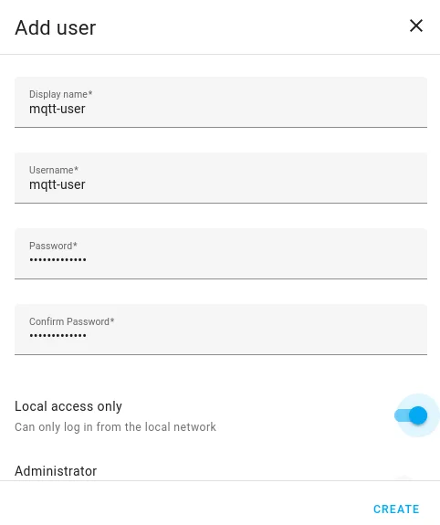
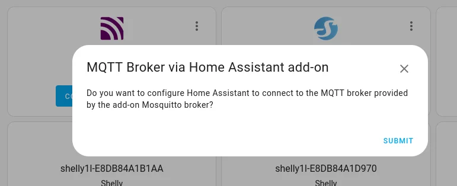

## Create a user for the Mosquitto Broker addon

1. Select Settings
2. Select People
3. Select Users
4. Select Add User
5. Create a user called mqtt-user
6. Give it a good password, take a note of what is, an example being 44G$2Yto^^$Zs
7. Turn on Can only log in from local network

_Add a User_

## Install MQTT addon and setup with user

1. Select Settings
2. Select Addon-ons
3. Click on ADD-ON STORE
4. In the search bar, type Mosquitto and select Mosquitto Broker
5. Click on the INSTALL button
6. Turn on Start on Boot
7. Turn on Watchdog
8. Select Settings then System then Restart Home Assitant then Advanced Options the select Reboot System
9. When Home Assistant restarts, check Notifications, it should say New devices discovered
10. Click on Check it out
11. Scroll down until you see MQTT and select
12. Click on Configure all going well, you should see the following.
13. Click on Submit and Finish



1. Under Settings Select Devices and Service then MQTT then Configure (Graphic Below)
2. click on RE-CONFIGURE MQTT
3. Fill in Username with mqtt-user
4. Fill in password (for the created user above)
5. Click on Next, Submit then Finish


## Checking that it's all is setup correctly

1. Click on Settings
2. Click on Add-ons
3. Click on Mosquitto broker
4. Select on Logs (Rop Right)

Note that the mqtt-user has been able to connect to the mqtt broker.

```bash
2024-07-06 21:28:03: New connection from 172.30.32.1:53593 on port 1883.
2024-07-06 21:28:03: New client connected from 172.30.32.1:53593 as 3xKsDMR5T3VgHASkdMdn2J (p2, c1, k60, u'mqtt-user').
```

## References

* Home Assistant [Website](https://www.home-assistant.io/)
* Installing MQTT- [Everything Smart Home](https://youtu.be/dqTn-Gk4Qeo?si=XTV_WoNA72LuOztw)
* Installing Zigbee2MQTT THE RIGHT WAY - [Smart Home Junkie](https://youtu.be/4y_dDgo0i2g?si=8lvSODKdqqh4lZao)
* Demo Home Assistant [Lovelace Interface](https://demo.home-assistant.io/#/lovelace/home)
