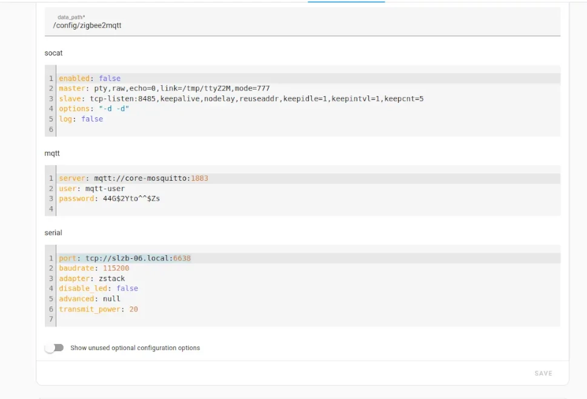

Prior to installing Zigbee2MQTT on Home Assistant, you will need to install a Mosquito Broker on your Home Assistant installation, see the the follow link below under Prerequisites. This setup connects to an external Network connected co-ordinator the SLB-06 that is POE powered.

## Prerequisites

* A working Mosiquitto Broker installation, see [link](https://thebloody.cloud/posts/Installing-Mosquitto-Broker/) for installation instructions if needed.
* Website to purchase the [SLBZ-06 POE powered Zigbee Coordinator](https://smlight.tech/product/slzb-06/)
_In the box_

_Fitted under the stairs_

## Instructions

1. Goto Settings, Add-ons, ADD ON-STORE  
2. Click on the 3 vertical dots at the top of the page  
3. Select Repositories  
4. Add the Zigbee2MQTT github repository
5. Click on Add

```yaml
https://github.com/zigbee2mqtt/hassio-zigbee2mqtt
```

1. Select __Home Assistant Add-on: Zigbee2MQTT__  

2. Click on the __Install__ Icon  

3. Enable Start on boot, Watchdog and Show in sidebar

4. These are the settings for my SLZB-06 controller, your IP address, user and password may be different. Unless you've followed my instructions for Installing a Mosquitto Broker


Below is the straight yaml text feel free to use it for your needs, you will have to change it to suit your circumstances.

```yml
data_path: /config/zigbee2mqtt
socat:
  enabled: false
  master: pty,raw,echo=0,link=/tmp/ttyZ2M,mode=777
  slave: tcp-listen:8485,keepalive,nodelay,reuseaddr,keepidle=1,keepintvl=1,keepcnt=5
  options: "-d -d"
  log: false
mqtt:
  server: mqtt://core-mosquitto:1883
  user: mqtt-user
  password: 44G$2Yto^^$Zs
serial:
  port: tcp://slzb-06.local:6638
  baudrate: 115200
  adapter: zstack
  disable_led: false
  advanced: null
  transmit_power: 20
```

1. Click on Save
2. Click on Info and click on the Start icon
3. Click on the the Open Web-UI icon and if  all setup correctly you should see something like this.


## References

* SLZB-06 [User Manual](https://smlight.tech/manual/slzb-06/)
* Configuration of [Zigbee2MQTT adaptor](https://www.zigbee2mqtt.io/guide/configuration/adapter-settings.html)
* Home Automation Guy [Installing zigbee2mqtt](https://youtu.be/sFSqgiOoPMs) in Home Assistant
* Zigbee2MQTT [github page with instructions](https://github.com/zigbee2mqtt/hassio-zigbee2mqtt#installation)
* Blackadders [Zigbee Device Compatibility Repository](https://zigbee.blakadder.com/)
* Zigbee2MQTT supported device [database](https://www.zigbee2mqtt.io/supported-devices/)
