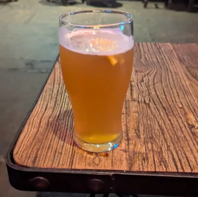
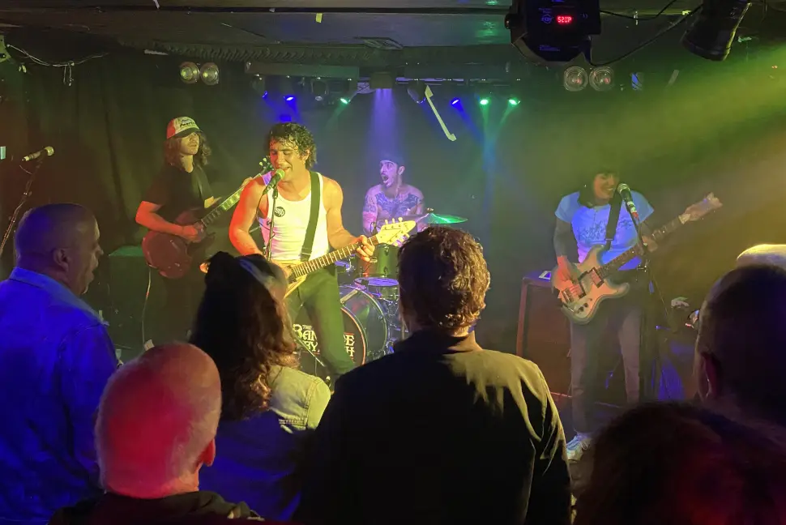
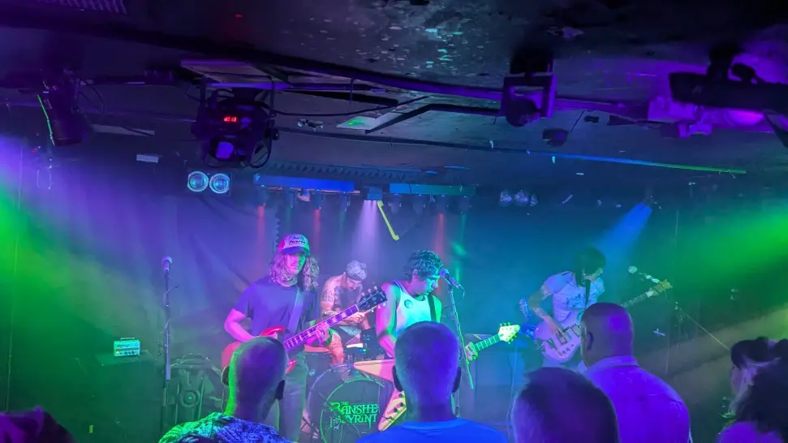

I left sharp from work and headed to the [City Restaurant](https://www.thecityrestaurant.co.uk/) for some [grub](https://idioms.thefreedictionary.com/grab+some+grub), which for me is always a good start to the evening, I had already arranged to meet the guys at [Bannermans](https://www.bannermanslive.co.uk/) for a few early gig libation, and a wee catchup (who doesn't love a wee catchup), It's always good to find out what everyone's been up to in the intervening weeks, family stuff and suggestions for new bands to see usually, but its always a pleasure.

The usual suspect turned up at various times between 7 and 30 past the hour, Chris, Ross, [Mark](hhttps://www.gig-antics.live/post/introducing-penigoth-mark) and [Danny](https://gig-antics.live). After a chat about the main event and the support act, we decided to have another drink and see the tail end of the support band.

I really enjoyed the gig and it was just as well I took the following day off, enjoyable but tiring. 😀

{: .w-75 .normal }_Blue Moon_

## The Band

LES LULLIES don’t shy away from their influences, but their synthesis of ’77-style punk with power pop and ’60s garage rock yields results that are inarguably original.

_Rocking Out!_

_Solo! Need to Concentrate_

Venue - [The Banshee Labyrinth](https://www.thebansheelabyrinth.com/)

Ze​́​ro Ambition" from the "Mauvaise Foi" LP by LES LULLIES, out 26 May, 2023 via Slovenly Recordings.


## References

* Danny - [Gig Antics](https://gig-antics.live)
* Mark - [Peni Goth Mark](https://www.gig-antics.live/post/introducing-penigoth-mark)
* The one and only - [Slash Vaseline](https://www.gig-antics.live/post/introducing-slash-vaseline)
* Les Lullies [Website](https://leslullies.fr/)
* [Slovenly Records](https://www.slovenly.com/artist/les-lullies/)
