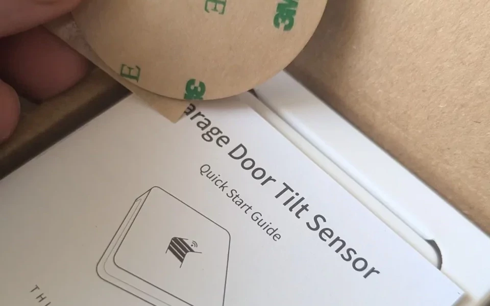
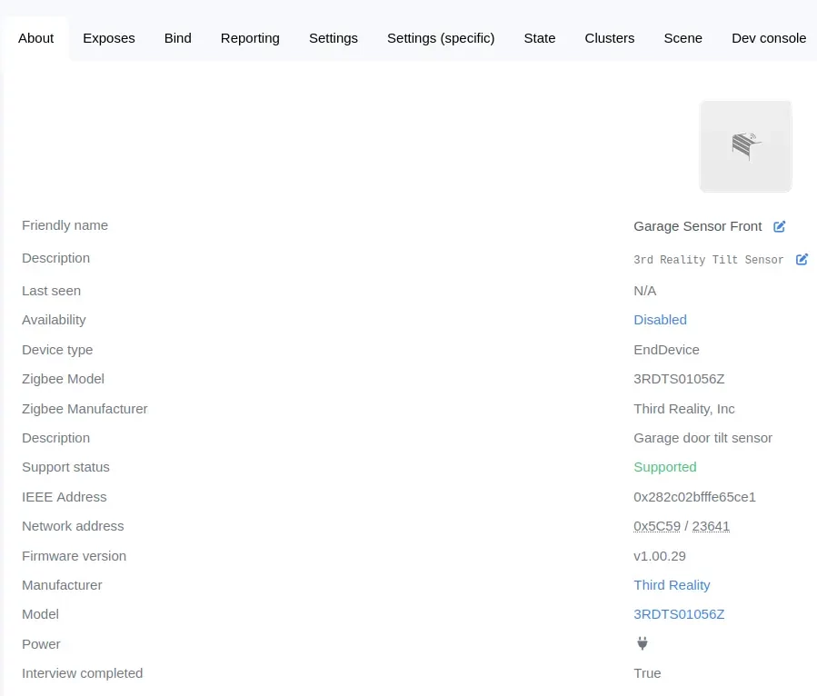
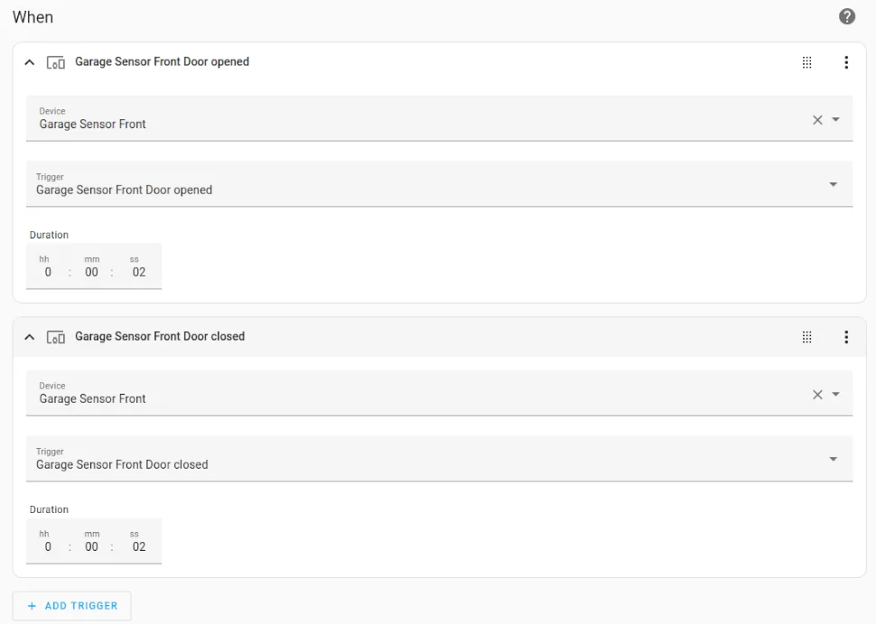
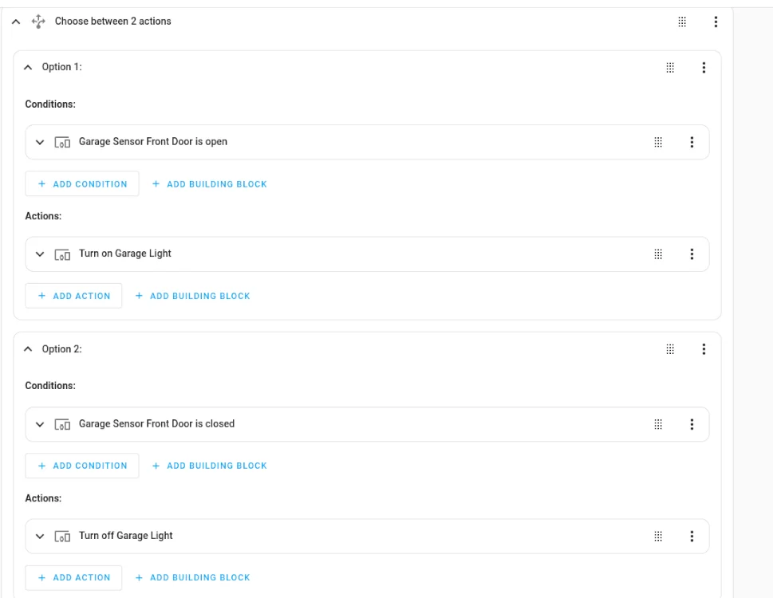
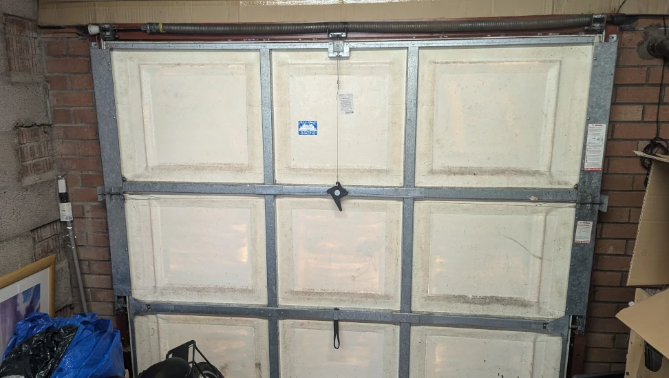
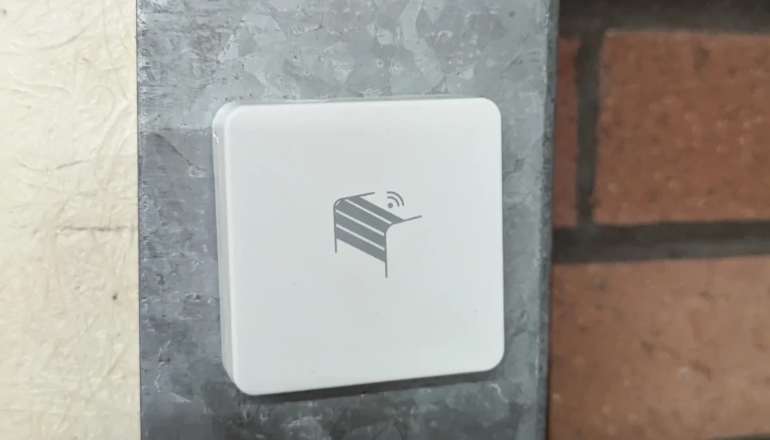

We have a small garage at home with an old tilt garage door installed, all the rage back in the day apparently. Unfortunately, these days you can't really park a car in the garage as cars in general have gotten wider, so these day we use it to store things in, garden implements and things that we don't use often and clutter up the house.

A few months ago my better looking half mentioned that when it's dark and she need to get into the garage, it's a bit of a nightmare finding the light switch to turn the garage light on when it's dark. So I had a think about it, and decided that if I could find a piece of of hardware that could communicate with my [HomeAssistant Yellow](https://www.home-assistant.io/yellow/) and turn the garage lights on automatically.

After trawling the [Home Assistant forums](https://community.home-assistant.io/) for a while, I cam across the company [3rd Reality](https://3reality.com/product/smart-garage-door-tilt-sensor/) who manufacture a zigbee tilt sensor.

## The Tilt Sensor

_What you get in the box_

## Home Assitant Setup

_Zigbee to MQTT Setup_

_Triggers_

_Conditions and Actions_

Raw Yaml

```yaml
alias: Garage Door Front
description: Turn the Garage light on when the garage door is open
trigger:
  - type: opened
    platform: device
    device_id: 2ea3f09eebf2f48b522e23bf3570100e
    entity_id: 5ec1b679a6e7f0be36da0a6cc6aa09a4
    domain: binary_sensor
    for:
      hours: 0
      minutes: 0
      seconds: 0
  - type: not_opened
    platform: device
    device_id: 2ea3f09eebf2f48b522e23bf3570100e
    entity_id: 5ec1b679a6e7f0be36da0a6cc6aa09a4
    domain: binary_sensor
    for:
      hours: 0
      minutes: 0
      seconds: 0
condition: []
action:
  - choose:
      - conditions:
          - type: is_open
            condition: device
            device_id: 2ea3f09eebf2f48b522e23bf3570100e
            entity_id: 5ec1b679a6e7f0be36da0a6cc6aa09a4
            domain: binary_sensor
        sequence:
          - type: turn_on
            device_id: 102686d703ff92a24e3a6563c09aa45b
            entity_id: c743706f29e224a89621339d1bd58973
            domain: switch
      - conditions:
          - type: is_not_open
            condition: device
            device_id: 2ea3f09eebf2f48b522e23bf3570100e
            entity_id: 5ec1b679a6e7f0be36da0a6cc6aa09a4
            domain: binary_sensor
        sequence:
          - type: turn_off
            device_id: 102686d703ff92a24e3a6563c09aa45b
            entity_id: c743706f29e224a89621339d1bd58973
            domain: switch
mode: single
```

## Sensor Positioning

_Garage Door_

_Sensor Positioning_

## References

* Third Reality [Website](https://3reality.com/)
* Home Assistant [Forums](https://community.home-assistant.io/)
* Home Assistant [Yellow](https://community.home-assistant.io/)
