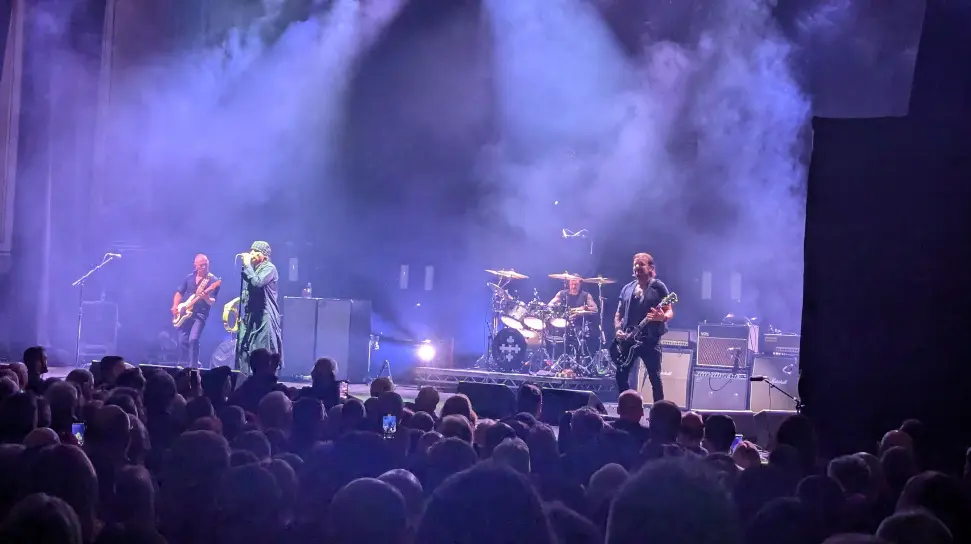

The Cult where excellent as always, some of my fellow Cult fans either prefer their Rock or Goth phases, I just like it all! The only fly in the ointment for me, was the price of the T-Shirts, considering the price of the tickets, they were taking the piss somewhat.

I’ve seen the Cult a few times over the years and they’ve always been great live, but I always remember the first time seeing them, which was in 1985 during the [Love](https://en.wikipedia.org/wiki/Love_(The_Cult_album)) tour at [Dundee University Student Union](https://www.setlist.fm/setlist/the-cult/1985/dundee-university-student-union-dundee-scotland-6bde2a02.html).

Myself and my mate Russel slept on the floor at a friends house, excellent gig and one I’ll remember for the amazing atmosphere and light show (it’s was a small venue in those days).

Venue - The [Usher Hall](https://www.usherhall.co.uk/)

## Gig Photos

## References

- The Cult [Website](https://thecult.us/DC/index.html)
- The Cult [Wikipedia](https://en.wikipedia.org/wiki/The_Cult)
