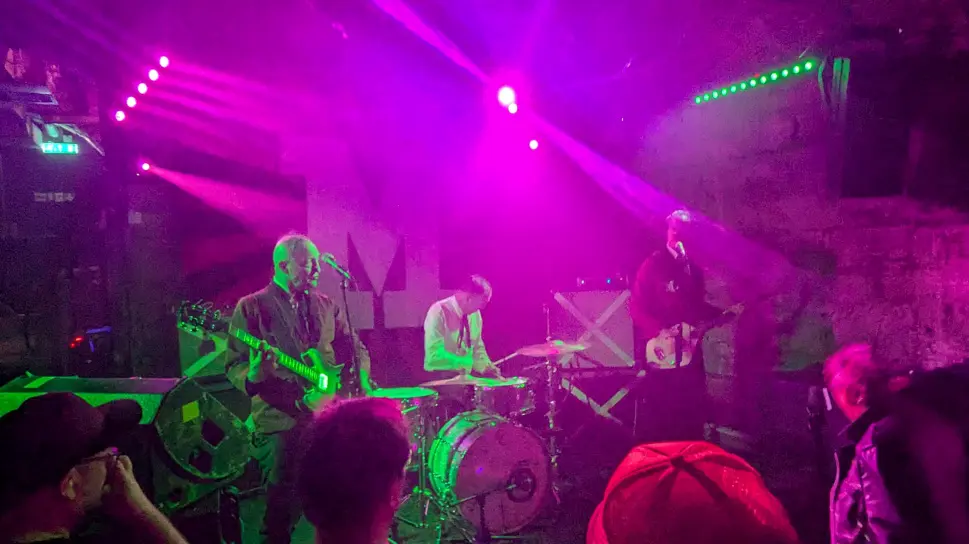

Finished work at five and popped down to [City Cafe](https://www.thecitycafe.co.uk) for some food (chilli beef nachos, Yum!) had a few drinks before meeting up with [Danny (GigAntics)](https://gig-antics.live) at around 7ish. We had  a good old chat before headed off to the gig at around 8ish as we wanted to catch the support band (Bucky Rage).

Who doesn't love noisy fuzzy guitar with a good backbeat, both bands reminded me of older proto-punk/rockabilly bands I’ve seen back in the day, anyway, I hope to see them when they happen to be near my neck of the woods in the future.

Bucky Rage Bandcamp Bio.

> Formed in 2005, The Bucky Rage have been playing their wrestling rock n roll all over the UK ever since.
Garnering a reputation as an excellent party band through hundreds of live shows, a slew of EPs, singles, international compilations and 3 albums, 'Under the Underground', 'FYI Luv U' and 'Living In A Cult'.

The Monsters Bandcamp Bio.

> The Monsters where formed in 1986 in Bern, capital of Switzerland. Their sound is a fuzzedout mix between 60ies garage punk, wild teenage trash rockabilly and primitive rock‘n‘roll. Its 187% no MTV and top 100 shit!
> The Monsters are a kick-ass live band who will burn every stage down. Over the years The Monsters recorded 7 albums, several singles and EP's and appeared on countless compilations.

Venue - [Cabaret Voltair](https://www.thecabaretvoltaire.com/)

Both bands were awesome and a good time was certainly had. Being from Scotland, I just love the name Bucky Rage!

## Gig Photos

### Bucky Rage

_Bucky Rage at the Cabaret Voltair_

_Bucky Rage at the Cabaret Voltair_

### The Monsters

_The Monsters at the Cabaret Voltair_

_The Monsters at the Cabaret Voltair_

_The Monsters at the Cabaret Voltair_

## References

- The Bucky Rage [Facebook](https://www.facebook.com/thebuckyrage)
- The Bucky Rage [Youtube](https://www.youtube.com/@thebuckyrage)
- The Bucky Rage [Bandcamp](https://the-bucky-rage.bandcamp.com/)
- The Monsters [Website](https://www.themonsters.ch/)
- The Monsters on [BandCamp](https://the-monsters.bandcamp.com/album/youre-class-im-trash)
- The Monsters on [Discog](https://www.discogs.com/artist/692949-The-Monsters-3)
