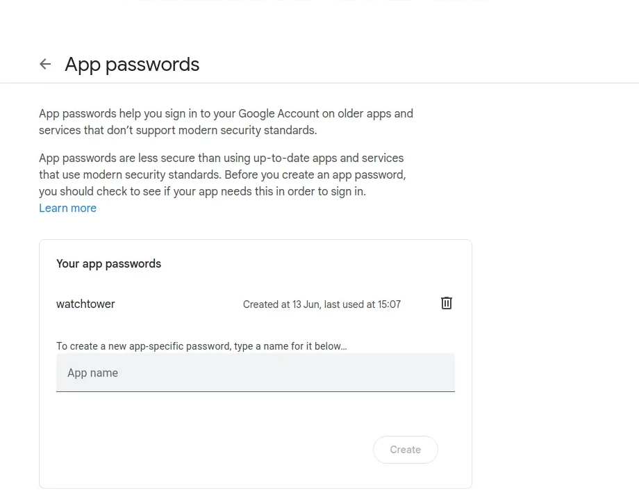
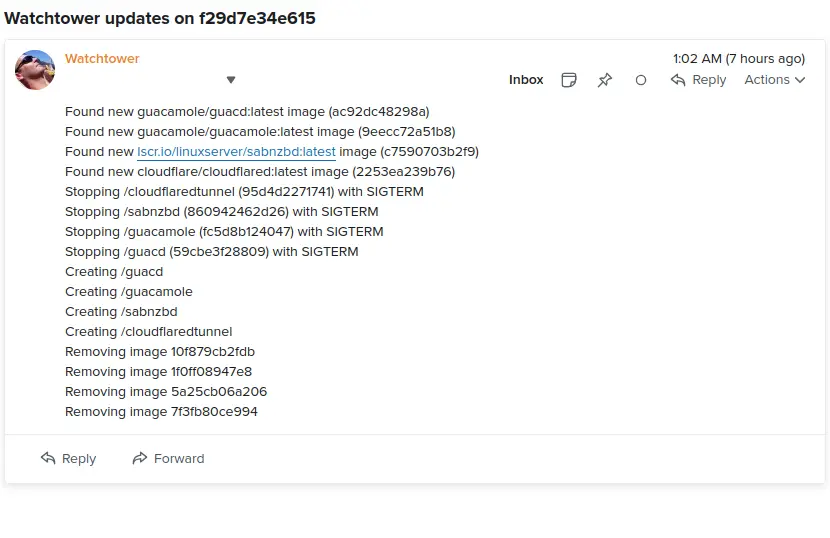

With watchtower you can update the running version of your containerized app simply by pushing a new image to the Docker Hub or your own image registry.

## Updated 16th December 2025

I was getting the following error message when starting Watchtower.

**Client version 1.32 is too old. Minimum supported API version is 1.44, please upgrade your client to a newer version** .

After some investigating, it looks like the current version of watchtower [here](https://github.com/containrrr/watchtower) is no longer getting updated to support newer versions of docker, so I'be moved over to a fork that I know works, I've updated the docker-compose script below to the new fork.

## Pre-requisites

1. Working knowledge of Linux
2. Linux box (or virtual machine) with docker already installed

Watchtower will pull down your new image, gracefully shut down your existing container and restart it with the same options that were used when it was deployed initially.

Watchtower is intended to be used in homelabs, media centers, local dev environments, and similar. Don’t use Watchtower in a commercial or production environment. If that is you, you should be looking into using Kubernetes. If that feels like too big a step for you, please look into solutions like MicroK8s and k3s that take away a lot of the toil of running a Kubernetes cluster.

## Installation

See my yaml code below, all of my docker containers reside on a self contained network called **black hole** and are checked for updates at 1:00  every night, when they are updated an email is sent through an old gmail account to my email proper.

The only thing I had to do, was to create an app password for the watchtower email client, you can do this by following the instructions in the this [link here](https://support.google.com/accounts/answer/185833?hl=en)



```yaml
services:
  watchtower:
    image: nickfedor/watchtower
    networks:
       - blackhole
    container_name: watchtower
    restart: always

    environment:
      WATCHTOWER_SCHEDULE: "0 0 1 * * *"
      TZ: Europe/London
      WATCHTOWER_INCLUDE_STOPPED: 'true'
      WATCHTOWER_CLEANUP: 'true'
      WATCHTOWER_MONITOR_ONLY: 'false'
      WATCHTOWER_REVIVE_STOPPED: 'false'
      WATCHTOWER_DEBUG: 'false'
      WATCHTOWER_NOTIFICATIONS: email
      WATCHTOWER_NOTIFICATION_EMAIL_FROM: old_gmail_account@gmail.com
      WATCHTOWER_NOTIFICATION_EMAIL_TO: billy@example.com
      WATCHTOWER_NOTIFICATION_EMAIL_SERVER: smtp.gmail.com
      WATCHTOWER_NOTIFICATION_EMAIL_SERVER_PORT: 587
      WATCHTOWER_NOTIFICATION_EMAIL_SERVER_USER: old_gmail_account@gmail.com
      WATCHTOWER_NOTIFICATION_EMAIL_SERVER_PASSWORD: "app password created above"

    volumes:
      - /var/run/docker.sock:/var/run/docker.sock

networks:
   blackhole:
    name: blackhole
    external: true
```

Below is an example of the email that's sent when an image is updated.



## References

* Installing watchtower on a [Digital Ocean Instance](https://www.digitalocean.com/community/tutorials/how-to-automatically-update-docker-container-images-with-watchtower-on-ubuntu-22-04)
* The [watchtower](https://github.com/containrrr/watchtower) github page
* Watchtower [Documentation](https://containrrr.dev/watchtower/)
* Nicolas Fedor - [Fork of Watchtower](https://github.com/nicholas-fedor/watchtower?tab=readme-ov-file)