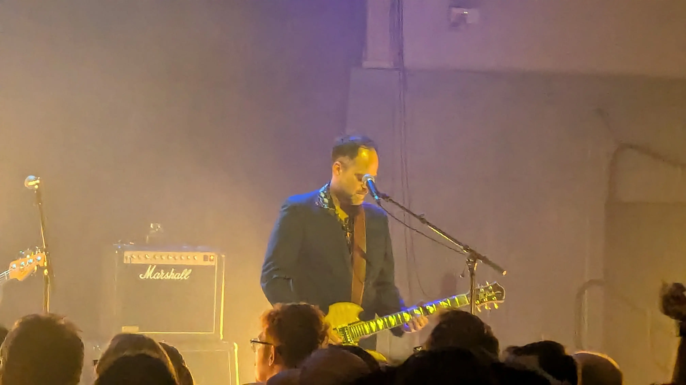
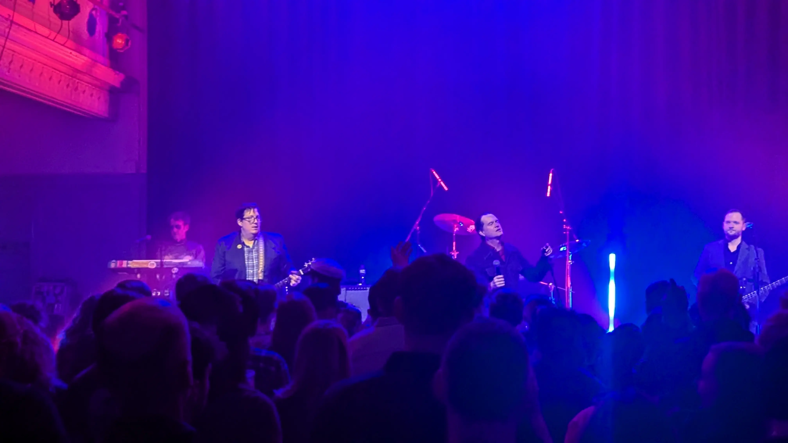
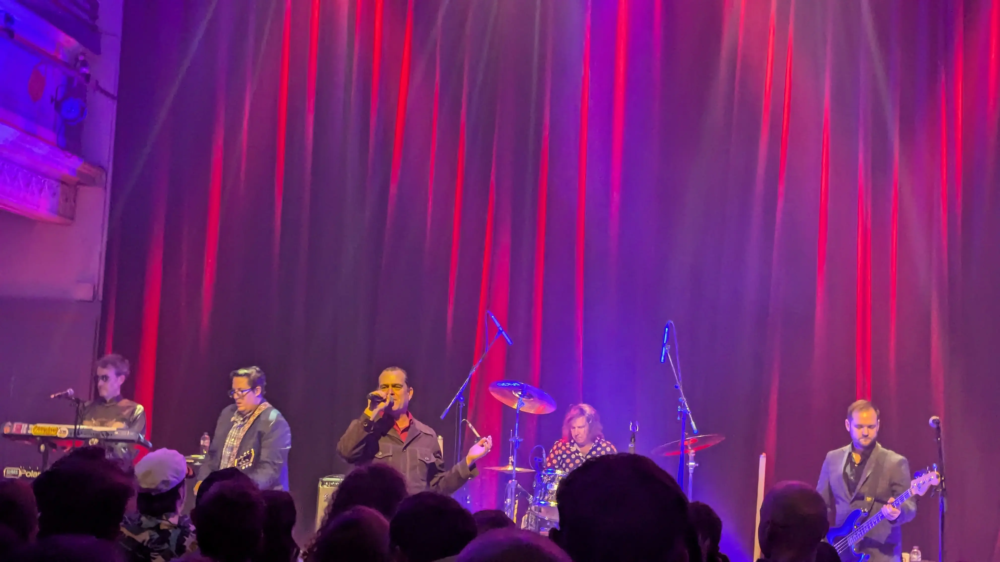
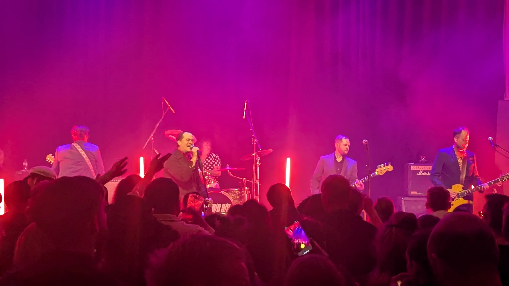

What can I say about this gig, well apart from it was unexpectedly awsome, never having seen them before and being lucky enough to score a free ticket from [Mr Slash Vaseline](https://www.gig-antics.live/post/introducing-slash-vaseline) who was double booked and was in [Bruges](https://en.wikipedia.org/wiki/Bruges). Lucky me is all I can say, loved their old classics especially Gay Bar and I really enjoyed their version of [Murder On The Dance Floor](https://www.youtube.com/watch?v=hAx6mYeC6pY) by [Sophie Ellis-Bextor](https://en.wikipedia.org/wiki/Sophie_Ellis-Bextor)

Venue - [The Queens Hall](https://thequeenshall.net)

As [Danny (Gig-Antics)](https://www.gig-antics.live/) and me mentioned on the night, everybody loves Dick 😉 (Valentine) on vocals, doing a grand job, as you can see below.



## Wikipedia

Electric Six is an American rock band formed in Detroit in 1996. They are known for combining elements of rock, disco, garage rock, metal, new wave, and punk rock.[1] Since achieving widespread recognition in 2003 with the singles "Danger! High Voltage" and "Gay Bar", they have released 20 studio albums, two rarities albums, one live album and one live DVD. Each band member is given a unique stage name; the line-up has undergone changes over the years; co-founder, lead vocalist, and primary songwriter Dick Valentine has been the only constant member. The current line-up consists of Valentine, lead guitarist Johnny Na$hinal, keyboardist Tait Nucleus?, rhythm guitarist Herb S. Flavourings, drummer Dr. J and bassist Smorgasbord.

## Gig Photos

_Johnny Na$hinal on Guitar_

_The Crowd and the Band_

_Dick Valentine on Vocals_

_The Whole Band looking cool and groovy_

## References

* Electric Six [Website](https://electricsix.com/)
* Electric Six [Wikipedia Page](https://en.wikipedia.org/wiki/Electric_Six)
