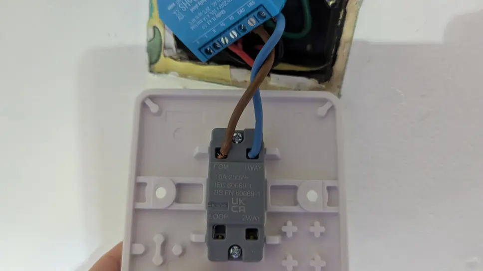
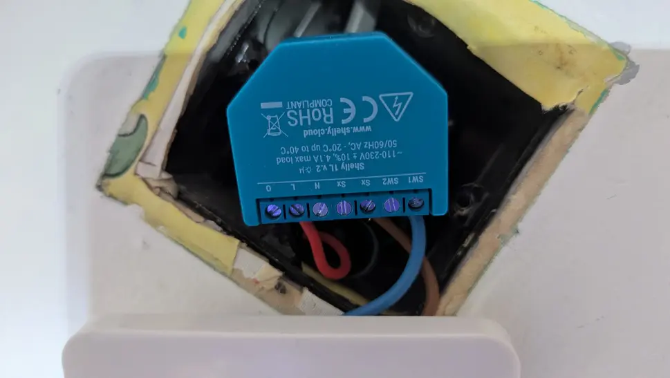
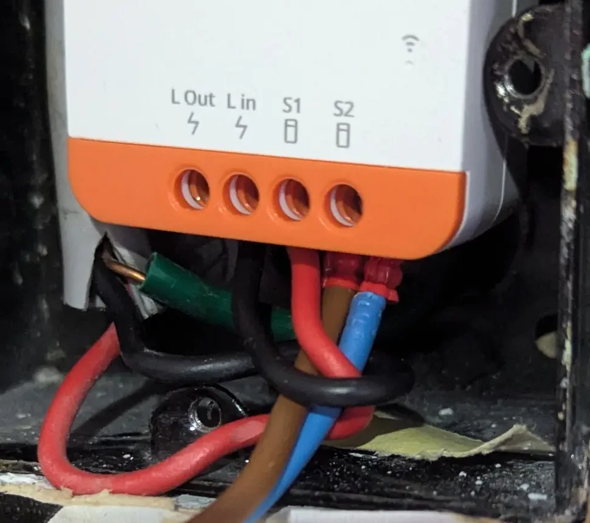

A couple of years ago I decided to add smart switches to my home, at the time, only Shelly offered a no neutral smart switch that was small enough to fit behind the wall switch. Unfortunately, they used Wi-Fi rather than Zigbee which would have been my preferred choice.

Over the years, I've had to replace 2 out of the 6 Shelly switches because they stopped working ([Magie Blue Smoke](https://en.wikipedia.org/wiki/Magic_smoke)), so I've kind of lost my faith in the Shelly product line, they also [discontinued](https://www.facebook.com/groups/ShellyIoTCommunitySupport/posts/6632790120153629/) the product without warning, not so good when you were planning to use them throughout your house.

I'm now in the process of replacing my [Shelly 1L](https://shellystore.co.uk/product/Shelly-1L/) with the [Sonoff ZBMINI-L2](https://sonoff.tech/product/diy-smart-switches/zbmini-l2/) zigbee smart switches which after some research, appear to be a bit more robust then the Shelly 1L. The one being replaced is in my Office/Spare Room.

> Remember to switch off the circuit at the fuse box (consumer unit) and check with a meter or an electrical testing pen that the circuit is off before working on it, mains electricity can kill. If you don’t know what you're doing and/or, are not comfortable working with  mains electricity, then pay an electrician to do the work.
 {: .prompt-danger }

## Photos

_Old Shellys and Contact Switch_

_Shelly 1L prior to removal_

_New Sonoff Switch_

## References

* Sonoff  [Website](https://sonoff.tech/products/)
* Radio Spares [Wiring Colour Guide](https://uk.rs-online.com/web/content/discovery/ideas-and-advice/wiring-colours-guide)
* Home Assistant Community - [How to wire a Sonoff ZBMINIZ2](https://community.home-assistant.io/t/how-to-wire-a-sonoff-zbmini-l2-extreme-for-uk-2-way-light-switches/572387)
