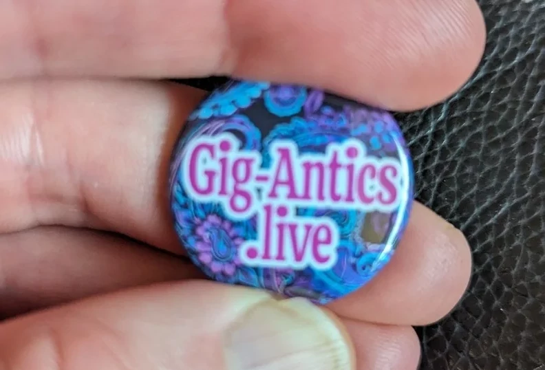

## Thoughts

Luckily, my good mate Danny Cordiner from [Gig-Antic](https://www.gig-antics.live/) suggested this one to me, and he's usually pretty good at choosing bands that I would appreciate and on this one, he was bang on the money. Loved the tunes, they were reminiscent of a cross between [Joy Division](https://en.wikipedia.org/wiki/Joy_Division) and [She Wants Revenge](https://en.wikipedia.org/wiki/Joy_Division) and pretty enjoyable.

A good night was had by all, the usual suspects (Mark, Chris, Ross and or course [Danny](https://www.gig-antics.live/)), hoping to go to many more over the coming year.

Thanks for the badge Danny, much appreciated.

## The Band

Venue - [The Voodoo Rooms](https://www.thevoodoorooms.com/)

> IST IST are a post-punk band based in Greater Manchester, United Kingdom. The group consists of Adam Houghton (vocals, guitar), Mat Peters (guitar, synthesiser keyboards), Andy Keating (bass) and Joel Kay (drums).
>
> The band formed in late 2014, and were originally going to call themselves DAS IST, but decided it sounded too industrial, so went with IST IST. They gained popularity in the Manchester music scene from word-of-mouth after gigs at venues such as The Ritz, Gorilla and The Deaf Institute. After a number of singles, the band went on to release two EPs, Spinning Rooms in 2018, and Everything Is Different Now in 2019, before releasing their debut album Architecture in 2020, which reached number three on the UK Independent Albums Chart.

## References

* [IST IST](https://www.ististmusic.com/) Website
* [Wikipedia](https://en.wikipedia.org/wiki/Ist_Ist) page about the band
