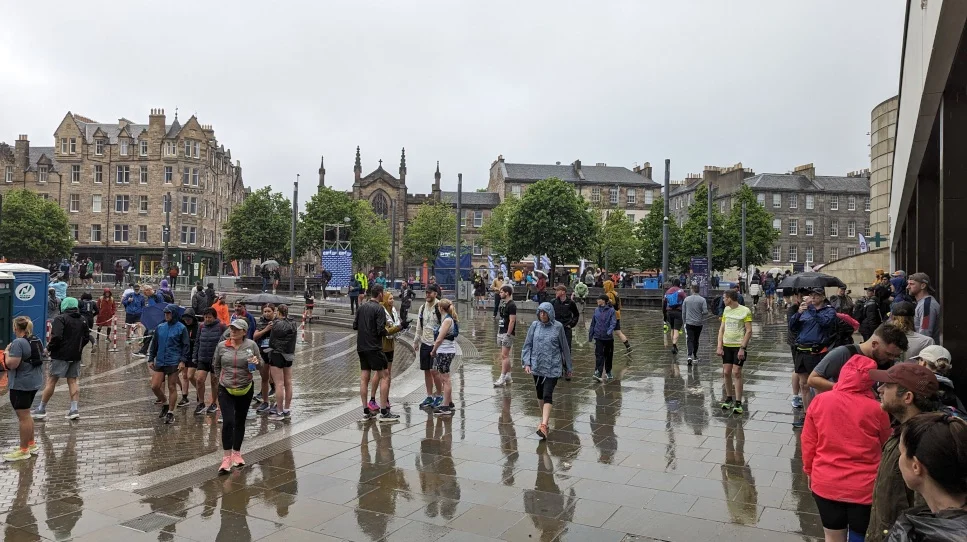
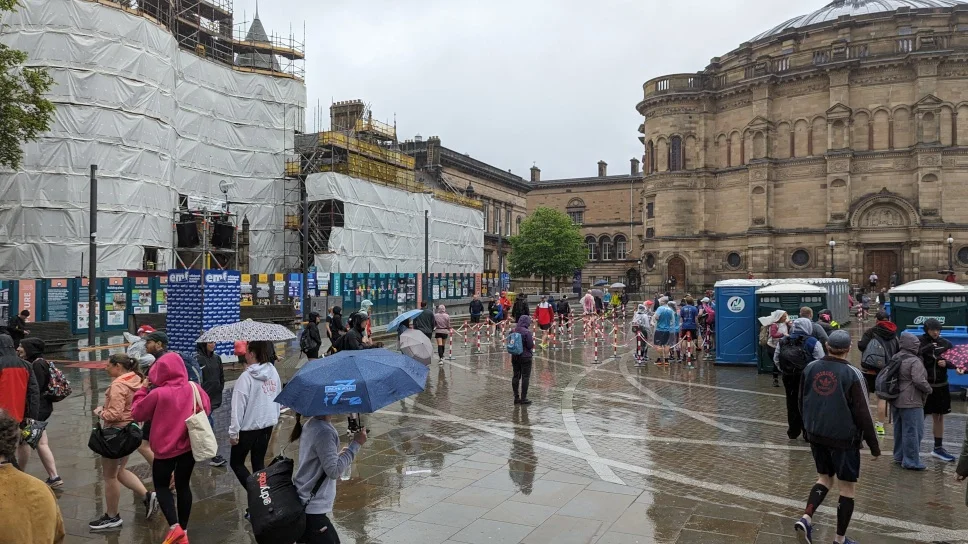
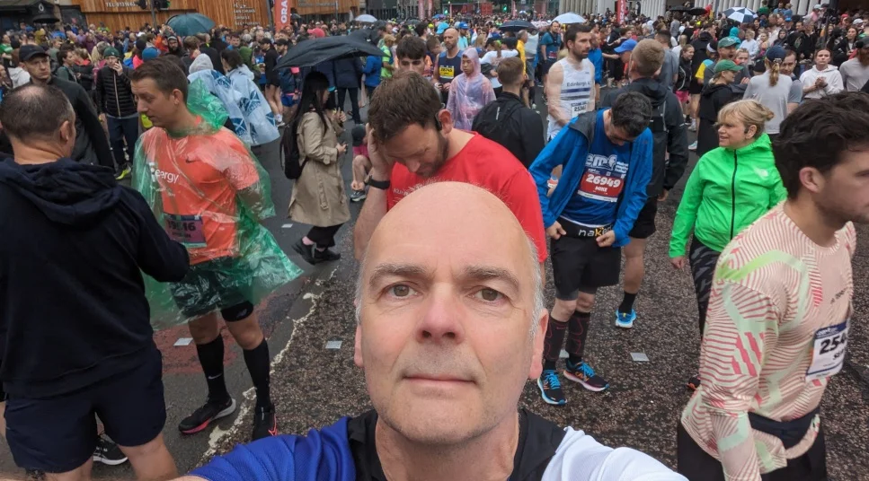

## Preamble

This run is literally on my doorstep so it would be rude not to, as it happened the day started to rain and didn’t stop all day, so as you can probably image, everyone running the Half Marathon that day was thoroughly soaked from start to finish.

Apparently the organisers of the run, [ran out of medals](https://news.stv.tv/east-central/edinburgh-marathon-runners-fuming-after-organisers-run-out-of-competitor-medals) for the marathon. I think it's totally unacceptable for that to happen, I mean you know how many runners your catering for, at that point it's simple arithmetic?

As it happens, I quite enjoyed the run despite the weather, I might even be tempted to run the full marathon next year, if they get their shit together.

## Event Photos

_Early in the morning_

_Before the Start_

_Me at the Starting line_
