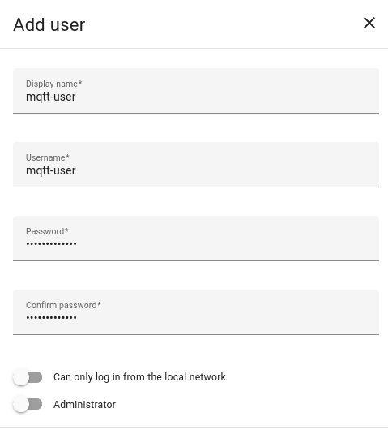
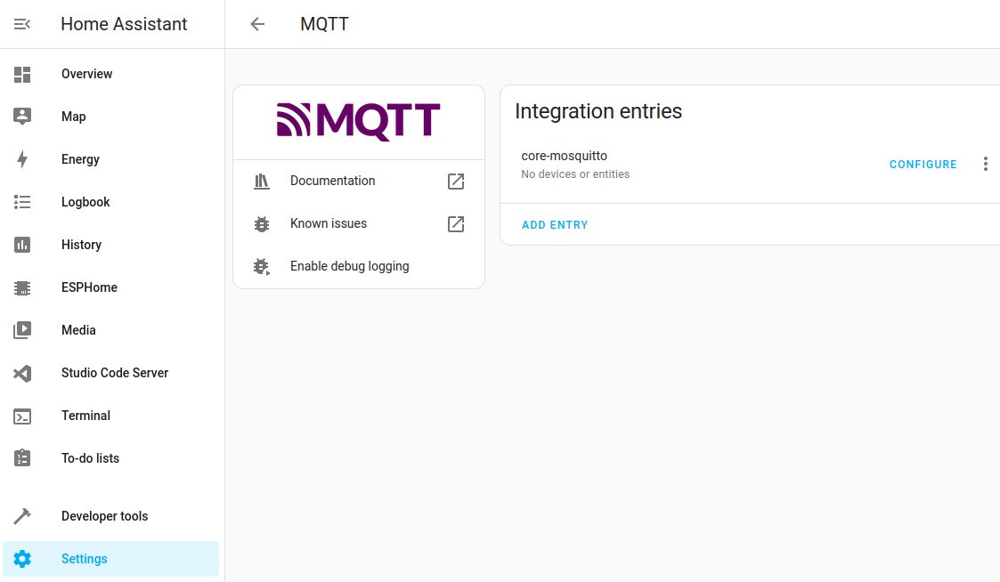

## Create a user for the Mosquitto Broker addon

1. Select Settings
2. Select People
3. Select Users
4. Select Add User
5. Create a user called mqtt-user
6. Give it a good password, take a note of what is, an example being 44G$2Yto^^$Zs

_Add a User_

1. Select Settings
2. Select Addon-ons
3. Click on _ADD-ON STORE_
4. In the search bar, type Mosquitto and select Mosquitto Broker
5. Click on the _INSTALL_ button
6. Turn on _Start on Boot_
7. Turn on _Watchdog_
8. Select _Settings_ then _System_ and _Restart Home Assitant_
9. When Home Assistant restarts, check Notifications, it should say _New devices discovered_
10. Click on _Check it out_
11. Scroll down until you see _MQTT_ and select
12. Click on _Configure_
13. Under _MQTT settings_ click on _RE-CONFIGURE MQTT_
14. Fill in Username with _mqtt-user_
15. Fill in Password created above.

## References

* Installing MQTT- [Everything Smart Home](https://youtu.be/dqTn-Gk4Qeo?si=XTV_WoNA72LuOztw)
* Installing Zigbee2MQTT THE RIGHT WAY - [Smart Home Junkie](https://youtu.be/4y_dDgo0i2g?si=8lvSODKdqqh4lZao)
