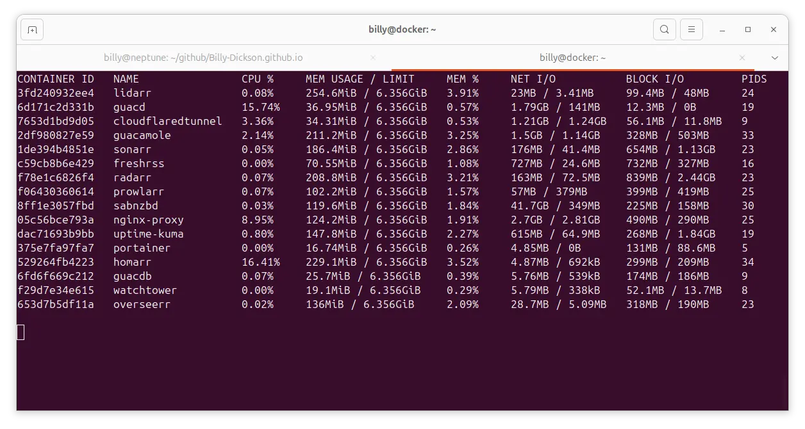
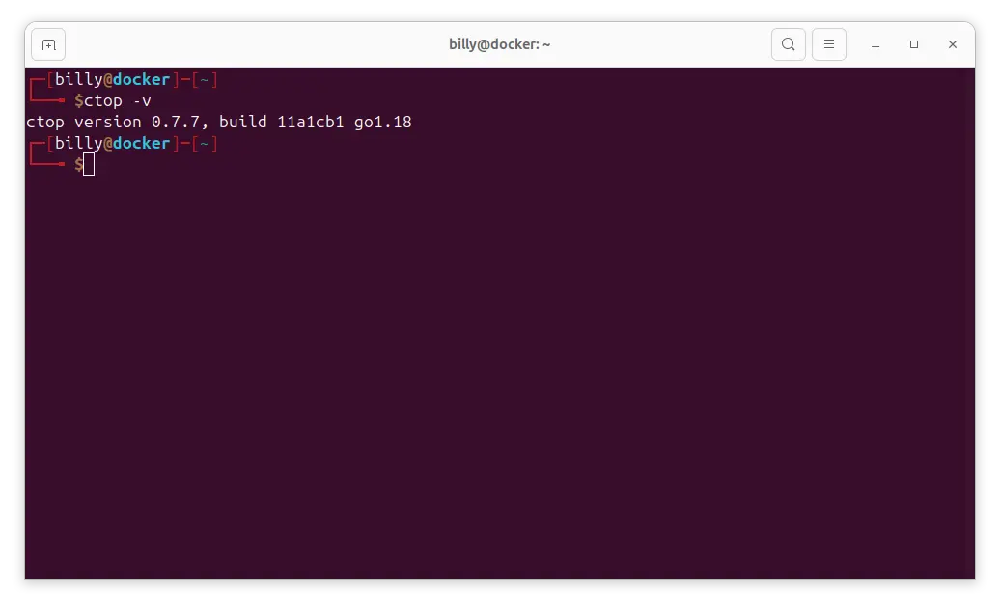
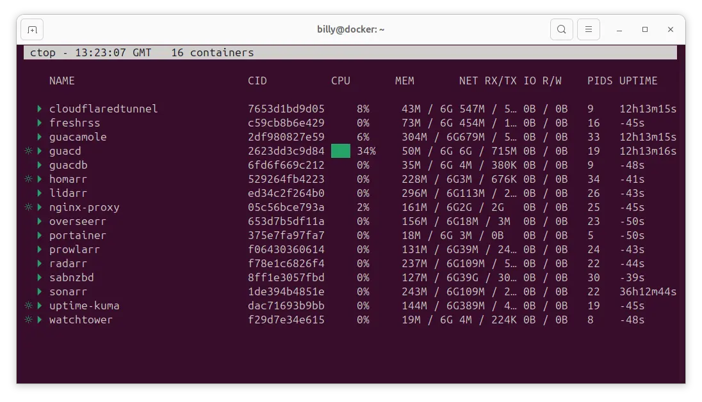
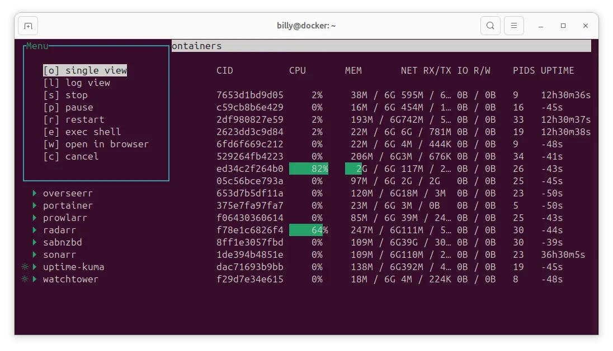
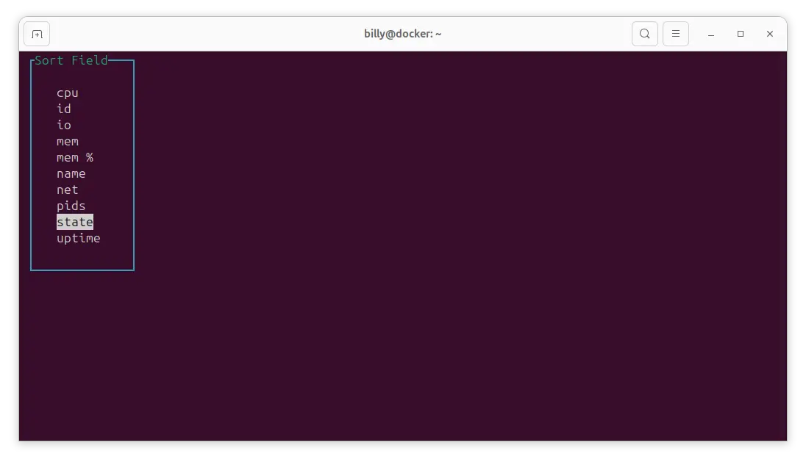
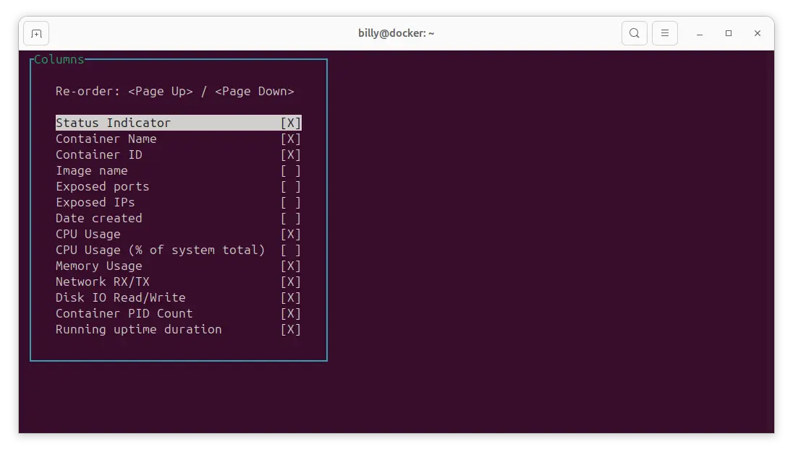
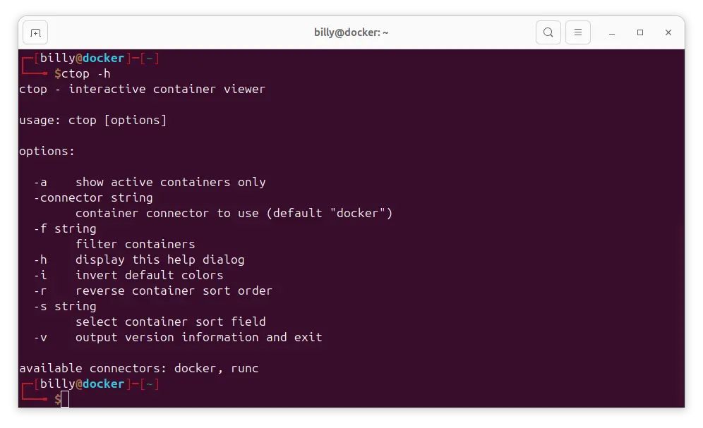

ctop is a free open source, simple and cross-platform top-like command-line tool for monitoring container metrics in real-time. It allows you to get an overview of metrics concerning CPU, memory, network, I/O for multiple containers and also supports inspection of a specific container.

The only concern that I have, is that the software hasn't been updated in a while, but saying that, it works well and does what it says on the the tin. If you have concerns about installing a binary, then do feel free to look over the source code prior to compiling and installing it yourself.

Instructions for doing so are on thisi [link here](https://github.com/bcicen/ctop/). 😃

If you just want to see the stats and don't intend to use the rest of the functionality, you can of course use the folllowing command.

```bash
docker stats
```



Use the ctrl + c to exit

## Download and Install

Download the ctop binary for Linux from the GitHub release page

```bash
sudo wget https://github.com/bcicen/ctop/releases/download/v0.7.7/ctop-0.7.7-linux-amd64 -O /usr/local/bin/ctop
```

Make the binary executable

```bash
sudo chmod +x /usr/local/bin/ctop
```

Verify that ctop is installed correctly by running

```bash
ctop -v
```



You can also check manually, going to the install directory

```bash
cd /usr/local/bin/
```

List the files in the directory

```bash
ls -la
total 74872
drwxr-xr-x  2 root root     4096 Jan  5 19:44 .
drwxr-xr-x 10 root root     4096 Sep 16  2023 ..
-rwxr-xr-x  1 root root 13606047 Mar 22  2022 ctop
-rwxr-xr-x  1 root root 63052874 Jun  9  2024 docker-compose
```

If you decide later that it's not for you, you can always delete the file by typing the following at the prompt.

```bash
sudo rm /usr/local/bin/ctop
```

## Using ctop

ctop is a command-line tool that runs in your terminal. When you start ctop, you'll see a live view of your Docker containers with their resource utilization metrics. You can sort the containers by various criteria, such as CPU usage, memory usage, network traffic, and more.

Here's an example of running ctop with the default setting

```bash
ctop
```

This will display a live view of your Docker containers, sorted by their CPU usage. You can use the up and down arrow keys up to navigate between containers and the right arrow key to view "Single View" the left arrow key displays the container log.


You can also use the return key to Stop, Pause, Restart as well as other useful commands


To sort the containers by a different criteria, press the s key followed by the corresponding shortcut key, press the q key to return to the ctop main page.


You can change what columns are displayed by pressing the c key and selecting what you want to display, use the up and down arrow keys and return to change the selection, press the q key to escape to the ctop main menu.


Command line options can be viewed by typing

```bash
ctop -h
```



## Conclusion

ctop is a powerful tool for monitoring and managing Docker containers in real-time. Its top-like interface and detailed container metrics make it easy to identify and troubleshoot container issues, optimize resource utilization, and ensure the smooth operation of your Docker infrastructure. With its customizable interface and numerous options for filtering and sorting containers, ctop is a versatile tool that can be tailored to your specific needs. Whether you're a Docker power user or just getting started with containerization, ctop is a must-have tool in your toolbox.

## References

- [Ctop website](https://ctop.sh) - Concise commandline monitoring for containers
- Techmint #1 Linux Blog - [ctop](https://www.tecmint.com/ctop-monitor-docker-containers/)
- Computing for Geeks - Monitor Computer Container Resources using [ctop](https://computingforgeeks.com/monitor-docker-container-resources-using-ctop/)
- Debian Package maintained by a [third party](https://packages.azlux.fr/)
- TechRepublic - How to monitor your docker containers with [ctop](https://www.techrepublic.com/article/how-to-monitor-your-docker-containers-with-ctop/)
- [Tutorialspoint](https://www.tutorialspoint.com/ctop-ndash-top-like-interface-for-monitoring-docker-containers) Website
