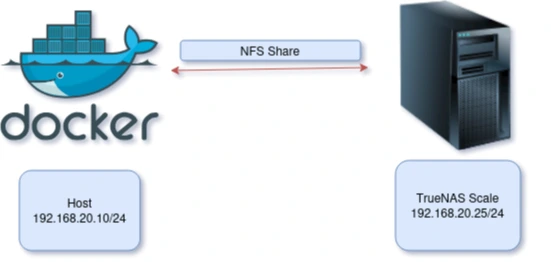
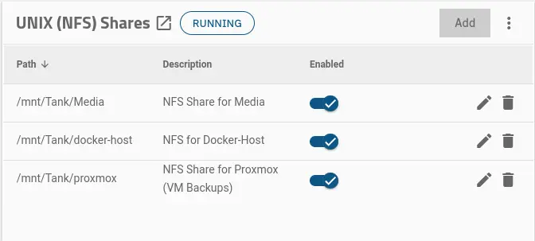
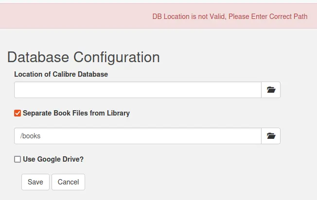
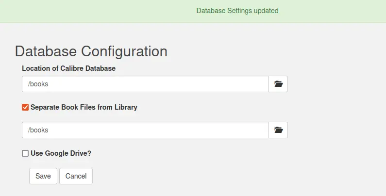
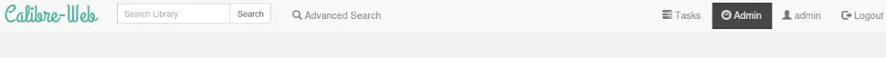
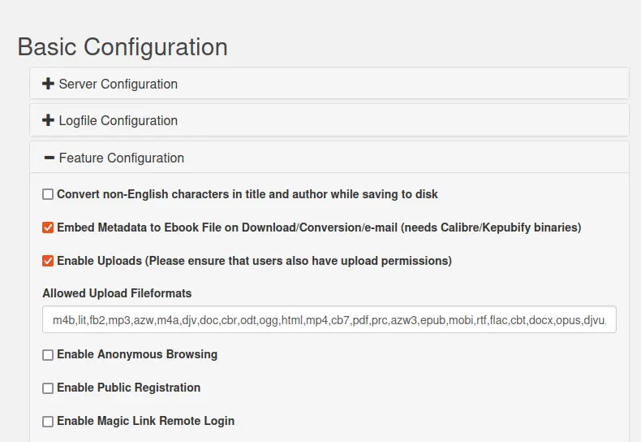
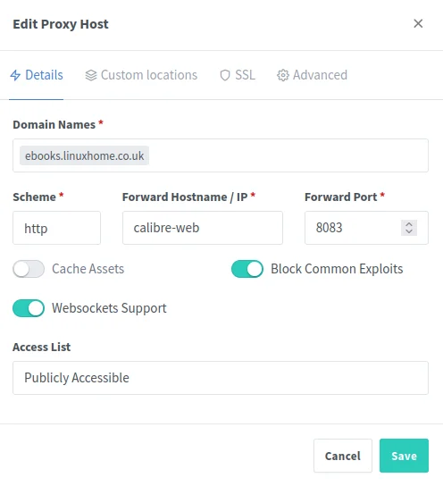
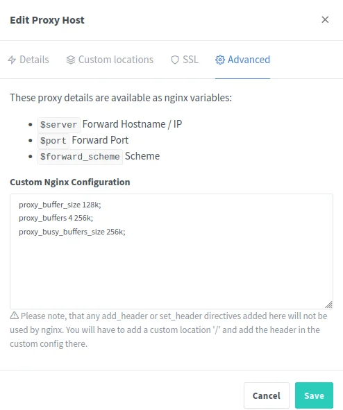

Calibre Ebook Manager is a versatile free tool for managing, converting and reading e-books. With Calibre you can organize your e-book collection, convert books into different formats, edit metadata and transfer e-books to different reading devices. In addition to the Calibre desktop program, there is also a web interface, Calibre Web, which can be used to access the Calibre database.

## Hardware Setup

I'm running Docker on a Debian Linux Virtual Machine



## Prerequisite

1. A running [docker host](https://thebloody.cloud/posts/Debian-Host-On-Proxmox/) on either bare metal or in a [Virtual Environment](https://thebloody.cloud/posts/Cheap-Home-Proxmox-Server/).
2. I'm saving my ebooks and database on a [TrueNAS Scale Home Server](https://thebloody.cloud/posts/Current-Home-Server/) for ease of offsite backup, but there's nothing to stop you saving them on a docker volume instead of a NFS volume. You will have to change the volume mounting options accordingly.

## Docker Setup

With regards the docker compose file below, I'm creating a network called *blackhole* as it supports DNS resolution, I've also mapped the ebook volume to my TrueNAS Scale server. If you want to keep it simple, do feel free to use the docker compose file on their [website](https://github.com/linuxserver/docker-calibre-web).

```yaml
services:
  calibre-web:
    image: lscr.io/linuxserver/calibre-web:latest
    networks:
      - blackhole
    container_name: calibre-web
    environment:
      - PUID=1000
      - PGID=1000
      - TZ=Europe/London
      - DOCKER_MODS=linuxserver/mods:universal-calibre #optional
    volumes:
      - calibre-web:/config
      - ebooks:/books
    ports:
      - 8083:8083
    restart: unless-stopped

volumes:
   ebooks:
      driver_opts:
         type: "nfs"
         o: "addr=192.168.20.25,nolock,soft,rw"
         device: ":/mnt/Tank/Media/Books"
   calibre-web:
      name: calibre-web

networks:
   blackhole:
      name: blackhole
      external: true
```

TrueNAS Scale NFS Share setup below



## Configure Calibre

To access the Calibre web interface, we enter the IP address of the server / host followed by the port defined in the Docker-Compose file: 8083

```text
http://ip-address:8083
````

Then the login page of Calibre-Web appears where we can log in using the following standard login data:

* Username: admin
* Password: admin123

The username and password should be changed in any case, especially if the Calibre web instance is to be publicly accessible.

As this is a virgin install, and I'm not importing files from [Calibre](https://calibre-ebook.com/), I'm going to have to create a database in the container. To do this you'll have to type the following command. Do bare in mind that if you're using a different volume name, you'll have to change the command appropriately.



```bash
docker exec -it calibre-web /bin/bash -c "cd /app/calibre/bin/ && mkdir /books/.calnotes && calibredb restore_database --really-do-it --with-library /books”
```



I intend to download the ebooks I own to calibre, as I might have to convert them first. But to do that, you need to enable downloading globally, followed by downloading per user.

To do that, login in as admin, and select admin, scroll down until you see *Edit Basic Configuration*



Select *Feature Configuration* then tick *Enable Download*, scroll down to the bottom of the page and press the Save Button.



## Nginx Proxy Manager Settings

I run [Nginx Proxy Manager](https://nginxproxymanager.com/) internally on my home network and it works great, doing so means that I don't have to deal with self signed certificates when I browse internal. Below are the setting that I use for calibre-web.

Advanced settings



```text
proxy_buffer_size 128k;
proxy_buffers 4 256k;
proxy_busy_buffers_size 256k;
```



## Security Considerations

1. Change the admin login, name and email address, then change the password to something with at least 12 characters.
2. Don't expose Calibre Web to the internet, unless it's behind something like a cloudflare tunnel with at the minimum, email 2FA enabled and tested.

Tom Lawrence has a really good youtube video on how to setup a Cloudflare Tunnels for your homelab, see below.



## Reference

* [Proxmox](https://www.proxmox.com/en/) - Open Source Virtual Environment
* [Debian Linux](https://www.debian.org/) - Open Source Operating System
* [Cybertalk.io](https://cybertalk.io/en/calibre-web-a-practical-front-end-for-ebook-management/) - Calibre web, a practical front-end for eBook management
* Nginx Reverse Proxy setting for [Calibre Web](https://github.com/janeczku/calibre-web/wiki/Setup-Reverse-Proxy)
