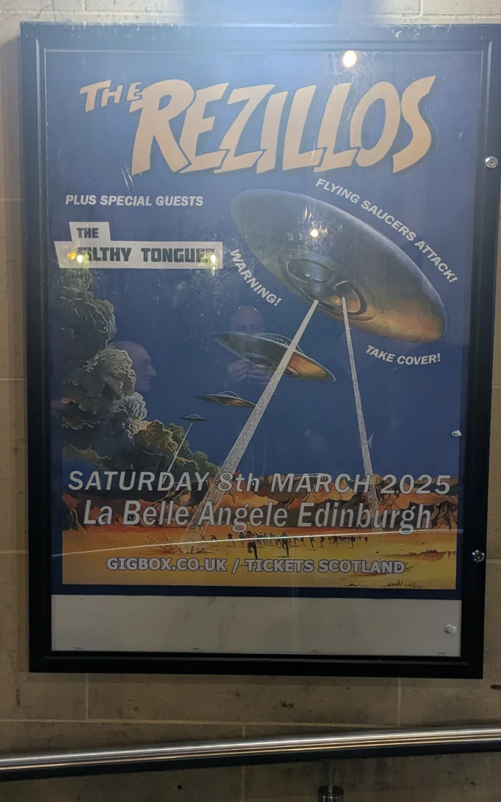
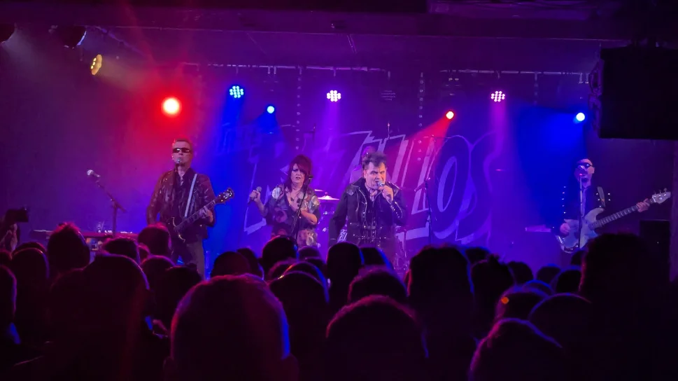
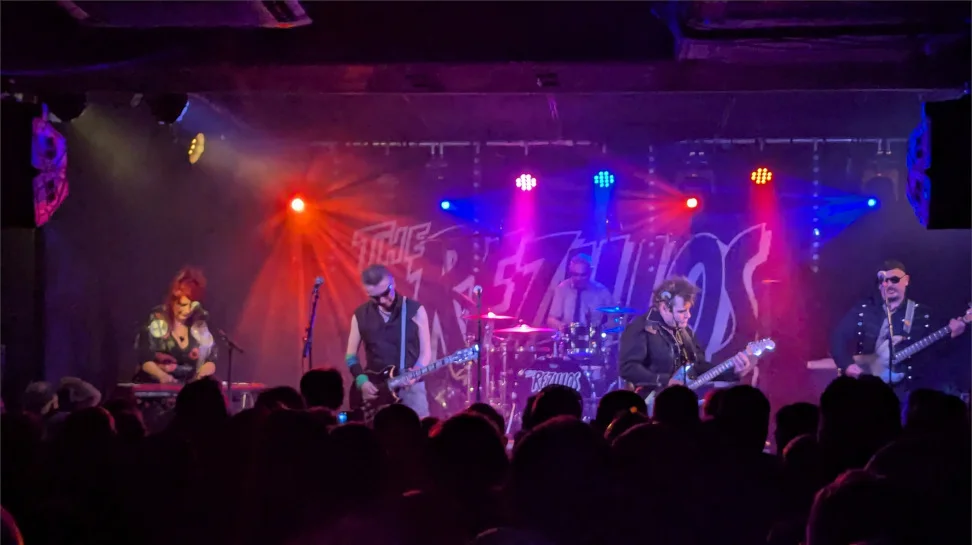
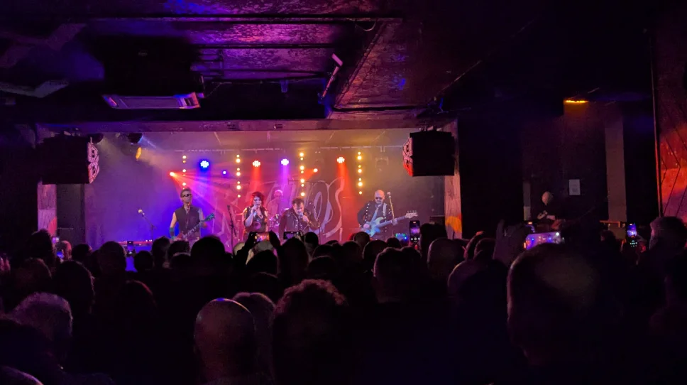

We all decided to meet up at Bannermans (Mark, Gavin, Vince and David) for a pre gig drink, after myself and Russel did usual the Domino's pizza thing at his gaff. After a wee chat we decided to see the support band, which sometimes we don't always do they were an edinburgh band called The Filthy Tongues, not my usual thing, but I did quite enjoy them.

The Filthy Tongues Bio

> The Filthy Tongues are an alternative rock group from Edinburgh, Scotland, made up of Martin Metcalfe, Fin Wilson and Derek Kelly, who were previously members of Goodbye Mr Mackenzie and Angelfish alongside Shirley Manson. As Isa & the Filthy Tongues with singer Stacey Chavis, the band released two albums.

The Rezillos Bio

> The Rezillos are a punk and new wave band formed in Edinburgh, Scotland, in 1976. Although emerging at the same time as other bands in the punk rock movement, the Rezillos did not share the nihilism or social commentary of their contemporaries. Instead, the band took a more light-hearted approach in their songs; at the time, they preferred to describe themselves as "a new wave beat group". Their songs are heavily influenced by 1950s rock and roll, 1960s English beat music and garage rock, early 1970s glam rock, with recurring lyrical themes of science fiction and B movies; their influences mirrored those of US bands the Cramps and the B-52s, who were starting out at the same time. The Rezillos' biggest hit in their home country was the UK Top 20 single "Top of the Pops" in 1978, but they are best known outside the UK for their cover version of "Somebody's Gonna Get Their Head Kicked In Tonight", which was featured on the soundtrack to Jackass: The Movie in 2002. Since the Rezillos recorded it, the song has been covered by other punk bands, including Youth Brigade and Murphy's Law.

Venue - [La Belle Angel](https://la-belleangele.com/)

## Gig Photos

_Rezillos Poster_

## References

* The [Filthy Tongues](https://en.wikipedia.org/wiki/The_Filthy_Tongues) Wikipedia
* Mark - [Peni Goth Mark](https://www.gig-antics.live/post/introducing-penigoth-mark)
* The [Rezillos](https://rezillos.rocks/) Website
* The [Rezillos](https://en.wikipedia.org/wiki/The_Rezillos) on Wikipedia
* The [Rezillos](https://www.facebook.com/TheRezillos/) Facebook Group
