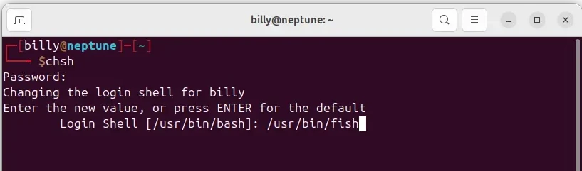

I've been using bash since I started using Linux at home, and occasionally at work for over 20 years and it's been great, until I moved to fish and found out what I've been missing. There's a great explainer [here](https://www.freecodecamp.org/news/linux-shells-explained/) at freecode camp.

## What is bash shell

In computing, Bash (short for "Bourne Again SHell,")s an interactive command interpreter and command programming language developed for UNIX-like operating systems. Created in 1989 by Brian Fox for the GNU Project, it is supported by the Free Software Foundation and designed as a 100% free alternative for the Bourne shell (sh) and other proprietary Unix shells.

## What is fish shell

Fish (or friendly interactive shell- stylized in lowercase) is a Unix-like shell with a focus on interactivity and usability. Fish is designed to be feature-rich by default, rather than highly configurable.[5] Fish is considered an exotic shell since it does not adhere to POSIX shell standards, at the discretion of its maintainers.

## Installation

Packages for Ubuntu and Debian are available from the fish PPA, and can be installed using the following commands.

```bash
sudo apt-add-repository ppa:fish-shell/release-4
sudo apt update
sudo apt install fish
```

Find out where the fish shell is installed

```bash
which fish
```


Add it as a pickable option in the shells file

```bash
echo "/usr/bin/fish" | sudo tee -a /etc/shells
```

Check to make sure it’s been added.

```bash
cat /etc/bin/shells
```


## The chsh Command

The chsh command allows you to change your default shell. The trick is being aware that it allows you to change both the default login and default interactive shells. You might want to change one or the other, or both.

Whenever you log in to obtain a command prompt, you use the shell configured to be your login shell. When you're already logged in and open a terminal window, you use the shell configured to be your interactive shell. These can either be the same or different shells.

To set your login shell, use chsh with no parameters

```bash
chsh
```



You're prompted for your password. Then, you must type the path to the new shell and hit Enter.

If we make a remote connection to this test computer from another, we'll find ourselves in the fish shell once we've logged in.


To change your interactive shell use chsh with the -s (shell) option. Pass the path to the new shell on the command line

```bash
chsh -s /usr/bin/fish
```


You're prompted for your password and returned to the command prompt of your current shell. You need to log out and back in for the change to take effect. When you do, you'll see the greeting and the fish shell command prompt.

The shell environment variable should now hold the string /usr/bin/fish

```bash
echo $SHELL
```


## Changing a users shell

If you have root or sudo access, you can of course change someone elses shell, using the chsh command.

```bash
sudo chsh -s /usr/bin/fish mary
```

## Changing the default prompt

The default prompt that you get with fish is fine, but they do have a number of alternatives that IMHO are better.


To show the prompts available, you would type the following.

```bash
fish_config prompt show 
```

To choose a prompt you would type the following, this one is called astronaut, my current favorite

```bash
fish_config prompt choose astronaut
```

If this is the one your going with then you would save the configuration.

```bash
fish_config prompt save
```

## Adding paths and variables

This is a reminder to myself that might be helpful to others who develop websites using [Jekyll](https://jekyllrb.com/docs/installation/ubuntu/).

Adding GEMS_HOME variable to so that [Jekyll](https://jekyllrb.com/docs/installation/ubuntu/) know where the Gem files are stored, see link above for more details.

Open a terminal

Use the set command with the -U or --universal flag.

```bash
set -Ux GEM_HOME "$HOME/gems"
```

Add a path to the gems folder

```bash
fish_add_path -m ~/gems/bin
```

Adding a path to the sbin folder, which I've noticed appears to be missing under fish.

```bash
fish_add_path -m /usr/sbin
```

Removing the quote from a directory listing with spaces.

```bash
set -Ux QUOTING_STYLE "literal"
```

If you want to see all your universal variables, you can check the ~/.config/fish/fish_variables file.

## References

* Fish vs Bash: [a Quick Comparison](https://bashcommands.com/fish-vs-bash)
* Why I Use [Fish Shell Over Bash and Zsh](https://medium.com/better-programming/why-i-use-fish-shell-over-bash-and-zsh-407d23293839)
* Finally, a [command line shell](https://fishshell.com/) for the 90’s
* The Fish [Github](https://github.com/fish-shell/fish-shell) page
* Installing [Jekyll](https://jekyllrb.com/docs/installation/ubuntu/)
* [Fish](https://fishshell.com/docs/current/index.html) Documention Site
