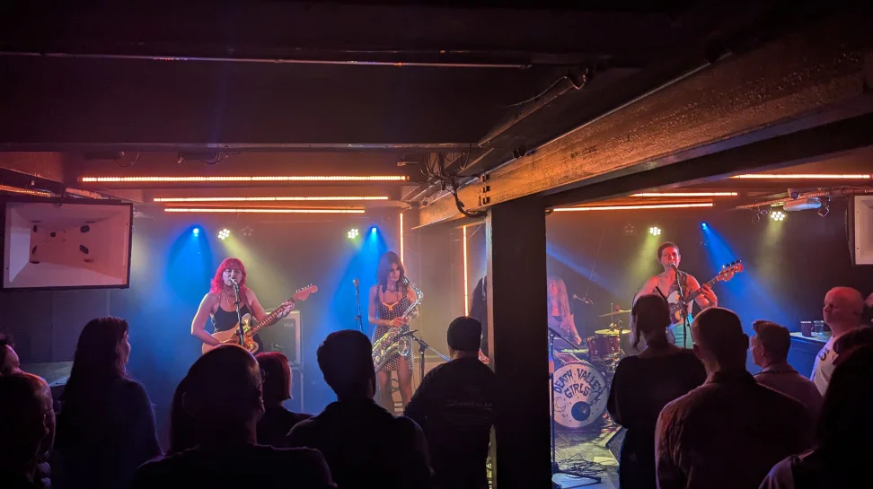
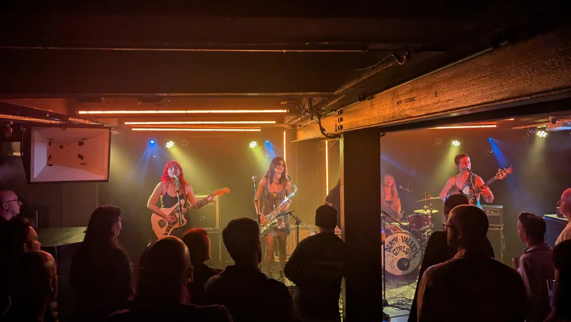
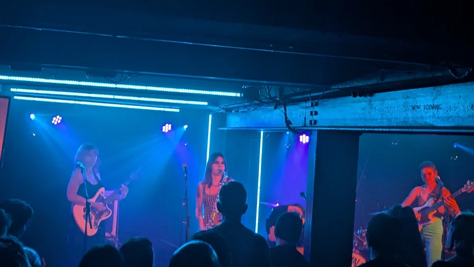
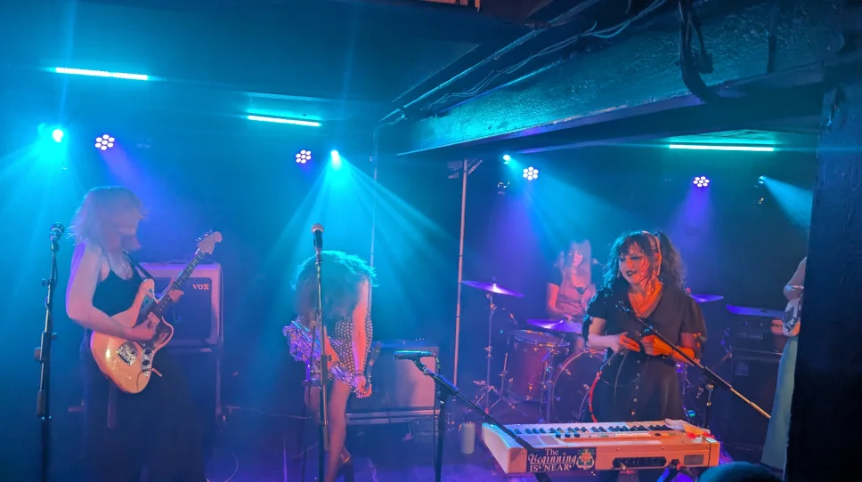
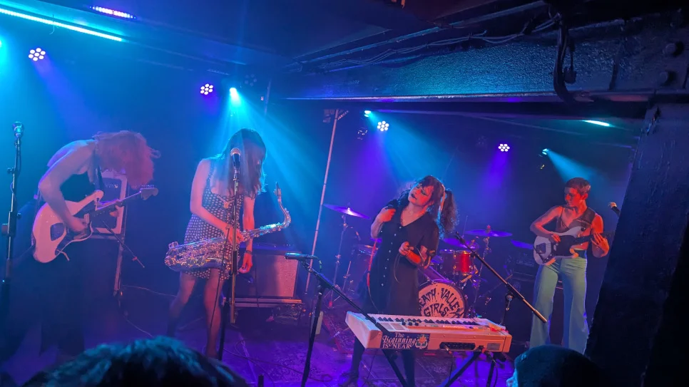

Finished work at 12:00 don't you just love flexi time? I then headed homeward to get some lunch and to sort myself out, I had previously arranged to meeting up with the guys at 6:00 (Mark, Chris and [Danny](https://gig-antics.live)) at [Bannermans](https://www.bannermanslive.co.uk/). Got home and had a wee power nap, suitably refreshed and with a change of clothes, I headed back into Edinburgh just after 4:00 to get some dinner. [Danny](https://gig-antics.live) suggested that I check out the [Mosque Kitchen](https://www.mosquekitchen.com/) as an alternative to expensive pub grub, so I popped in, and for  under tenner, you can get a decent portion Chicken Korma, which was excellent in these rather expensive times.

After a few beers in [Bannermans](https://www.bannermanslive.co.uk/) we decided to see the last few tracks of the support band [Bella and the Bizarre](https://bellaandthebizarre.bandcamp.com/album/bella-and-the-bizarre) who turned out to be rather good. Now I wish we had missed out the last few beers and seen their whole set! Definitely a band I’ll not miss the next time they happen to be in the Toon.

On a separate note, it was really nice to bump into my old mate Lara and her partner Steve at the gig, hopefully see more of them in the future. 👍

Venue - [The Bongo Club](https://www.thebongoclub.co.uk/)

### Death Valley Girls

> For the better part of a decade, LA’s scrappy rock n’ roll mystics Death Valley Girls have used their music as a means of tapping into a communal cosmic energy. On albums like Glow In The Dark (2016), Darkness Rains (2018), and Under the Spell of Joy (2020) the band challenged the soul-crushing banality of modern society and celebrated “true magical infinite potential” through a collage of scorching proto-punk riffs, earworm melodies, far-out lyrics, and lysergic auxiliary instrumentation.

### Bella and the Bizarre

> Berlin-based Bella and the Bizarre are a wild fusion of garage punk, sixties rock n roll and a touch of RnB soul, with its own gentle smokiness. Known for their vibrant stage presence and infectious energy, Bella and the Bizarre deliver performances that are as captivating as they are unpredictable. And yes, Bella is King Khan’s daughter. That’s should be all you need to know.

### Gig Photos

## References

* Danny - [Gig Antics](https://gig-antics.live)
* Bella and the Bizarre [Bandcamp](https://bellaandthebizarre.bandcamp.com/)
* Bella and the Bizarre [Instagram](https://www.instagram.com/bellaandthebizarre/)
* Death Valley Girls [Wikipedia](https://en.wikipedia.org/wiki/Death_Valley_Girls)
* Death Valley Girls [Facebook page](https://www.facebook.com/DeathValleyGirls/?locale=en_GB&checkpoint_src=any)
* Death Valley Girls [Bandcamp](https://deathvalleygirls.bandcamp.com)
