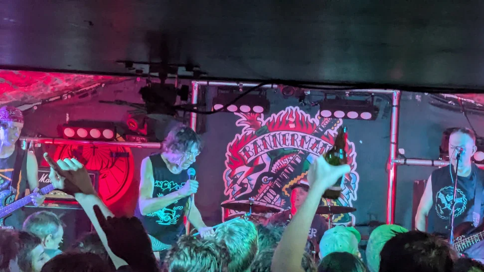
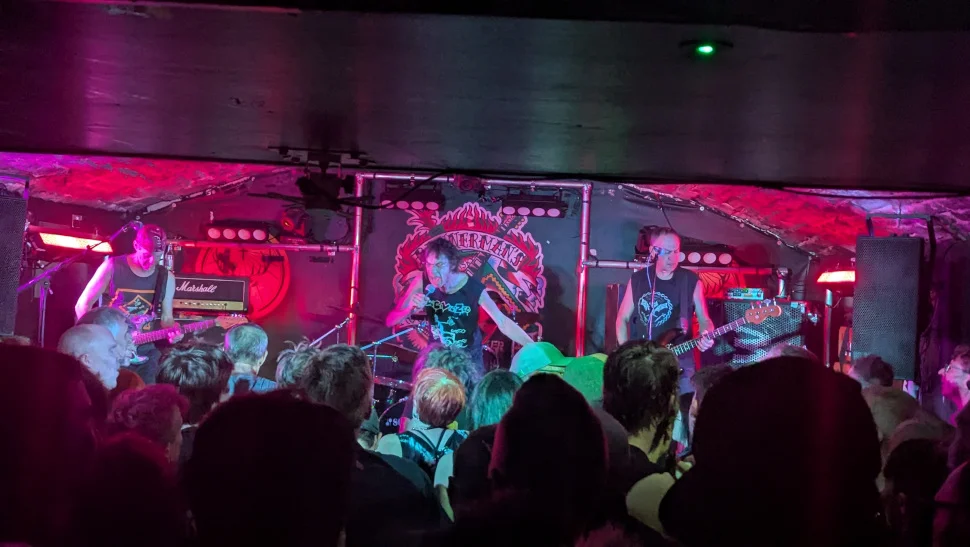
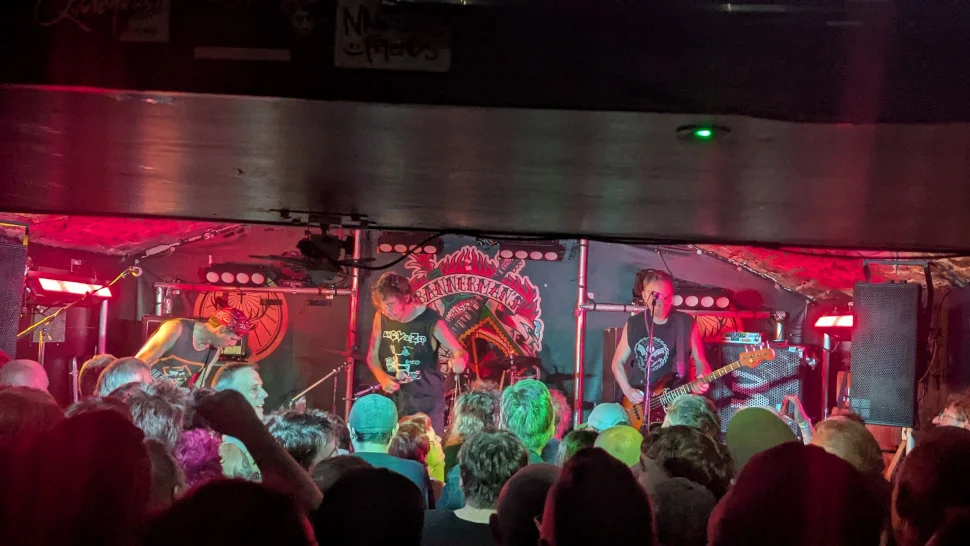
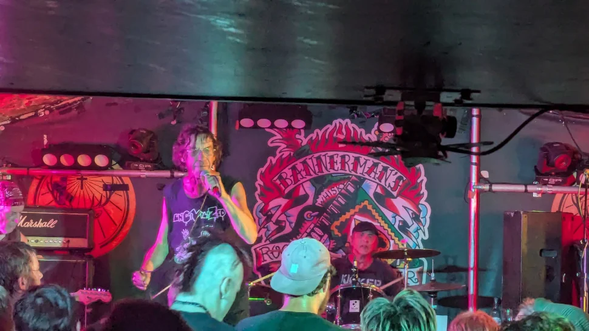
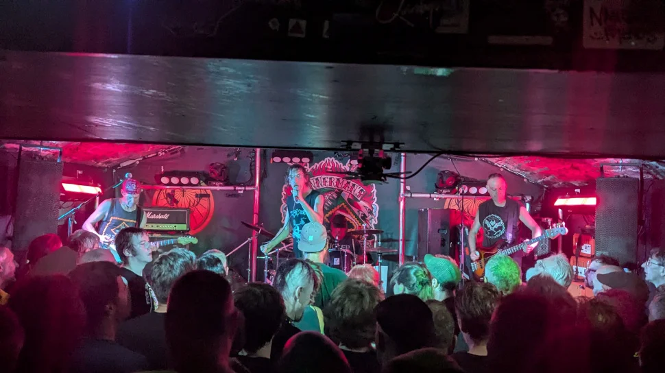
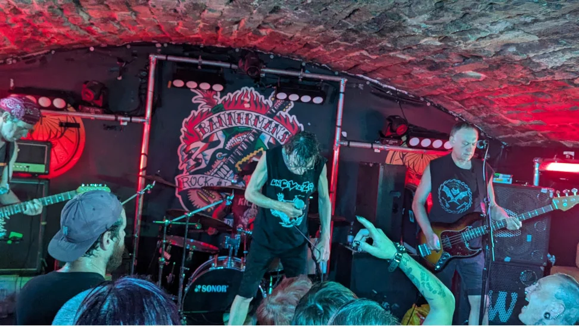
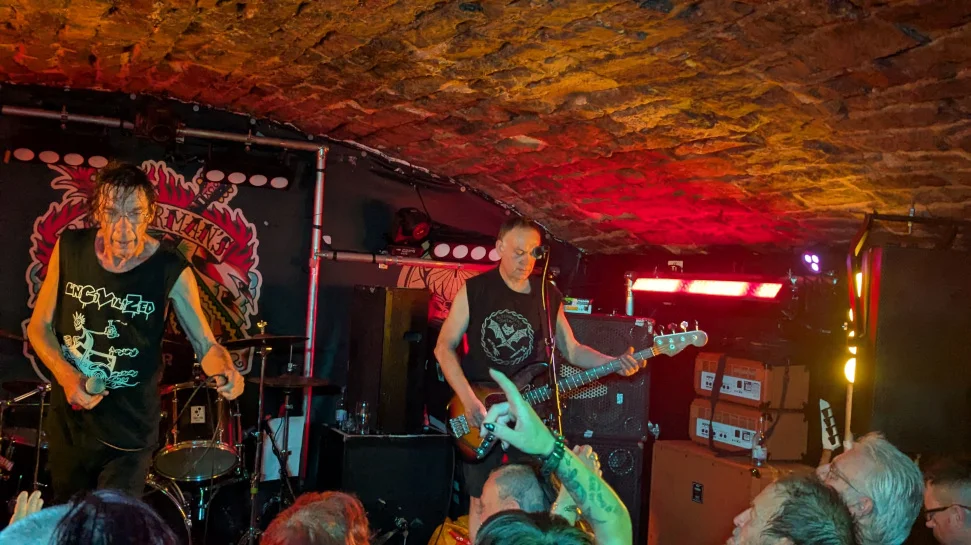
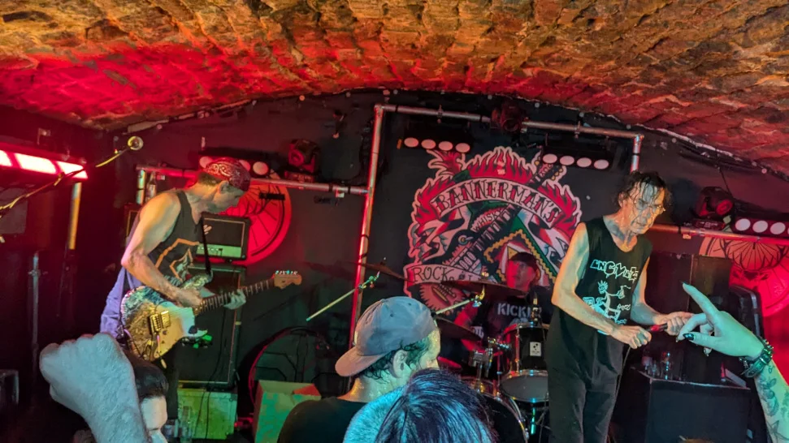

I got changed out of my obligatory smart work shirt, and donned my favourite Damned florescent T-shirt, and headed down town to the City Cafe for some food (I do like the vibe of the place). The place wasn’t too busy thankfully, so I managed to snag a decent sized table near the entrance.

As it was still early, I ordered food and settled down to watch some [YouTube](https://youtube.com) on my phone until the food arrived, I had a wee chat with the guys online for a while and Danny [Gig Antics](https://www.gig-antics.live/) popped in for a chat and a quick beer before heading for his train to [Bellshill](https://en.wikipedia.org/wiki/Bellshill) to see the [BMX Bandits](https://www.gig-antics.live/post/bmx-bandits-bellshill-cultural-centre-30-05-25), I always enjoy a beer a catchup and a chat.

I decided to head down to the venue at 7:30 and meet Mark, Chris, Lee-Ann with a guest appearances by Holly and Yasmin the respective daughters of Mark and Lee-Ann. It’s always good to see a younger crowd going to gigs and not just us old fogies.

After having a few drinks, it was time to go and see the main band the Subhumans, because it's such a small venue, we were all up close and personal, with the band being only about 20ft away from us, and I've got to say, they were excellent! They played a fair medley of there best known tunes as we all sang along. At the end of the night, Dick Lucas was kind enough to pop over and have a chat and was gracious enough to let us take a few selfies with him.

Venue - [Bannermans](https://www.bannermanslive.co.uk/)

### Gig Photos

_Bruce Treasure, (Drummer) Trotsky, Dick Lucas and Phil Bryant_

_Bruce Treasure, Dick Lucas and Phil Bryant_

_Bruce Treasure, Dick Lucas and Phil Bryant_

_Dick Lucas_

_Bruce Treasure, Dick Lucas and Phil Bryant_

_Bruce Treasure, Dick Lucas and Phil Bryant_

_Dick Lucas and Phil Bryant_

_Bruce Treasure and Dick Lucas_

## References

* Subhumans - [Wikipedia](https://en.wikipedia.org/wiki/Subhumans_(British_band))
* Subhumans - [Bandcamp](https://subhumans.bandcamp.com/)
* Subhumans - [Bands in Town](https://www.bandsintown.com/e/1033710169-subhumans-at-bannerman's?came_from=251)
* Subhumans - [Facebook](https://www.facebook.com/officialsubhumans/)
* The Hippies Now Wear Black - [Blog](https://thehippiesnowwearblack.org.uk/2025/05/27/subhumans-live-dates-in-may-and-june-2025/)
