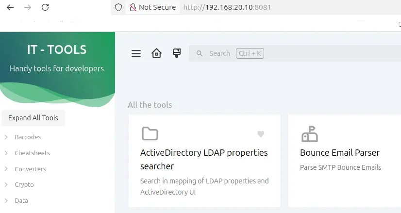
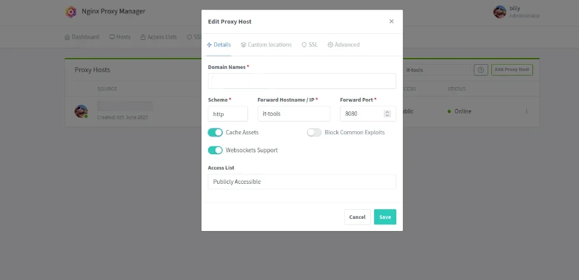

### Prerequisites

A running hypervisor such as [Proxmox](https://thebloody.cloud/posts/Cheap-Home-Proxmox-Server/) with a running docker container, or a bare metal install of docker on a [machine running linux](https://thebloody.cloud/posts/Debian-Host-On-Proxmox/).

### IT Tools Docker Config

This Docker Compose configuration defines a service named `it-tools` that uses the image `sharevb/it-tools`. Below is a breakdown of the configuration:

### Docker Compose File

```yaml
# Filename docker-compose.yml
services:
  it-tools:
    image: sharevb/it-tools
    pull_policy: always
    networks:
       - blackhole
    container_name: it-tools
    ports: 
    - 8081:8080
    restart: unless-stopped

networks:
   blackhole:
    name: blackhole
    external: true
    
```

### Image Pull Policy: `pull_policy: always`

In the context of container orchestration and deployment, particularly with tools like Kubernetes or Docker, the `pull_policy: always` setting refers to the image pull policy for a container. This policy dictates how the container runtime should handle image pulls when starting a container.

### Definition

When you set `pull_policy: always`, it means that the container runtime will always attempt to pull the latest version of the image from the specified image repository every time the container is started. This ensures that you are using the most up-to-date version of the image, which can be particularly useful in development environments or when images are frequently updated.

### Common Image Pull Policies

1. **Always**: Always pull the image from the repository.
2. **IfNotPresent**: Pull the image only if it is not already present on the node.
3. **Never**: Never pull the image; it must be present on the node.

### Considerations

Using `pull_policy: always` can help avoid issues with outdated images but may increase startup time due to the need to fetch the image from the repository each time.

### Network Configuration

- **Network Name**: `blackhole`
- **External**: `true`
  This indicates that the network is not created by this Docker Compose file but is an existing external network.

### Ports Configuration

In the Docker Compose configuration, the `ports` section is used to define how the container's internal ports are mapped to the host machine's ports. This allows external access to the services running inside the container.

### Configuration Breakdown

- **Container Port**: `8080`
  - This is the port on which the application inside the container is listening. In this case, it is the default HTTP port, which is commonly used for web applications.

- **Host Port**: `8081`
  - This is the port on the host machine that will be mapped to the container's port. When you access `http://localhost:8081` in your web browser, the request will be forwarded to the container's port `80`.

## Start the container

docker-compose up -d starts the containers in the background and leaves them running. (this means that if you want to see the logs of the containers you will have to use docker-compose logs -f)

```bash
docker-compose up -d
```

## Accessing the container

Open a browser and enter the ip address and port of your docker container.



## NGINX Reverse Proxy Settings (Optional)

If your already running [Nginx Remote Proxy Manager](https://nginxproxymanager.com/setup/) in your home network, here are the setting that I use, hopefully it will save you a bit of time. Where is says **Forward Hostname/IP** you might have substitute  what I have with the IP of your container.



## Accessing via a Cloudflare Tunnel

Tom Lawrence does a great video on setting up a secure Cloudflare Tunnel to access your home network assets, do feel free to watch it and subscribe. I use the instructions provided, to securely connect to my IT Tools docker container when I'm away from home.



## References

- Stack Overflow - [docker-compose](https://stackoverflow.com/questions/52111190/whats-the-difference-between-docker-compose-up-d-and-docker-compose-up-build) command
- Nginx - [The Benefits of Microcaching](https://blog.nginx.org/blog/benefits-of-microcaching-nginx)
